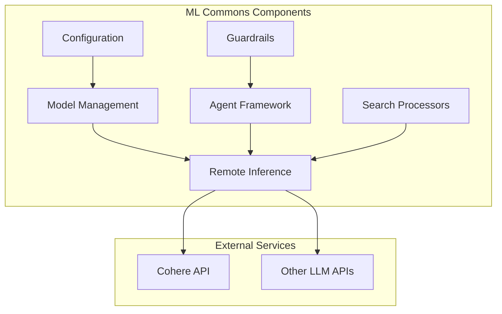

# ML Commons Stability and Reliability

## Summary

ML Commons is OpenSearch's machine learning plugin that provides algorithms, model management, and inference capabilities. This document tracks stability improvements, bugfixes, and reliability enhancements across releases.

## Details

### Architecture

### Components

| Component | Description |
|-----------|-------------|
| Model Management | Handles model registration, deployment, and deletion |
| Remote Inference | Connects to external ML services (Cohere, OpenAI, etc.) |
| Agent Framework | Orchestrates multi-step ML workflows |
| Guardrails | Input/output validation and safety checks |
| Search Processors | ML inference in search pipelines |
| Configuration | Plugin settings and index management |

### Key Stability Areas

#### Model Lifecycle Management

Proper handling of model states during concurrent operations:
- Registration and deployment
- Undeployment and deletion
- State transitions and cleanup

#### Remote Inference Reliability

Robust communication with external ML services:
- Input validation and type handling
- Error handling and retries
- Response parsing

#### Agent Execution

Reliable multi-step workflow execution:
- Error propagation and formatting
- State management
- Timeout handling

#### Configuration Management

Backward-compatible configuration handling:
- Index field migrations
- API response compatibility
- Default value management

### Configuration

| Setting | Description | Default |
|---------|-------------|---------|
| `plugins.ml_commons.guardrails.type` | Guardrails validation type | `local_regex` |
| `plugins.ml_commons.model_access_control_enabled` | Enable model access control | `false` |
| `plugins.ml_commons.only_run_on_ml_node` | Restrict ML tasks to ML nodes | `true` |

## Limitations

- Concurrent model operations may still experience race conditions in distributed environments
- Remote inference depends on external service availability
- Agent execution timeouts may vary based on underlying model response times

## Related PRs

| Version | PR | Description |
|---------|-----|-------------|
| v2.17.0 | [#2806](https://github.com/opensearch-project/ml-commons/pull/2806) | Fix delete model race condition |
| v2.17.0 | [#2847](https://github.com/opensearch-project/ml-commons/pull/2847) | Fix Cohere model validation |
| v2.17.0 | [#2852](https://github.com/opensearch-project/ml-commons/pull/2852) | Fix remote inference parameter types |
| v2.17.0 | [#2853](https://github.com/opensearch-project/ml-commons/pull/2853) | Set local_regex as default guardrails type |
| v2.17.0 | [#2858](https://github.com/opensearch-project/ml-commons/pull/2858) | Agent error JSON formatting |
| v2.17.0 | [#2871](https://github.com/opensearch-project/ml-commons/pull/2871) | Fix List substitution in prompts |
| v2.17.0 | [#2882](https://github.com/opensearch-project/ml-commons/pull/2882) | Fix config index breaking changes |
| v2.17.0 | [#2892](https://github.com/opensearch-project/ml-commons/pull/2892) | Config API backward compatibility |
| v2.17.0 | [#2898](https://github.com/opensearch-project/ml-commons/pull/2898) | Fix HTTP dependency in batch jobs |

## References

- [ML Commons Repository](https://github.com/opensearch-project/ml-commons)
- [Issue #2793](https://github.com/opensearch-project/ml-commons/issues/2793): Model deletion 500 error
- [Issue #2829](https://github.com/opensearch-project/ml-commons/issues/2829): Model interface validation
- [OpenSearch ML Commons Documentation](https://opensearch.org/docs/latest/ml-commons-plugin/index/)

## Change History

- **v2.17.0** (2024-09-17): Multiple stability fixes including model deletion race condition, Cohere validation, agent error formatting, config backward compatibility, and guardrails default type
