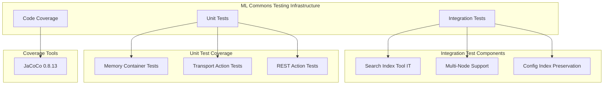

# ML Commons Test Fixes

## Summary

This feature tracks test infrastructure improvements and documentation additions for the ML Commons plugin, including fixes for multi-node cluster integration tests, memory container unit tests, integration test stability fixes, and tutorials for integrating external services like Amazon Bedrock Guardrails.

## Details

### Architecture



### Components

| Component | Description |
|-----------|-------------|
| Search Index Tool IT | Integration tests for the Search Index Tool functionality |
| Multi-Node Test Support | Enables running integration tests across distributed clusters |
| Config Index Preservation | Preserves `.plugins-ml-config` index during test cleanup for master key consistency |
| Memory Container Tests | Comprehensive unit tests for memory container CRUD operations |
| Transport Action Tests | Tests for `TransportCreateMemoryContainerAction` and `TransportGetMemoryContainerAction` |
| REST Action Tests | Tests for REST API endpoints for memory containers |
| JaCoCo | Code coverage tool upgraded to 0.8.13 |

### Configuration

| Setting | Description | Default |
|---------|-------------|---------|
| `numNodes` | Number of nodes for integration test cluster | 1 |
| `jacoco.toolVersion` | JaCoCo version for code coverage | 0.8.13 |
| `guardrails.input_guardrail.model_id` | Model ID for input validation | - |
| `guardrails.input_guardrail.response_filter` | JSONPath to extract guardrail action | - |
| `guardrails.input_guardrail.response_validation_regex` | Regex to validate allowed responses | - |

### Usage Example

**Running Multi-Node Integration Tests:**
```bash
./gradlew opensearch-ml-plugin:integTest \
  --tests "org.opensearch.ml.rest.RestSearchIndexToolIT" \
  -PnumNodes=3
```

**Running Memory Container Unit Tests:**
```bash
./gradlew :opensearch-ml-plugin:test \
  --tests "*MemoryContainer*"
```

**Configuring Bedrock Guardrails:**
```json
POST /_plugins/_ml/models/_register?deploy=true
{
  "name": "Model with Guardrails",
  "function_name": "remote",
  "connector_id": "<connector_id>",
  "guardrails": {
    "input_guardrail": {
      "model_id": "<guardrail_model_id>",
      "response_filter": "$.action",
      "response_validation_regex": "^\"NONE\"$"
    },
    "type": "model"
  }
}
```

## Limitations

- Bedrock Guardrails require AWS credentials and pre-configured guardrails in AWS console
- Multi-node test execution requires additional system resources
- Memory container integration tests are planned for future releases

## Related PRs

| Version | PR | Description |
|---------|-----|-------------|
| v3.2.0 | [#3883](https://github.com/opensearch-project/ml-commons/pull/3883) | SearchIndexTool arguments parsing logic improvement |
| v3.2.0 | [#3989](https://github.com/opensearch-project/ml-commons/pull/3989) | Keep .plugins-ml-config index for integration tests |
| v3.2.0 | [#4056](https://github.com/opensearch-project/ml-commons/pull/4056) | Unit tests for create and get memory container |
| v3.2.0 | [#4057](https://github.com/opensearch-project/ml-commons/pull/4057) | Additional unit tests and JaCoCo upgrade |
| v2.17.0 | [#2407](https://github.com/opensearch-project/ml-commons/pull/2407) | Test: recover search index tool IT in multi node cluster |
| v2.17.0 | [#2695](https://github.com/opensearch-project/ml-commons/pull/2695) | Add tutorial for Bedrock Guardrails |

## References

- [Issue #2362](https://github.com/opensearch-project/ml-commons/issues/2362): Original bug report for multi-node test failure
- [Issue #2560](https://github.com/opensearch-project/ml-commons/issues/2560): Master key consistency issue
- [Issue #3834](https://github.com/opensearch-project/ml-commons/issues/3834): MCP tool schema alignment
- [OpenSearch Guardrails Documentation](https://opensearch.org/docs/latest/ml-commons-plugin/remote-models/guardrails/)
- [AWS Bedrock Guardrails](https://docs.aws.amazon.com/bedrock/latest/userguide/guardrails-create.html)

## Change History

- **v3.2.0** (2025-08-05): Added memory container unit tests, integration test stability fix, JaCoCo upgrade to 0.8.13
- **v2.17.0** (2024-09-17): Added multi-node cluster test support and Bedrock Guardrails tutorial
