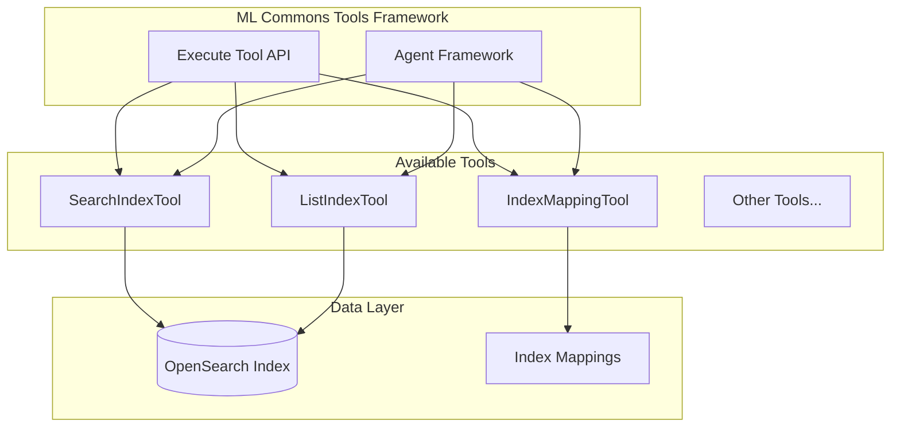

# ML Commons Tools

## Summary

ML Commons Tools provide a framework for AI agents to interact with OpenSearch data and services. Tools like SearchIndexTool, ListIndexTool, and IndexMappingTool enable agents to search indexes, list available indexes, and retrieve index mappings. The Execute Tool API allows direct tool execution independent of agents.

## Details

### Architecture



### Components

| Component | Description |
|-----------|-------------|
| `SearchIndexTool` | Searches an index using Query DSL and returns results |
| `ListIndexTool` | Lists available indexes in the cluster |
| `IndexMappingTool` | Retrieves index mappings |
| `Execute Tool API` | REST API for direct tool execution |
| `PlainNumberAdapter` | Gson adapter for numeric serialization without scientific notation |

### Configuration

| Setting | Description | Default |
|---------|-------------|---------|
| `plugins.ml_commons.execute_tools_enabled` | Enable/disable Execute Tool API | `true` (v3.3.0+) |
| `plugins.ml_commons.agent_framework_enabled` | Enable/disable agent framework | `true` |

### Usage Example

#### Using SearchIndexTool with an Agent

```json
POST /_plugins/_ml/agents/_register
{
  "name": "Search Agent",
  "type": "flow",
  "tools": [
    {
      "type": "SearchIndexTool"
    }
  ]
}
```

#### Direct Tool Execution

```json
POST /_plugins/_ml/tools/SearchIndexTool/_execute
{
  "parameters": {
    "input": "{\"index\": \"my-index\", \"query\": {\"match_all\": {}}}"
  }
}
```

### JSON Number Handling

SearchIndexTool uses `PLAIN_NUMBER_GSON` for query serialization to avoid scientific notation issues:

```java
// Input with scientific notation
{"range": {"price": {"gte": 1e-6}}}

// Serialized output (plain format)
{"range": {"price": {"gte": 0.000001}}}
```

Special value handling:
- `NaN` → `null`
- `Infinity` → `null`
- `-Infinity` → `null`

## Limitations

- Execute Tool API requires `plugins.ml_commons.execute_tools_enabled` to be `true`
- `NaN` and `Infinity` values are converted to `null` in SearchIndexTool queries
- Tools must be registered before use with agents

## Change History

- **v3.3.0** (2026-01): Execute Tool API enabled by default, PlainNumberAdapter added for SearchIndexTool, setting naming standardization

## References

### Documentation
- [SearchIndexTool Documentation](https://docs.opensearch.org/3.0/ml-commons-plugin/agents-tools/tools/search-index-tool/)
- [Tools Overview](https://docs.opensearch.org/3.0/ml-commons-plugin/agents-tools/tools/index/)
- [ML Commons Cluster Settings](https://docs.opensearch.org/3.0/ml-commons-plugin/cluster-settings/)
- [Execute Agent API](https://docs.opensearch.org/3.0/ml-commons-plugin/api/agent-apis/execute-agent/)

### Pull Requests
| Version | PR | Description | Related Issue |
|---------|-----|-------------|---------------|
| v3.3.0 | [#4296](https://github.com/opensearch-project/ml-commons/pull/4296) | Enable execute tool feature flag by default |   |
| v3.3.0 | [#4133](https://github.com/opensearch-project/ml-commons/pull/4133) | Add PlainNumberAdapter for Gson in SearchIndexTool |   |
| v3.3.0 | [#4215](https://github.com/opensearch-project/ml-commons/pull/4215) | Standardize setting naming convention |   |
