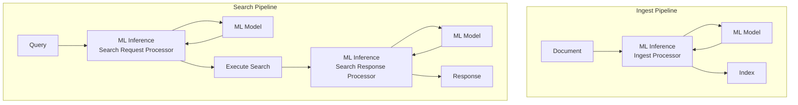

# ML Inference Processor

## Summary

The ML Inference Processor enables seamless integration of machine learning models into OpenSearch ingest and search pipelines. It allows documents to be enriched with ML model predictions during indexing or search operations, supporting use cases like semantic search, text embedding generation, document classification, reranking, and content summarization.

## Details

### Architecture



### Components

| Component | Description |
|-----------|-------------|
| ML Inference Ingest Processor | Enriches documents during indexing with ML model predictions |
| ML Inference Search Request Processor | Transforms search queries using ML models (e.g., query embedding) |
| ML Inference Search Response Processor | Enriches search results with ML model predictions |

### Configuration

| Setting | Description | Default |
|---------|-------------|---------|
| `model_id` | ID of the ML model to invoke | Required |
| `function_name` | Function name (`remote`, `text_embedding`, `sparse_encoding`, etc.) | `remote` |
| `input_map` | Maps document/query fields to model input parameters | Optional |
| `output_map` | Maps model output to new document fields | Optional |
| `model_config` | Additional model configuration parameters | Optional |
| `model_input` | Template for model input format | Auto-generated |
| `full_response_path` | Use JSON path for output field extraction | `false` (remote), `true` (local) |
| `ignore_missing` | Skip documents with missing input fields | `false` |
| `ignore_failure` | Continue on prediction failures | `false` |
| `override` | Overwrite existing fields with same name | `false` |
| `max_prediction_tasks` | Maximum concurrent model invocations | `10` |
| `one_to_one` | Invoke model per document (search response only) | `false` |

### Usage Examples

#### Ingest Pipeline - Text Embedding

```json
PUT /_ingest/pipeline/embedding_pipeline
{
  "processors": [
    {
      "ml_inference": {
        "model_id": "<embedding_model_id>",
        "input_map": [
          {
            "inputText": "text_field"
          }
        ],
        "output_map": [
          {
            "text_embedding": "embedding"
          }
        ]
      }
    }
  ]
}
```

#### Search Request Pipeline - Query Embedding

```json
PUT /_search/pipeline/semantic_search_pipeline
{
  "request_processors": [
    {
      "ml_inference": {
        "model_id": "<embedding_model_id>",
        "query_template": "{\"query\":{\"knn\":{\"embedding\":{\"vector\":${modelPredictionOutcome},\"k\":10}}}}",
        "input_map": [
          {
            "inputText": "query.match.text.query"
          }
        ],
        "output_map": [
          {
            "modelPredictionOutcome": "embedding"
          }
        ]
      }
    }
  ]
}
```

#### Search Response Pipeline - Summarization

```json
PUT /_search/pipeline/summarization_pipeline
{
  "response_processors": [
    {
      "ml_inference": {
        "model_id": "<llm_model_id>",
        "input_map": [
          {
            "context": "text_field"
          }
        ],
        "output_map": [
          {
            "summary": "content[0].text"
          }
        ],
        "model_config": {
          "messages": "[{\"role\":\"user\",\"content\":[{\"type\":\"text\",\"text\":\"Summarize: ${parameters.context}\"}]}]"
        },
        "one_to_one": true
      }
    }
  ]
}
```

## Limitations

- Local models require explicit `function_name` and `model_input` configuration
- `one_to_one` mode increases latency proportionally to document count
- Model must be deployed and accessible before pipeline execution
- Complex nested field mappings require JSON path syntax

## Related PRs

| Version | PR | Description |
|---------|-----|-------------|
| v2.14.0 | - | Initial ML Inference Ingest Processor |
| v2.16.0 | - | ML Inference Search Request/Response Processors |
| v2.17.0 | [#2801](https://github.com/opensearch-project/ml-commons/pull/2801) | Support one_to_one in ML Inference Search Response Processor |

## References

- [Issue #2173](https://github.com/opensearch-project/ml-commons/issues/2173): RFC - ML Inference Processors
- [ML Inference Ingest Processor Documentation](https://docs.opensearch.org/latest/ingest-pipelines/processors/ml-inference/)
- [ML Inference Search Request Processor Documentation](https://docs.opensearch.org/latest/search-plugins/search-pipelines/ml-inference-search-request/)
- [ML Inference Search Response Processor Documentation](https://docs.opensearch.org/latest/search-plugins/search-pipelines/ml-inference-search-response/)
- [Blog: Introduction to ML inference processors](https://opensearch.org/blog/introduction-to-ml-inference-processors-in-opensearch-review-summarization-and-semantic-search/)

## Change History

- **v2.17.0** (2024-10-15): Added `one_to_one` parameter for per-document inference in search response processor
- **v2.16.0**: Added ML Inference Search Request and Search Response Processors
- **v2.14.0**: Initial ML Inference Ingest Processor implementation
