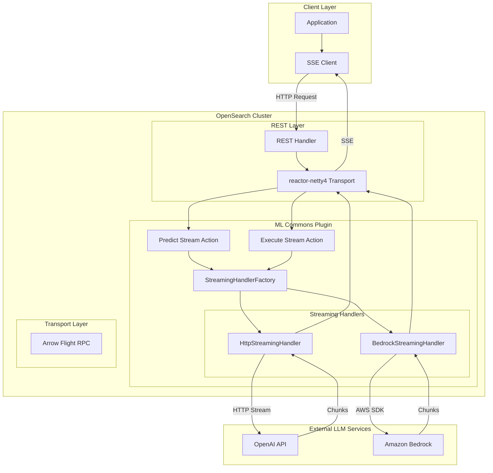
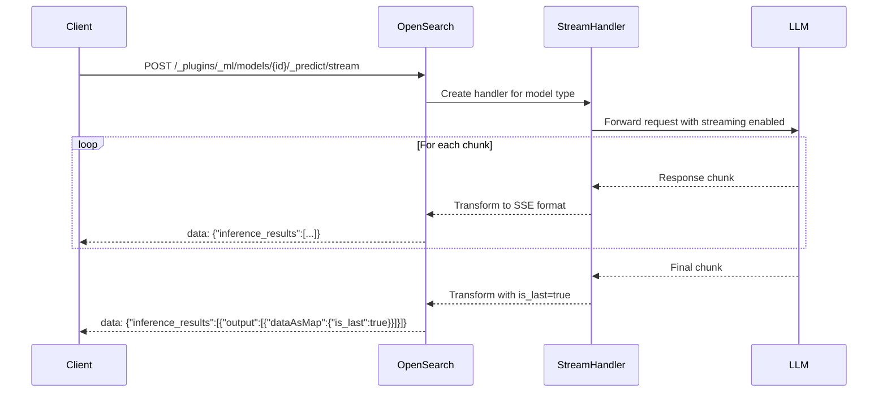

---
tags:
  - ml
---

# Streaming APIs

## Summary

Streaming APIs enable real-time incremental response delivery for ML Commons model predictions and agent executions. Instead of waiting for complete responses from large language models, applications receive data chunks as they become available through Server-Sent Events (SSE). This significantly improves user experience for AI-powered applications where response generation time is unpredictable and outputs can be lengthy.

## Details

### Architecture



### Data Flow



### Components

| Component | Description |
|-----------|-------------|
| `MLPredictionStreamTaskAction` | Transport action handling streaming model predictions |
| `MLExecuteStreamTaskAction` | Transport action handling streaming agent executions |
| `StreamingHandler` | Interface defining streaming response handling contract |
| `StreamingHandlerFactory` | Factory creating appropriate handlers based on model type |
| `HttpStreamingHandler` | Handler for HTTP-based streaming protocols (OpenAI) |
| `BedrockStreamingHandler` | Handler for Amazon Bedrock Converse Stream API |
| `StreamPredictActionListener` | Action listener managing streaming prediction lifecycle |
| `BaseStreamingHandler` | Base implementation with common streaming logic |
| `StreamingWrapper` | Wrapper enabling streaming for conversational agents |

### Configuration

| Setting | Description | Default |
|---------|-------------|---------|
| `plugins.ml_commons.stream_enabled` | Enable streaming feature at cluster level | `false` |
| `opensearch.experimental.feature.transport.stream.enabled` | Enable experimental transport streaming | `false` |
| `http.type` | HTTP transport type for streaming support | - |
| `arrow.flight.publish_host` | Arrow Flight publish host for multi-node clusters | - |
| `arrow.flight.bind_host` | Arrow Flight bind host for multi-node clusters | - |
| `transport.stream.type.default` | Default stream transport type | - |
| `flight.ssl.enable` | Enable SSL for Arrow Flight | `false` |

### API Endpoints

#### Predict Stream API

```
POST /_plugins/_ml/models/{model_id}/_predict/stream
```

Streams model prediction responses for supported remote models.

#### Execute Stream Agent API

```
POST /_plugins/_ml/agents/{agent_id}/_execute/stream
```

Streams agent execution responses including tool calls and final answers.

### Supported Models

| Provider | Model Type | LLM Interface |
|----------|------------|---------------|
| OpenAI | Chat Completion | `openai/v1/chat/completions` |
| Amazon Bedrock | Converse Stream | `bedrock/converse/claude` |

### Usage Example

#### Prerequisites Setup

1. Install required plugins:
```bash
bin/opensearch-plugin install transport-reactor-netty4
bin/opensearch-plugin install arrow-flight-rpc
```

2. Configure `opensearch.yml`:
```yaml
opensearch.experimental.feature.transport.stream.enabled: true
http.type: reactor-netty4  # or reactor-netty4-secure for security enabled
```

3. Add JVM options:
```
-Dio.netty.noUnsafe=false
-Dio.netty.tryUnsafe=true
-Dio.netty.tryReflectionSetAccessible=true
--add-opens=java.base/java.nio=org.apache.arrow.memory.core,ALL-UNNAMED
```

4. Enable feature flag:
```json
PUT _cluster/settings
{
  "persistent": {
    "plugins.ml_commons.stream_enabled": true
  }
}
```

#### Register Streaming Model (OpenAI)

```json
POST /_plugins/_ml/models/_register
{
  "name": "OpenAI GPT Streaming",
  "function_name": "remote",
  "connector": {
    "name": "OpenAI Chat Connector",
    "protocol": "http",
    "parameters": {
      "endpoint": "api.openai.com",
      "model": "gpt-4"
    },
    "credential": {
      "openAI_key": "<your_api_key>"
    },
    "actions": [{
      "action_type": "predict",
      "method": "POST",
      "url": "https://${parameters.endpoint}/v1/chat/completions",
      "headers": {"Authorization": "Bearer ${credential.openAI_key}"},
      "request_body": "{\"model\":\"${parameters.model}\",\"messages\":${parameters.messages}}",
      "response_filter": "$.choices[0].delta.content"
    }]
  }
}
```

#### Stream Prediction Request

```json
POST /_plugins/_ml/models/<model_id>/_predict/stream
{
  "parameters": {
    "messages": [
      {"role": "system", "content": "You are a helpful assistant."},
      {"role": "user", "content": "Explain machine learning in simple terms."}
    ],
    "_llm_interface": "openai/v1/chat/completions"
  }
}
```

#### Register Streaming Agent

```json
POST /_plugins/_ml/agents/_register
{
  "name": "Streaming Chat Agent",
  "type": "conversational",
  "llm": {
    "model_id": "<model_id>",
    "parameters": {
      "max_iteration": 5,
      "system_prompt": "You are a helpful assistant.",
      "prompt": "${parameters.question}"
    }
  },
  "memory": {"type": "conversation_index"},
  "parameters": {
    "_llm_interface": "openai/v1/chat/completions"
  },
  "tools": [
    {"type": "ListIndexTool", "name": "ListIndices"}
  ]
}
```

#### Stream Agent Execution

```json
POST /_plugins/_ml/agents/<agent_id>/_execute/stream
{
  "parameters": {
    "question": "List all indices in my cluster"
  }
}
```

### Response Format

Responses use Server-Sent Events (SSE) format:

```
data: {"inference_results":[{"output":[{"name":"response","dataAsMap":{"content":"Hello","is_last":false}}]}]}

data: {"inference_results":[{"output":[{"name":"response","dataAsMap":{"content":" world","is_last":false}}]}]}

data: {"inference_results":[{"output":[{"name":"response","dataAsMap":{"content":"","is_last":true}}]}]}
```

#### Response Fields

| Field | Type | Description |
|-------|------|-------------|
| `inference_results` | Array | Container for streaming response data |
| `inference_results.output` | Array | Output objects for each inference result |
| `inference_results.output.name` | String | Output field name (`response`, `memory_id`, `parent_interaction_id`) |
| `inference_results.output.result` | String | Value for `memory_id` and `parent_interaction_id` fields |
| `inference_results.output.dataAsMap` | Object | Response content and metadata |
| `inference_results.output.dataAsMap.content` | String | Text content chunk from model |
| `inference_results.output.dataAsMap.is_last` | Boolean | `true` indicates final chunk |

## Limitations

- **Experimental Status**: Depends on experimental `transport-reactor-netty4` plugin; not recommended for production
- **Model Support**: Limited to OpenAI Chat Completion and Amazon Bedrock Converse Stream
- **Agent Types**: Execute Stream Agent API only supports conversational agents
- **Plugin Dependencies**: Requires explicit installation of `transport-reactor-netty4` and `arrow-flight-rpc`
- **Security Configuration**: Requires specific HTTP type configuration (`reactor-netty4-secure`) for security-enabled clusters
- **Multi-node Setup**: Requires additional Arrow Flight host configuration

## Change History

- **v3.3.0** (2025): Initial implementation with Predict Stream and Execute Stream Agent APIs

## Related Features
- [Neural Search](../neural-search/agentic-search.md)
- [Flow Framework](../flow-framework/flow-framework.md)
- [AI Assistant (Dashboards)](../dashboards-assistant/dashboards-assistant.md)
- [Skills](../skills/skills-plugin-dependencies.md)

## References

### Documentation
- [Predict Stream API Documentation](https://docs.opensearch.org/latest/ml-commons-plugin/api/train-predict/predict-stream/)
- [Execute Stream Agent API Documentation](https://docs.opensearch.org/latest/ml-commons-plugin/api/agent-apis/execute-stream-agent/)
- [Installing Plugins](https://docs.opensearch.org/latest/install-and-configure/plugins/)

### Blog Posts
- [Blog: Introducing real-time streaming for AI models and agents](https://opensearch.org/blog/introducing-real-time-streaming-for-ai-models-and-agents-in-opensearch/)

### Pull Requests
| Version | PR | Description | Related Issue |
|---------|-----|-------------|---------------|
| v3.3.0 | [ml-commons#4187](https://github.com/opensearch-project/ml-commons/pull/4187) | [FEATURE] Predict Stream - model prediction streaming | [#3630](https://github.com/opensearch-project/ml-commons/issues/3630) |
| v3.3.0 | [ml-commons#4212](https://github.com/opensearch-project/ml-commons/pull/4212) | [FEATURE] Agent Execute Stream - agent execution streaming | [#3630](https://github.com/opensearch-project/ml-commons/issues/3630) |

### Issues (Design / RFC)
- [Issue ml-commons#3630](https://github.com/opensearch-project/ml-commons/issues/3630): RFC for Remote Model Inference Streaming
