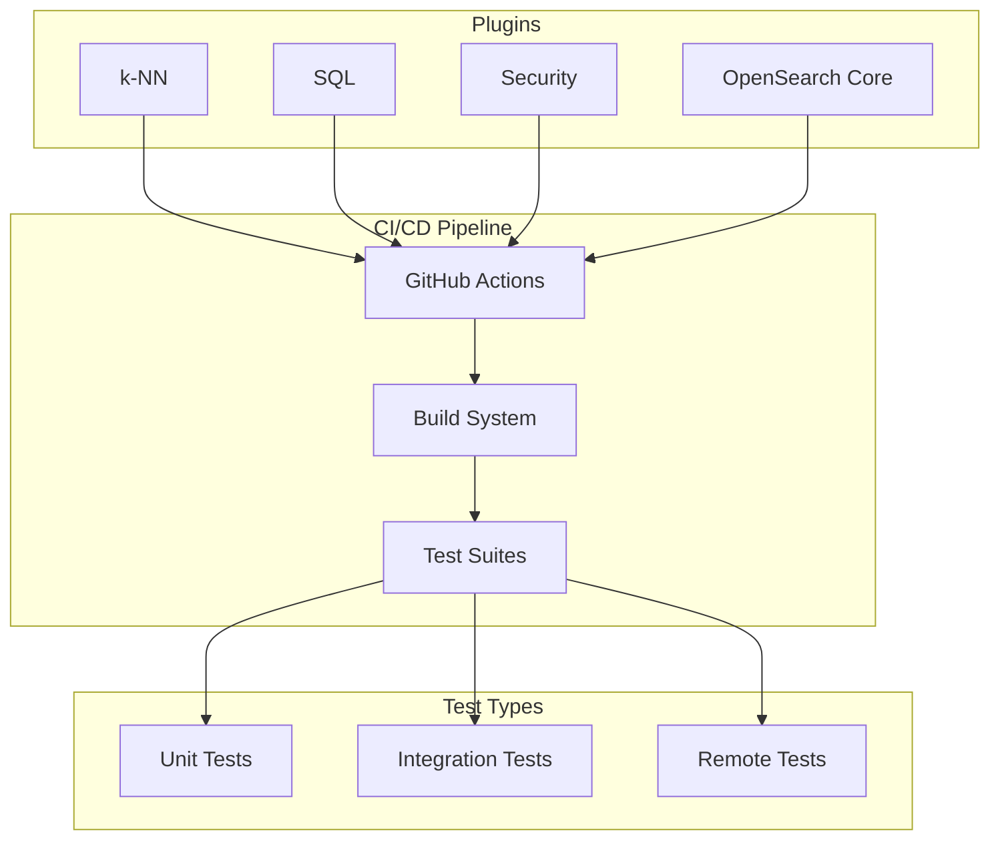
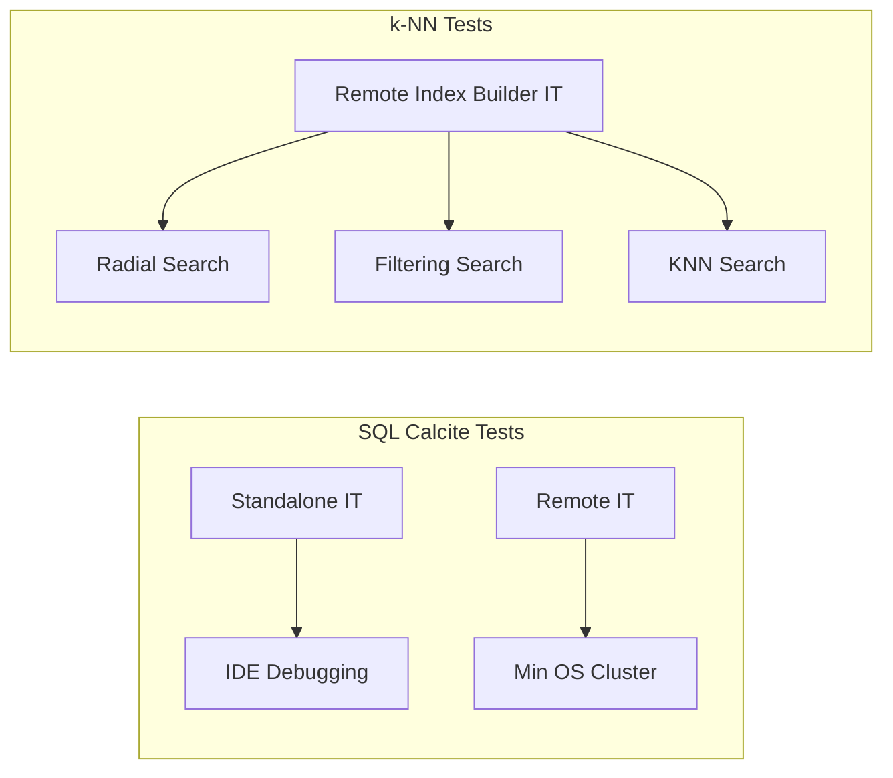

# CI/CD & Testing Infrastructure

## Summary

OpenSearch's CI/CD and testing infrastructure encompasses GitHub Actions workflows, integration test frameworks, and build configurations across multiple plugins. This infrastructure ensures code quality, enables automated testing, and supports the development workflow for the OpenSearch ecosystem.

## Details

### Architecture



### Components

| Component | Plugin | Description |
|-----------|--------|-------------|
| Remote Index Builder IT | k-NN | GitHub Action for testing remote vector index builder |
| Calcite IT Framework | SQL | Standalone and remote integration tests for Calcite engine |
| Pushdown Test Separation | SQL | Separate test suites for with/without pushdown scenarios |
| Shadow JAR Configuration | SQL | Build configuration for proper dependency packaging |

### Configuration

| Setting | Plugin | Description | Default |
|---------|--------|-------------|---------|
| `plugins.calcite.enabled` | SQL | Enable Calcite engine | `false` |
| `plugins.calcite.fallback.allowed` | SQL | Allow fallback to v2 engine | `true` |

### Test Framework Architecture



### Usage Example

```bash
# k-NN: Run remote index builder tests
# Triggered automatically via GitHub Actions on PR

# SQL: Run Calcite standalone IT (IDE debugging)
./gradlew :integ-test:integTest --tests "CalciteIT"

# SQL: Run Calcite remote IT
./gradlew :integ-test:integTestRemote --tests "CalciteIT"

# SQL: Run tests without pushdown
./gradlew :integ-test:integTest -Dplugins.calcite.pushdown=false
```

## Limitations

- Remote index builder tests limited to specific precision types
- Calcite IT requires specific cluster configuration for remote execution
- Some test frameworks are plugin-specific and not shared across repositories

## Related PRs

| Version | PR | Repository | Description |
|---------|-----|------------|-------------|
| v3.0.0 | [#2620](https://github.com/opensearch-project/k-NN/pull/2620) | k-NN | GitHub Action for remote index builder ITs |
| v3.0.0 | [#3342](https://github.com/opensearch-project/sql/pull/3342) | sql | Build Calcite integration test framework |
| v3.0.0 | [#3413](https://github.com/opensearch-project/sql/pull/3413) | sql | Separate with/without pushdown ITs |
| v3.0.0 | [#3447](https://github.com/opensearch-project/sql/pull/3447) | sql | Use entire shadow jar to fix IT |
| v3.0.0 | [#3469](https://github.com/opensearch-project/sql/pull/3469) | sql | Set bouncycastle version inline |
| v3.0.0 | [#3544](https://github.com/opensearch-project/sql/pull/3544) | sql | Only enable fallback for tests that need it |

## References

- [Issue #2553](https://github.com/opensearch-project/k-NN/issues/2553): Remote index builder testing task
- [Issue #3330](https://github.com/opensearch-project/sql/issues/3330): Calcite IT framework request
- [Issue #3411](https://github.com/opensearch-project/sql/issues/3411): Separate pushdown ITs
- [Issue #3546](https://github.com/opensearch-project/sql/issues/3546): IT refactoring request
- [remote-vector-index-builder](https://github.com/opensearch-project/remote-vector-index-builder): Remote index builder repository

## Change History

- **v3.0.0** (2025): Added remote index builder IT for k-NN, Calcite IT framework for SQL, test optimizations
