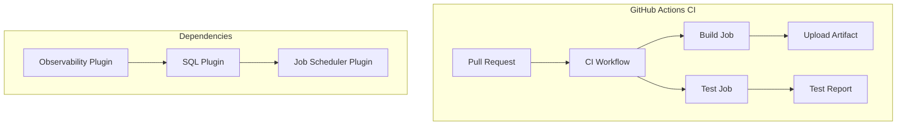

# CI/Infrastructure Fixes

## Summary

CI/Infrastructure fixes are maintenance changes to GitHub Actions workflows and CI configurations across OpenSearch plugin repositories. These fixes ensure continuous integration pipelines remain functional as GitHub deprecates older action versions and as plugin dependencies evolve.

## Details

### Architecture



### Components

| Component | Description |
|-----------|-------------|
| GitHub Actions Workflows | CI/CD pipeline definitions in `.github/workflows/` |
| actions/upload-artifact | GitHub Action for uploading build artifacts |
| Job Scheduler Plugin | Dependency for SQL and Observability plugins |
| Link Checker | Validates documentation links |

### Configuration

| Setting | Description | Default |
|---------|-------------|---------|
| `ACTIONS_ALLOW_USE_UNSECURE_NODE_VERSION` | Allows older Node.js versions for GLIBC compatibility | `false` |
| `actions/upload-artifact` version | GitHub Action version for artifact uploads | v4 (current) |

### Common Issues Addressed

1. **Deprecated GitHub Actions**: GitHub periodically deprecates older versions of actions
2. **GLIBC Compatibility**: Docker containers may have older GLIBC versions incompatible with newer Node.js
3. **Plugin Dependencies**: Changes in plugin dependency chains require CI workflow updates
4. **Link Validation**: Documentation link checkers need exclusion patterns for localhost URLs

### Usage Example

```yaml
# Example: Setting environment variable for GLIBC compatibility
env:
  ACTIONS_ALLOW_USE_UNSECURE_NODE_VERSION: true

jobs:
  build:
    runs-on: ubuntu-latest
    steps:
      - name: Upload Artifact
        uses: actions/upload-artifact@v4
        with:
          name: build-artifact
          path: ./build/
```

## Limitations

- Infrastructure changes require coordination across multiple repositories
- Temporary workarounds (like `ACTIONS_ALLOW_USE_UNSECURE_NODE_VERSION`) may need future updates
- Plugin dependency changes can cascade to multiple downstream repositories

## Related PRs

| Version | PR | Repository | Description |
|---------|-----|------------|-------------|
| v2.17.0 | [#703](https://github.com/opensearch-project/common-utils/pull/703) | common-utils | GLIBC compatibility fix |
| v2.17.0 | [#2046](https://github.com/opensearch-project/dashboards-observability/pull/2046) | dashboards-observability | Job Scheduler dependency, link checker fix |
| v2.17.0 | [#2133](https://github.com/opensearch-project/dashboards-observability/pull/2133) | dashboards-observability | upload-artifact v1 to v4 |

## References

- [GitHub Actions upload-artifact deprecation notice](https://github.blog/changelog/2024-02-13-deprecation-notice-v1-and-v2-of-the-artifact-actions/)
- [Issue #1886](https://github.com/opensearch-project/dashboards-observability/issues/1886): Observability CI failures

## Change History

- **v2.17.0** (2024-09-17): Fixed CI workflows across common-utils and dashboards-observability repositories
