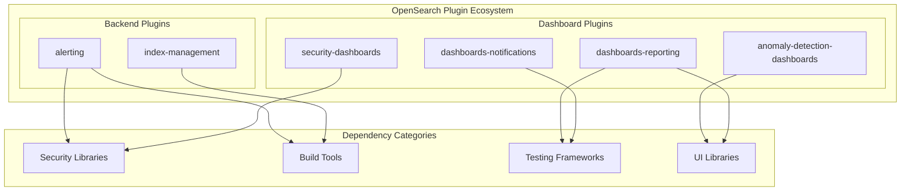
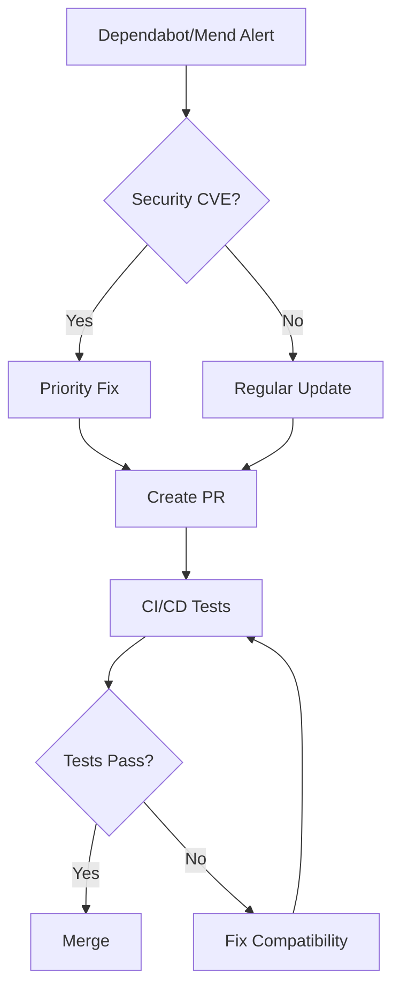

# CVE Fixes & Dependency Updates

## Summary

OpenSearch maintains security and stability through regular CVE fixes and dependency updates across its plugin ecosystem. This feature tracks security vulnerability remediation and dependency management across multiple repositories including alerting, security, anomaly-detection, reporting, index-management, and notifications plugins.

## Details

### Architecture

### Components

| Component | Description |
|-----------|-------------|
| Security Libraries | axios, elliptic, dompurify - handle authentication, cryptography, and sanitization |
| Build Tools | Gradle plugins (nebula.ospackage, detekt), ktlint |
| Testing Frameworks | cypress, babel-jest |
| UI Libraries | jspdf, @babel/runtime, @babel/helpers |

### Common CVE Categories

| Category | Description | Typical Fix |
|----------|-------------|-------------|
| SSRF | Server-Side Request Forgery | Upgrade HTTP client libraries |
| XSS | Cross-Site Scripting | Upgrade sanitization libraries |
| Cryptographic | Weak cryptographic implementations | Upgrade crypto libraries |
| Prototype Pollution | JavaScript prototype manipulation | Upgrade affected packages |
| Arbitrary Code Execution | Remote code execution risks | Upgrade affected packages |

### Dependency Management Strategy

### Configuration

No user configuration required. Dependency updates are applied automatically during plugin installation.

## Limitations

- Dependency versions may be constrained by OpenSearch Dashboards compatibility requirements
- Some security fixes require coordinated updates across multiple plugins
- Dev dependencies (cypress, babel-jest) may be removed rather than updated to reduce attack surface

## Related PRs

| Version | PR | Repository | Description |
|---------|-----|------------|-------------|
| v3.0.0 | [#1802](https://github.com/opensearch-project/alerting/pull/1802) | alerting | Bump logback to 1.5.16 |
| v3.0.0 | [#993](https://github.com/opensearch-project/anomaly-detection-dashboards-plugin/pull/993) | anomaly-detection | Update @babel/runtime (CVE-2025-27789) |
| v3.0.0 | [#529](https://github.com/opensearch-project/dashboards-reporting/pull/529) | reporting | Bump jspdf to 3.0 (CVE-2025-26791) |
| v3.0.0 | [#555](https://github.com/opensearch-project/dashboards-reporting/pull/555) | reporting | Bump jspdf to 3.0.1 (CVE-2025-29907) |
| v3.0.0 | [#550](https://github.com/opensearch-project/dashboards-reporting/pull/550) | reporting | CVE fix for elliptic |
| v3.0.0 | [#558](https://github.com/opensearch-project/dashboards-reporting/pull/558) | reporting | CVE fix for babel/helpers |
| v3.0.0 | [#1374](https://github.com/opensearch-project/index-management/pull/1374) | index-management | Bump nebula.ospackage |
| v3.0.0 | [#338](https://github.com/opensearch-project/dashboards-notifications/pull/338) | notifications | Bump cypress |

## References

- [CVE-2025-27789](https://nvd.nist.gov/vuln/detail/CVE-2025-27789): @babel/runtime vulnerability
- [CVE-2025-26791](https://nvd.nist.gov/vuln/detail/CVE-2025-26791): jspdf vulnerability
- [CVE-2025-29907](https://nvd.nist.gov/vuln/detail/CVE-2025-29907): jspdf vulnerability
- [GHSA-vjh7-7g9h-fjfh](https://github.com/advisories/GHSA-vjh7-7g9h-fjfh): elliptic vulnerability

## Change History

- **v3.0.0** (2025-04): Multiple CVE fixes across alerting, security, anomaly-detection, reporting, index-management, and notifications plugins
