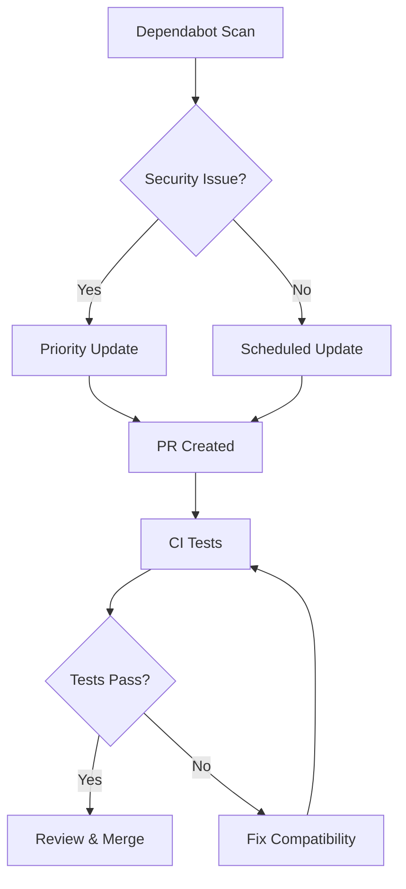

---
tags:
  - security
---

# Dependency Bumps

## Summary

Dependency bumps are routine maintenance updates performed across OpenSearch repositories to keep third-party libraries current, address security vulnerabilities, and maintain compatibility with the latest tooling. These updates are typically automated via Dependabot and reviewed by maintainers.

## Details

### Dependency Update Workflow



### Common Dependency Categories

| Category | Examples | Purpose |
|----------|----------|---------|
| Build Tools | Gradle, Maven plugins | Build automation |
| Testing | JUnit, Mockito | Test frameworks |
| Logging | SLF4J, Log4j | Logging infrastructure |
| Security | Cryptacular, Passay | Security utilities |
| Utilities | Commons CLI, Guava | General utilities |
| Frameworks | Spring | Application framework |

### Dependabot Configuration

Most OpenSearch repositories use Dependabot with configuration in `.github/dependabot.yml`:

```yaml
version: 2
updates:
  - package-ecosystem: "gradle"
    directory: "/"
    schedule:
      interval: "weekly"
    open-pull-requests-limit: 10
```

### Security-Related Updates

Security-related dependency updates are prioritized and may include:
- CVE fixes in transitive dependencies
- Cryptographic library updates
- Authentication/authorization library patches

## Limitations

- Dependency updates may introduce breaking changes requiring code modifications
- Some updates may be blocked by compatibility requirements with OpenSearch core
- Transitive dependency conflicts may require manual resolution

## Change History

- **v3.2.0** (2026-01-10): 20 dependency updates in OpenSearch core including Apache Lucene 10.2.2, Log4j 2.25.1, BouncyCastle FIPS updates, OkHttp 5.1.0, Azure SDK updates, Kafka clients 3.9.1
- **v3.1.0** (2026-01-10): 21 dependency updates in OpenSearch core including CVE-2025-27820 fix (Apache HttpClient5/HttpCore5), Netty 4.1.121.Final, Gson 2.13.1, Azure SDK updates, Gradle Actions 4
- **v2.18.0** (2024-11-05): 19 dependency updates including CVE-2024-7254 fix (protobuf), Gradle 8.10.2, upload-artifact v4
- **v2.17.0** (2024-09-17): 16 dependency updates across Job Scheduler (4 PRs) and Security (12 PRs) plugins

## References

### Documentation
- [Dependabot Documentation](https://docs.github.com/en/code-security/dependabot)
- [CVE-2025-27820](https://www.mend.io/vulnerability-database/CVE-2025-27820): Apache HttpCore5 vulnerability
- [CVE-2024-7254](https://nvd.nist.gov/vuln/detail/CVE-2024-7254): Protobuf DOS vulnerability
- [Job Scheduler Repository](https://github.com/opensearch-project/job-scheduler)
- [Security Plugin Repository](https://github.com/opensearch-project/security)

### Pull Requests
| PR | Description |
|----|-------------|
| [#18573](https://github.com/opensearch-project/OpenSearch/pull/18573) | Bump Apache Lucene to 10.2.2 |
| [#18589](https://github.com/opensearch-project/OpenSearch/pull/18589) | Bump log4j-core from 2.24.3 to 2.25.1 |
| [#18668](https://github.com/opensearch-project/OpenSearch/pull/18668) | Bump BouncyCastle and password4j |
| [#18749](https://github.com/opensearch-project/OpenSearch/pull/18749) | Bump okhttp from 4.12.0 to 5.1.0 |
| [#18646](https://github.com/opensearch-project/OpenSearch/pull/18646) | Bump nebula.ospackage-base from 11.11.2 to 12.0.0 |
| [#18585](https://github.com/opensearch-project/OpenSearch/pull/18585) | Bump gson from 2.13.0 to 2.13.1 |
| [#18586](https://github.com/opensearch-project/OpenSearch/pull/18586) | Bump azure-core-http-netty from 1.15.11 to 1.15.12 |
| [#18645](https://github.com/opensearch-project/OpenSearch/pull/18645) | Bump okio from 3.13.0 to 3.15.0 |
| [#18644](https://github.com/opensearch-project/OpenSearch/pull/18644) | Bump azure-storage-blob from 12.30.0 to 12.30.1 |
| [#18672](https://github.com/opensearch-project/OpenSearch/pull/18672) | Bump failureaccess from 1.0.1 to 1.0.2 |
| [#18691](https://github.com/opensearch-project/OpenSearch/pull/18691) | Bump azure-core from 1.55.3 to 1.55.5 |
| [#18742](https://github.com/opensearch-project/OpenSearch/pull/18742) | Bump azure-storage-common from 12.29.0 to 12.29.1 |
| [#18743](https://github.com/opensearch-project/OpenSearch/pull/18743) | Bump jimfs from 1.3.0 to 1.3.1 |
| [#18745](https://github.com/opensearch-project/OpenSearch/pull/18745) | Bump commons-lang3 from 3.17.0 to 3.18.0 |
| [#18759](https://github.com/opensearch-project/OpenSearch/pull/18759) | Bump nimbus-jose-jwt from 10.2 to 10.4 |
| [#18401](https://github.com/opensearch-project/OpenSearch/pull/18401) | Bump commons-beanutils from 1.9.4 to 1.11.0 |
| [#18803](https://github.com/opensearch-project/OpenSearch/pull/18803) | Bump snappy-java from 1.1.10.7 to 1.1.10.8 |
| [#18935](https://github.com/opensearch-project/OpenSearch/pull/18935) | Bump grgit-core from 5.2.1 to 5.3.2 |
| [#18935](https://github.com/opensearch-project/OpenSearch/pull/18935) | Bump kafka-clients from 3.8.1 to 3.9.1 |
| [#18524](https://github.com/opensearch-project/OpenSearch/pull/18524) | Bump git-auto-commit-action from 5 to 6 |
| PR | Description |
|----|-------------|
| [#18152](https://github.com/opensearch-project/OpenSearch/pull/18152) | Update Apache HttpClient5 and HttpCore5 (CVE-2025-27820) |
| [#18192](https://github.com/opensearch-project/OpenSearch/pull/18192) | Bump netty from 4.1.118.Final to 4.1.121.Final |
| [#17923](https://github.com/opensearch-project/OpenSearch/pull/17923) | Bump com.google.code.gson:gson from 2.12.1 to 2.13.1 |
| [#17922](https://github.com/opensearch-project/OpenSearch/pull/17922) | Bump com.github.spotbugs:spotbugs-annotations from 4.9.0 to 4.9.3 |
| [#17925](https://github.com/opensearch-project/OpenSearch/pull/17925) | Bump com.microsoft.azure:msal4j from 1.18.0 to 1.20.0 |
| [#18101](https://github.com/opensearch-project/OpenSearch/pull/18101) | Bump org.apache.commons:commons-collections4 from 4.4 to 4.5 |
| [#18102](https://github.com/opensearch-project/OpenSearch/pull/18102) | Bump org.apache.commons:commons-text from 1.13.0 to 1.13.1 |
| [#18103](https://github.com/opensearch-project/OpenSearch/pull/18103) | Bump org.apache.commons:commons-configuration2 from 2.11.0 to 2.12.0 |
| [#18104](https://github.com/opensearch-project/OpenSearch/pull/18104) | Bump com.nimbusds:nimbus-jose-jwt from 10.0.2 to 10.3 |
| [#18243](https://github.com/opensearch-project/OpenSearch/pull/18243) | Bump reactor-netty from 1.2.4 to 1.2.5 |
| [#18263](https://github.com/opensearch-project/OpenSearch/pull/18263) | Bump com.maxmind.geoip2:geoip2 from 4.2.1 to 4.3.1 |
| [#18264](https://github.com/opensearch-project/OpenSearch/pull/18264) | Bump lycheeverse/lychee-action from 2.4.0 to 2.4.1 |
| [#18265](https://github.com/opensearch-project/OpenSearch/pull/18265) | Bump com.azure:azure-core-http-netty from 1.15.7 to 1.15.10 |
| [#18335](https://github.com/opensearch-project/OpenSearch/pull/18335) | Bump com.azure:azure-json from 1.3.0 to 1.5.0 |
| [#18368](https://github.com/opensearch-project/OpenSearch/pull/18368) | Bump org.jline:jline from 3.29.0 to 3.30.4 |
| [#18369](https://github.com/opensearch-project/OpenSearch/pull/18369) | Bump com.nimbusds:oauth2-oidc-sdk from 11.23.1 to 11.25 |
| [#18371](https://github.com/opensearch-project/OpenSearch/pull/18371) | Bump gradle/actions from 3 to 4 |
| [#18415](https://github.com/opensearch-project/OpenSearch/pull/18415) | Bump com.azure:azure-storage-common from 12.28.0 to 12.29.0 |
| [#18468](https://github.com/opensearch-project/OpenSearch/pull/18468) | Bump com.squareup.okio:okio from 3.10.2 to 3.12.0 |
| [#18469](https://github.com/opensearch-project/OpenSearch/pull/18469) | Bump com.azure:azure-xml from 1.1.0 to 1.2.0 |
| [#18470](https://github.com/opensearch-project/OpenSearch/pull/18470) | Bump com.maxmind.db:maxmind-db from 3.1.1 to 3.2.0 |
| PR | Description |
|----|-------------|
| [#16254](https://github.com/opensearch-project/OpenSearch/pull/16254) | Fix protobuf-java leak through client library dependencies |
| PR | Description |
|----|-------------|
| [#4829](https://github.com/opensearch-project/security/pull/4829) | Bump Gradle to 8.10.2 |
| [#4807](https://github.com/opensearch-project/security/pull/4807) | Bump logback-classic 1.5.8 → 1.5.11 |
| [#4824](https://github.com/opensearch-project/security/pull/4824) | Bump passay 1.6.5 → 1.6.6 |
| [#4767](https://github.com/opensearch-project/security/pull/4767) | Bump junit-jupiter 5.11.0 → 5.11.2 |
| [#4789](https://github.com/opensearch-project/security/pull/4789) | Bump metrics-core 4.2.27 → 4.2.28 |
| [#4737](https://github.com/opensearch-project/security/pull/4737) | Bump nimbus-jose-jwt 9.40 → 9.41.2 |
| [#4788](https://github.com/opensearch-project/security/pull/4788) | Bump asm 9.7 → 9.7.1 |
| [#4786](https://github.com/opensearch-project/security/pull/4786) | Bump google-java-format |
| PR | Description |
|----|-------------|
| [#3083](https://github.com/opensearch-project/ml-commons/pull/3083) | Bump protobuf to 3.25.5 (CVE-2024-7254 fix) |
| PR | Description |
|----|-------------|
| [#679](https://github.com/opensearch-project/job-scheduler/pull/679) | Bump org.gradle.test-retry 1.5.10 → 1.6.0 |
| [#684](https://github.com/opensearch-project/job-scheduler/pull/684) | Bump google-java-format |
| [#688](https://github.com/opensearch-project/job-scheduler/pull/688) | Gradle 8.10.2 + JDK 23 CI checks |
| PR | Description |
|----|-------------|
| [#746](https://github.com/opensearch-project/common-utils/pull/746) | Update Gradle to 8.10.2 |
| PR | Description |
|----|-------------|
| [#264](https://github.com/opensearch-project/notifications/pull/264) | Upgrade upload-artifact to v4 |
| PR | Description |
|----|-------------|
| [#462](https://github.com/opensearch-project/reporting/pull/462) | Bump dompurify to 3.0.11 (CVE fix) |
| PR | Description |
|----|-------------|
| [#450](https://github.com/opensearch-project/OpenSearch-Dashboards/pull/450) | Bump actions/upload-artifact |
| [#449](https://github.com/opensearch-project/OpenSearch-Dashboards/pull/449) | Update to latest SVG |
| PR | Description |
|----|-------------|
| [#1252](https://github.com/opensearch-project/index-management/pull/1252) | Upgrade upload-artifact to version 3 |
| PR | Description |
|----|-------------|
| [#653](https://github.com/opensearch-project/job-scheduler/pull/653) | Bump org.gradle.test-retry from 1.5.9 to 1.5.10 |
| [#663](https://github.com/opensearch-project/job-scheduler/pull/663) | Bump google-java-format |
| [#666](https://github.com/opensearch-project/job-scheduler/pull/666) | Bump slf4j-api from 2.0.13 to 2.0.16 |
| [#668](https://github.com/opensearch-project/job-scheduler/pull/668) | Bump nebula.ospackage from 11.9.1 to 11.10.0 |
| PR | Description |
|----|-------------|
| [#4696](https://github.com/opensearch-project/security/pull/4696) | Bump error_prone_annotations from 2.30.0 to 2.31.0 |
| [#4682](https://github.com/opensearch-project/security/pull/4682) | Bump passay from 1.6.4 to 1.6.5 |
| [#4661](https://github.com/opensearch-project/security/pull/4661) | Bump spring_version from 5.3.37 to 5.3.39 |
| [#4659](https://github.com/opensearch-project/security/pull/4659) | Bump commons-cli from 1.8.0 to 1.9.0 |
| [#4657](https://github.com/opensearch-project/security/pull/4657) | Bump junit-jupiter from 5.10.3 to 5.11.0 |
| [#4656](https://github.com/opensearch-project/security/pull/4656) | Bump cryptacular from 1.2.6 to 1.2.7 |
| [#4646](https://github.com/opensearch-project/security/pull/4646) | Update Gradle to 8.10 |
| [#4639](https://github.com/opensearch-project/security/pull/4639) | Bump snappy-java from 1.1.10.5 to 1.1.10.6 |
| [#4622](https://github.com/opensearch-project/security/pull/4622) | Bump google-java-format from 1.22.0 to 1.23.0 |
| [#4660](https://github.com/opensearch-project/security/pull/4660) | Bump metrics-core from 4.2.26 to 4.2.27 |
| [#4681](https://github.com/opensearch-project/security/pull/4681) | Bump nebula.ospackage from 11.9.1 to 11.10.0 |
| [#4623](https://github.com/opensearch-project/security/pull/4623) | Bump checker-qual from 3.45.0 to 3.46.0 |

### Issues (Design / RFC)
- [Issue #16253](https://github.com/opensearch-project/OpenSearch/issues/16253): protobuf-java leak bug report
- [Issue #2998](https://github.com/opensearch-project/ml-commons/issues/2998): tribuo-clustering-kmeans vulnerability
