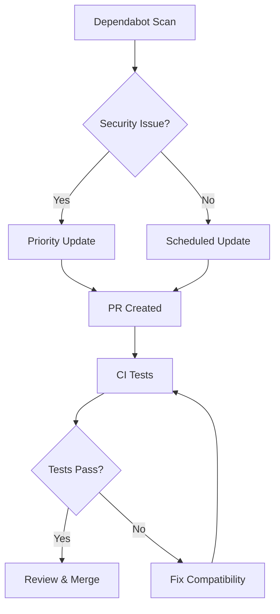

# Dependency Bumps

## Summary

Dependency bumps are routine maintenance updates performed across OpenSearch repositories to keep third-party libraries current, address security vulnerabilities, and maintain compatibility with the latest tooling. These updates are typically automated via Dependabot and reviewed by maintainers.

## Details

### Dependency Update Workflow



### Common Dependency Categories

| Category | Examples | Purpose |
|----------|----------|---------|
| Build Tools | Gradle, Maven plugins | Build automation |
| Testing | JUnit, Mockito | Test frameworks |
| Logging | SLF4J, Log4j | Logging infrastructure |
| Security | Cryptacular, Passay | Security utilities |
| Utilities | Commons CLI, Guava | General utilities |
| Frameworks | Spring | Application framework |

### Dependabot Configuration

Most OpenSearch repositories use Dependabot with configuration in `.github/dependabot.yml`:

```yaml
version: 2
updates:
  - package-ecosystem: "gradle"
    directory: "/"
    schedule:
      interval: "weekly"
    open-pull-requests-limit: 10
```

### Security-Related Updates

Security-related dependency updates are prioritized and may include:
- CVE fixes in transitive dependencies
- Cryptographic library updates
- Authentication/authorization library patches

## Limitations

- Dependency updates may introduce breaking changes requiring code modifications
- Some updates may be blocked by compatibility requirements with OpenSearch core
- Transitive dependency conflicts may require manual resolution

## Related PRs

### v2.17.0

#### Job Scheduler
| PR | Description |
|----|-------------|
| [#653](https://github.com/opensearch-project/job-scheduler/pull/653) | Bump org.gradle.test-retry from 1.5.9 to 1.5.10 |
| [#663](https://github.com/opensearch-project/job-scheduler/pull/663) | Bump google-java-format |
| [#666](https://github.com/opensearch-project/job-scheduler/pull/666) | Bump slf4j-api from 2.0.13 to 2.0.16 |
| [#668](https://github.com/opensearch-project/job-scheduler/pull/668) | Bump nebula.ospackage from 11.9.1 to 11.10.0 |

#### Security
| PR | Description |
|----|-------------|
| [#4696](https://github.com/opensearch-project/security/pull/4696) | Bump error_prone_annotations from 2.30.0 to 2.31.0 |
| [#4682](https://github.com/opensearch-project/security/pull/4682) | Bump passay from 1.6.4 to 1.6.5 |
| [#4661](https://github.com/opensearch-project/security/pull/4661) | Bump spring_version from 5.3.37 to 5.3.39 |
| [#4659](https://github.com/opensearch-project/security/pull/4659) | Bump commons-cli from 1.8.0 to 1.9.0 |
| [#4657](https://github.com/opensearch-project/security/pull/4657) | Bump junit-jupiter from 5.10.3 to 5.11.0 |
| [#4656](https://github.com/opensearch-project/security/pull/4656) | Bump cryptacular from 1.2.6 to 1.2.7 |
| [#4646](https://github.com/opensearch-project/security/pull/4646) | Update Gradle to 8.10 |
| [#4639](https://github.com/opensearch-project/security/pull/4639) | Bump snappy-java from 1.1.10.5 to 1.1.10.6 |
| [#4622](https://github.com/opensearch-project/security/pull/4622) | Bump google-java-format from 1.22.0 to 1.23.0 |
| [#4660](https://github.com/opensearch-project/security/pull/4660) | Bump metrics-core from 4.2.26 to 4.2.27 |
| [#4681](https://github.com/opensearch-project/security/pull/4681) | Bump nebula.ospackage from 11.9.1 to 11.10.0 |
| [#4623](https://github.com/opensearch-project/security/pull/4623) | Bump checker-qual from 3.45.0 to 3.46.0 |

## References

- [Dependabot Documentation](https://docs.github.com/en/code-security/dependabot)
- [Job Scheduler Repository](https://github.com/opensearch-project/job-scheduler)
- [Security Plugin Repository](https://github.com/opensearch-project/security)

## Change History

- **v2.17.0** (2024-09-17): 16 dependency updates across Job Scheduler (4 PRs) and Security (12 PRs) plugins
