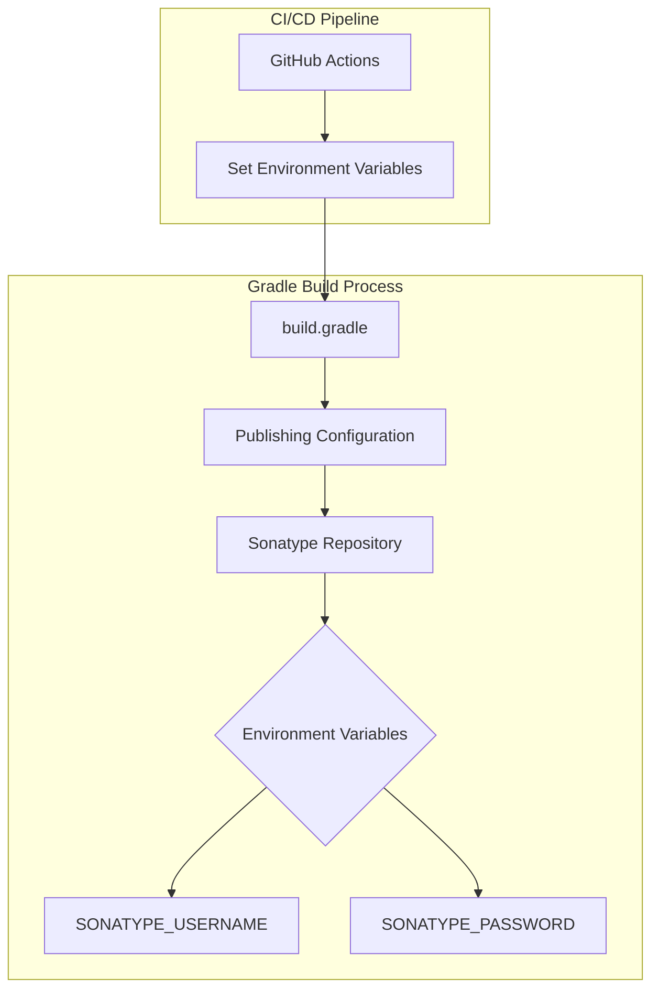

# Gradle 9 Compatibility

## Summary

Gradle 9 introduced breaking changes in how environment variables are accessed in Gradle build scripts. The `$System.env.VARIABLE_NAME` string interpolation syntax is no longer supported and must be replaced with the `System.getenv("VARIABLE_NAME")` method call. This affects OpenSearch plugin repositories that use environment variables for Sonatype credentials during SNAPSHOT publication.

## Details

### Architecture



### Problem

The deprecated syntax using string interpolation for environment variables fails in Gradle 9:

```gradle
// This syntax fails in Gradle 9
credentials {
    username "$System.env.SONATYPE_USERNAME"
    password "$System.env.SONATYPE_PASSWORD"
}
```

Error message: The build fails during the `publishToSonatype` task when attempting to resolve credentials.

### Solution

Use the `System.getenv()` method which is compatible with all Gradle versions:

```gradle
// Gradle 9 compatible syntax
credentials {
    username System.getenv("SONATYPE_USERNAME")
    password System.getenv("SONATYPE_PASSWORD")
}
```

### Configuration

| Setting | Description | Example |
|---------|-------------|---------|
| `SONATYPE_USERNAME` | Sonatype repository username | Set in CI environment |
| `SONATYPE_PASSWORD` | Sonatype repository password/token | Set in CI environment |

### Usage Example

```gradle
publishing {
    repositories {
        maven {
            name = "Snapshots"
            url = "https://central.sonatype.com/repository/maven-snapshots/"
            credentials {
                username System.getenv("SONATYPE_USERNAME")
                password System.getenv("SONATYPE_PASSWORD")
            }
        }
    }
}
```

## Limitations

- The fix is specific to Sonatype credentials; other environment variable usages may need similar updates
- Requires Gradle wrapper update to Gradle 9+ for full compatibility testing

## Change History

- **v3.3.0** (2026-01): Fixed Gradle 9 compatibility across 16 plugin repositories by updating `$System.env` syntax to `System.getenv()`

## References

### Documentation
- [Gradle 9 Release Notes](https://docs.gradle.org/9.0/release-notes.html): Official Gradle 9 documentation
- [opensearch-remote-metadata-sdk#245](https://github.com/opensearch-project/opensearch-remote-metadata-sdk/pull/245): Original fix that restored successful snapshots
- [Example failed workflow](https://github.com/opensearch-project/opensearch-remote-metadata-sdk/actions/runs/17023398832/job/48255946880#step:5:74): CI failure demonstrating the issue

### Pull Requests
| Version | PR | Description | Related Issue |
|---------|-----|-------------|---------------|
| v3.3.0 | [alerting#1920](https://github.com/opensearch-project/alerting/pull/1920) | alerting plugin fix |   |
| v3.3.0 | [asynchronous-search#763](https://github.com/opensearch-project/asynchronous-search/pull/763) | asynchronous-search plugin fix |   |
| v3.3.0 | [common-utils#867](https://github.com/opensearch-project/common-utils/pull/867) | common-utils fix |   |
| v3.3.0 | [cross-cluster-replication#1575](https://github.com/opensearch-project/cross-cluster-replication/pull/1575) | CCR plugin fix |   |
| v3.3.0 | [custom-codecs#273](https://github.com/opensearch-project/custom-codecs/pull/273) | custom-codecs plugin fix |   |
| v3.3.0 | [geospatial#791](https://github.com/opensearch-project/geospatial/pull/791) | geospatial plugin fix |   |
| v3.3.0 | [index-management#1474](https://github.com/opensearch-project/index-management/pull/1474) | index-management plugin fix |   |
| v3.3.0 | [job-scheduler#821](https://github.com/opensearch-project/job-scheduler/pull/821) | job-scheduler plugin fix |   |
| v3.3.0 | [opensearch-system-templates#95](https://github.com/opensearch-project/opensearch-system-templates/pull/95) | system-templates fix |   |
| v3.3.0 | [query-insights#407](https://github.com/opensearch-project/query-insights/pull/407) | query-insights plugin fix |   |
| v3.3.0 | [reporting#1120](https://github.com/opensearch-project/reporting/pull/1120) | reporting plugin fix |   |
| v3.3.0 | [notifications#1069](https://github.com/opensearch-project/notifications/pull/1069) | notifications plugin fix |   |
| v3.3.0 | [opensearch-learning-to-rank-base#219](https://github.com/opensearch-project/opensearch-learning-to-rank-base/pull/219) | learning-to-rank plugin fix |   |
| v3.3.0 | [user-behavior-insights#122](https://github.com/opensearch-project/user-behavior-insights/pull/122) | UBI plugin fix |   |
| v3.3.0 | [dashboards-search-relevance#227](https://github.com/opensearch-project/dashboards-search-relevance/pull/227) | search-relevance fix |   |
| v3.3.0 | [skills#630](https://github.com/opensearch-project/skills/pull/630) | skills plugin fix |   |
