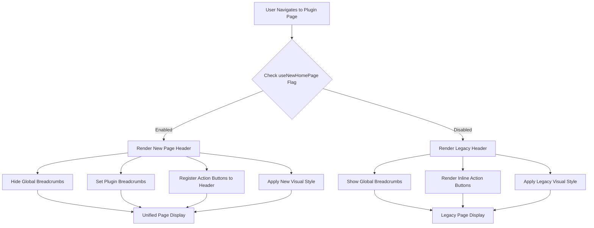

# Header Redesign

## Summary

The Header Redesign feature provides a unified, modern page header component across all OpenSearch Dashboards plugins. This cross-plugin initiative standardizes the visual design and interaction patterns for page headers, supporting both the new navigation system and legacy navigation modes. The redesign improves user experience by providing consistent breadcrumb handling, action button placement, and visual hierarchy across all plugin pages.

## Details

### Architecture

```mermaid
graph TB
    subgraph "OpenSearch Dashboards Core"
        Chrome[Chrome Service]
        NavSystem[Navigation System]
        HeaderAPI[Page Header API]
    end
    
    subgraph "Feature Flag"
        Flag[useNewHomePage]
    end
    
    subgraph "Plugin Layer"
        subgraph "Anomaly Detection"
            AD_Dashboard[Dashboard]
            AD_List[Detector List]
            AD_Detail[Detector Detail]
            AD_Create[Create Detector]
        end
        
        subgraph "Observability"
            OBS_Metrics[Metrics]
            OBS_Apps[Applications]
            OBS_Notebooks[Notebooks]
        end
        
        subgraph "Index Management"
            ISM_Snapshots[Snapshots]
            ISM_Policies[ISM Policies]
            ISM_DataStreams[Data Streams]
            ISM_Rollups[Rollup Jobs]
            ISM_Templates[Templates]
        end
        
        subgraph "Other Plugins"
            SEC[Security]
            NOT[Notifications]
            SR[Search Relevance]
            ML[ML Commons]
        end
    end
    
    Flag --> HeaderAPI
    Chrome --> HeaderAPI
    NavSystem --> HeaderAPI
    HeaderAPI --> AD_Dashboard
    HeaderAPI --> AD_List
    HeaderAPI --> AD_Detail
    HeaderAPI --> AD_Create
    HeaderAPI --> OBS_Metrics
    HeaderAPI --> OBS_Apps
    HeaderAPI --> OBS_Notebooks
    HeaderAPI --> ISM_Snapshots
    HeaderAPI --> ISM_Policies
    HeaderAPI --> ISM_DataStreams
    HeaderAPI --> ISM_Rollups
    HeaderAPI --> ISM_Templates
    HeaderAPI --> SEC
    HeaderAPI --> NOT
    HeaderAPI --> SR
    HeaderAPI --> ML
```



### Data Flow



### Components

| Component | Description |
|-----------|-------------|
| Page Header API | Core API for registering page headers with breadcrumbs and actions |
| Navigation System | Controls the overall navigation mode (new vs legacy) |
| useNewHomePage Flag | Feature flag controlling header style selection |
| Chrome Service | Provides breadcrumb and header action menu APIs |
| Plugin Header Components | Individual plugin implementations of the page header |

### Configuration

| Setting | Description | Default |
|---------|-------------|---------|
| `useNewHomePage` | Enable new page header and navigation | `false` |
| `navigation.style` | Navigation style (condensed/expanded) | `expanded` |

### Supported Plugins

| Plugin | Repository | Pages Updated |
|--------|------------|---------------|
| Anomaly Detection | anomaly-detection-dashboards-plugin | Dashboard, Detector List, Detector Detail, Create Detector |
| Observability | dashboards-observability | Metrics, Applications, Notebooks |
| Security | security-dashboards-plugin | Threat Detection, Home Page, Various Admin Pages |
| Notifications | dashboards-notifications | All notification pages |
| Search Relevance | dashboards-search-relevance | Search comparison pages |
| Index Management | index-management-dashboards-plugin | Snapshots, ISM Policies, Data Streams, Rollups, Component Templates, Index Templates, Aliases, Transforms, Notification Settings |
| ML Commons | ml-commons-dashboards | Model Registry |

### Usage Example

```typescript
// Plugin implementation supporting new page header
import { useNewPageHeader } from '@osd/core';

const MyPluginPage: React.FC = () => {
  const { chrome, useNewHomePage } = useOpenSearchDashboards();
  
  useEffect(() => {
    if (useNewHomePage) {
      // Set breadcrumbs for new header
      chrome.setBreadcrumbs([
        { text: 'My Plugin' },
        { text: 'Current Page' }
      ]);
      
      // Register action button to header
      chrome.setHeaderActionMenu((
        <EuiButton onClick={handleCreate}>
          Create New
        </EuiButton>
      ));
    }
  }, [useNewHomePage]);
  
  return (
    <div>
      {!useNewHomePage && (
        // Legacy header with inline title and actions
        <EuiPageHeader
          pageTitle="My Plugin Page"
          rightSideItems={[<CreateButton />]}
        />
      )}
      {/* Page content */}
    </div>
  );
};
```

## Limitations

- Plugins not updated in v2.17.0 will retain legacy header style
- Custom third-party plugins need manual updates to support new header
- Some visual inconsistencies may exist during transition period
- Feature flag must be enabled to see new header design

## Change History

- **v2.17.0** (2024-09-17): Initial implementation across 7 plugin repositories with 16 PRs

## References

### Documentation
- [OpenSearch Dashboards Quickstart Guide](https://docs.opensearch.org/2.17/dashboards/quickstart/): Navigation menu documentation
- [Custom Branding](https://docs.opensearch.org/2.17/dashboards/branding/): Condensed header configuration

### Pull Requests
| Version | PR | Repository | Description | Related Issue |
|---------|-----|------------|-------------|---------------|
| v2.17.0 | [#841](https://github.com/opensearch-project/anomaly-detection-dashboards-plugin/pull/841) | anomaly-detection-dashboards-plugin | Header redesign for AD pages |   |
| v2.17.0 | [#2050](https://github.com/opensearch-project/dashboards-observability/pull/2050) | dashboards-observability | New page header for metrics |   |
| v2.17.0 | [#2081](https://github.com/opensearch-project/dashboards-observability/pull/2081) | dashboards-observability | New page header for applications |   |
| v2.17.0 | [#2099](https://github.com/opensearch-project/dashboards-observability/pull/2099) | dashboards-observability | New page header for notebooks |   |
| v2.17.0 | [#236](https://github.com/opensearch-project/dashboards-notifications/pull/236) | dashboards-notifications | Page header for notifications |   |
| v2.17.0 | [#428](https://github.com/opensearch-project/dashboards-search-relevance/pull/428) | dashboards-search-relevance | New page header for search relevance |   |
| v2.17.0 | [#1105](https://github.com/opensearch-project/index-management-dashboards-plugin/pull/1105) | index-management-dashboards-plugin | Update header for Snapshot pages |   |
| v2.17.0 | [#1108](https://github.com/opensearch-project/index-management-dashboards-plugin/pull/1108) | index-management-dashboards-plugin | Update header for ISM policies |   |
| v2.17.0 | [#1115](https://github.com/opensearch-project/index-management-dashboards-plugin/pull/1115) | index-management-dashboards-plugin | Update header for data streams and rollups |   |
| v2.17.0 | [#1122](https://github.com/opensearch-project/index-management-dashboards-plugin/pull/1122) | index-management-dashboards-plugin | Update header for component templates |   |
| v2.17.0 | [#1124](https://github.com/opensearch-project/index-management-dashboards-plugin/pull/1124) | index-management-dashboards-plugin | Update header for aliases, templates, transforms |   |
| v2.17.0 | [#1126](https://github.com/opensearch-project/index-management-dashboards-plugin/pull/1126) | index-management-dashboards-plugin | Update header for notification settings |   |
| v2.17.0 | [#351](https://github.com/opensearch-project/ml-commons-dashboards/pull/351) | ml-commons-dashboards | Support new page header |   |
