# JDK 21 & Java Agent Migration

## Summary

OpenSearch's JDK 21 & Java Agent Migration represents a fundamental shift in how OpenSearch handles security sandboxing. With Java Security Manager (JSM) deprecated in JDK 17 and scheduled for permanent removal in JDK 24, OpenSearch has adopted a Java Agent-based approach for runtime security instrumentation. This migration requires JDK 21 as the minimum runtime and affects all OpenSearch plugins through a new Gradle plugin that simplifies the transition.

## Details

### Architecture


### Security Model Evolution

```mermaid
flowchart TB
    subgraph "Legacy (JDK ≤ 17)"
        SM[Security Manager]
        PP[Policy Files]
        PC[Permission Checks]
        SM --> PP --> PC
    end
    
    subgraph "Modern (JDK 21+)"
        JA[Java Agent]
        BI[Bytecode Instrumentation]
        RC[Runtime Checks]
        JA --> BI --> RC
    end
    
    SM -.->|"Migration"| JA
```



### Components

| Component | Description | Location |
|-----------|-------------|----------|
| opensearch.java-agent | Gradle plugin for Java Agent configuration | OpenSearch build-tools |
| Java Agent JAR | Runtime instrumentation agent | Bundled with OpenSearch |
| JdkJarHellCheck | JDK compatibility validator | org.opensearch.common.bootstrap |

### Configuration

| Setting | Description | Default |
|---------|-------------|---------|
| `sourceCompatibility` | Java source version | `JavaVersion.VERSION_21` |
| `targetCompatibility` | Java target version | `JavaVersion.VERSION_21` |
| `JAVA_HOME` | JDK installation path | System default |
| `OPENSEARCH_JAVA_HOME` | OpenSearch-specific JDK | Not set |

### JDK Version Requirements

| OpenSearch Version | Minimum JDK | Bundled JDK | Notes |
|-------------------|-------------|-------------|-------|
| 1.x | 8/11 | 11/15 | SecurityManager active |
| 2.x | 11 | 17 | SecurityManager deprecated |
| 3.0+ | 21 | 21 | Java Agent replaces SecurityManager |

### Usage Example

```groovy
// Plugin build.gradle configuration
plugins {
    id 'opensearch.opensearchplugin'
    id 'opensearch.java-agent'  // Enable Java Agent support
}

java {
    sourceCompatibility = JavaVersion.VERSION_21
    targetCompatibility = JavaVersion.VERSION_21
}

// For plugins using shadow JAR
plugins {
    id 'com.gradleup.shadow'  // Updated shadow plugin
}
```

```yaml
# CI workflow update (.github/workflows/ci.yml)
jobs:
  build:
    strategy:
      matrix:
        java: [21, 23]  # Removed 11, 17
    steps:
      - uses: actions/setup-java@v4
        with:
          java-version: ${{ matrix.java }}
          distribution: 'temurin'
```

## Limitations

- **JDK 21 Required**: No backward compatibility with JDK 11/17
- **Plugin Recompilation**: All plugins must be recompiled for OpenSearch 3.0
- **SecurityManager Code**: Legacy permission-based code must be refactored
- **Third-party Dependencies**: Some libraries may require updates for JDK 21

## Related PRs

| Version | PR | Repository | Description |
|---------|-----|------------|-------------|
| v3.0.0 | [#17900](https://github.com/opensearch-project/OpenSearch/pull/17900) | OpenSearch | Custom Gradle plugin for Java Agent |
| v3.0.0 | [#730](https://github.com/opensearch-project/flow-framework/pull/730) | flow-framework | JDK 21 target compatibility |
| v3.0.0 | [#1108](https://github.com/opensearch-project/flow-framework/pull/1108) | flow-framework | Java Agent Gradle plugin |
| v3.0.0 | [#1087](https://github.com/opensearch-project/flow-framework/pull/1087) | flow-framework | BC to BCFIPS migration |
| v3.0.0 | [#2422](https://github.com/opensearch-project/k-NN/pull/2422) | k-NN | JDK 21 minimum |
| v3.0.0 | [#1921](https://github.com/opensearch-project/k-NN/pull/1921) | k-NN | Remove JDK 11/17 CI |
| v3.0.0 | [#719](https://github.com/opensearch-project/asynchronous-search/pull/719) | asynchronous-search | Java Agent migration |
| v3.0.0 | [#695](https://github.com/opensearch-project/geospatial/pull/695) | geospatial | JDK 21 baseline |
| v3.0.0 | [#723](https://github.com/opensearch-project/geospatial/pull/723) | geospatial | Gradle 8.10.2, JDK 23 |
| v3.0.0 | [#722](https://github.com/opensearch-project/job-scheduler/pull/722) | job-scheduler | Shadow plugin update |

## References

- [Issue #10745](https://github.com/opensearch-project/OpenSearch/issues/10745): Set OpenSearch 3.0.0 baseline JDK to JDK-21
- [Issue #16634](https://github.com/opensearch-project/OpenSearch/issues/16634): META - Replace Java Security Manager
- [Issue #16753](https://github.com/opensearch-project/OpenSearch/issues/16753): Java Agent implementation tracking
- [JEP 411](https://openjdk.org/jeps/411): Deprecate the Security Manager for Removal
- [JDK 24 Project](https://openjdk.org/projects/jdk/24/): SecurityManager permanently disabled

## Change History

- **v3.0.0** (2025): JDK 21 minimum requirement, Java Agent Gradle plugin, SecurityManager phase-out across all plugins
