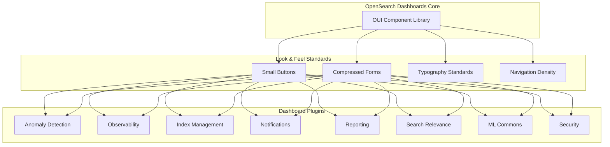

# Look & Feel UI Improvements

## Summary

The Look & Feel UI Improvements initiative is a coordinated effort to standardize the visual appearance and density of OpenSearch Dashboards plugins. This feature introduces consistent button sizes, compressed form components, standardized typography, and improved visual hierarchy across all dashboard plugins, creating a more cohesive and professional user experience.

## Details

### Architecture



### Components

| Component Category | Standard Component | Compressed/Small Variant |
|-------------------|-------------------|-------------------------|
| Primary Button | `EuiButton` | `EuiSmallButton` |
| Empty Button | `EuiButtonEmpty` | `EuiSmallButtonEmpty` |
| Icon Button | `EuiButtonIcon` | `EuiSmallButtonIcon` |
| Text Field | `EuiFieldText` | `EuiCompressedFieldText` |
| Select | `EuiSelect` | `EuiCompressedSelect` |
| Number Field | `EuiFieldNumber` | `EuiCompressedFieldNumber` |
| Checkbox | `EuiCheckbox` | `EuiCompressedCheckbox` |
| Radio | `EuiRadio` | `EuiCompressedRadio` |
| Switch | `EuiSwitch` | `EuiCompressedSwitch` |
| Tabs | `EuiTabs` | `EuiTabs size="s"` |
| Context Menu | `EuiContextMenu` | `EuiContextMenu size="s"` |

### Design Guidelines

#### Typography Hierarchy

| Element | Implementation | Font Size |
|---------|---------------|-----------|
| Page Title | H1 in `<EuiText size="s">` | Semantic H1 |
| Modal/Flyout Title | H2 in `<EuiText size="s">` | Semantic H2 |
| Section Header | H3 in `<EuiText size="s">` | Semantic H3 |
| Body Text | `<EuiText size="s">` | 15.75px (Next) / 14px (V7) |

#### Button Usage Rules

1. **Primary Button**: One per view, for the main call to action
2. **Secondary Button**: For supporting actions
3. **Danger Button**: For destructive actions (delete, remove)
4. **Empty Button**: For tertiary or less prominent actions

### Configuration

No configuration is required. The Look & Feel improvements are applied automatically when using the updated OUI components.

### Usage Example

```tsx
import {
  EuiSmallButton,
  EuiSmallButtonEmpty,
  EuiCompressedFieldText,
  EuiCompressedSelect,
  EuiText,
  EuiTabs,
  EuiTab,
} from '@elastic/eui';

const MyComponent = () => {
  return (
    <EuiText size="s">
      <h1>Page Title</h1>
      
      <EuiCompressedFieldText
        placeholder="Enter value"
        value={value}
        onChange={handleChange}
      />
      
      <EuiCompressedSelect
        options={options}
        value={selected}
        onChange={handleSelect}
      />
      
      <EuiTabs size="s">
        <EuiTab isSelected={tab === 'overview'}>Overview</EuiTab>
        <EuiTab isSelected={tab === 'details'}>Details</EuiTab>
      </EuiTabs>
      
      <EuiSmallButtonEmpty onClick={handleCancel}>
        Cancel
      </EuiSmallButtonEmpty>
      <EuiSmallButton fill onClick={handleSubmit}>
        Submit
      </EuiSmallButton>
    </EuiText>
  );
};
```

## Limitations

- Requires updating existing code to use new component variants
- Custom styled components may need manual adjustments
- Theme-specific font sizes may vary between Next and V7 themes
- Some third-party components may not follow the same density standards

## Related PRs

| Version | PR | Repository | Description |
|---------|-----|------------|-------------|
| v2.17.0 | [#826](https://github.com/opensearch-project/anomaly-detection-dashboards-plugin/pull/826) | anomaly-detection-dashboards-plugin | Smaller buttons and compressed form components |
| v2.17.0 | [#836](https://github.com/opensearch-project/anomaly-detection-dashboards-plugin/pull/836) | anomaly-detection-dashboards-plugin | Consistency and density improvements |
| v2.17.0 | [#2068](https://github.com/opensearch-project/dashboards-observability/pull/2068) | dashboards-observability | Smaller buttons and compressed form components |
| v2.17.0 | [#2071](https://github.com/opensearch-project/dashboards-observability/pull/2071) | dashboards-observability | Integrations density and consistency improvements |
| v2.17.0 | [#1103](https://github.com/opensearch-project/index-management-dashboards-plugin/pull/1103) | index-management-dashboards-plugin | Smaller buttons and compressed form components |
| v2.17.0 | [#231](https://github.com/opensearch-project/dashboards-notifications/pull/231) | dashboards-notifications | Smaller buttons and compressed form components |
| v2.17.0 | [#398](https://github.com/opensearch-project/dashboards-reporting/pull/398) | dashboards-reporting | Smaller buttons and compressed form components |
| v2.17.0 | [#421](https://github.com/opensearch-project/dashboards-search-relevance/pull/421) | dashboards-search-relevance | Smaller buttons and compressed form components |
| v2.17.0 | [#349](https://github.com/opensearch-project/ml-commons-dashboards/pull/349) | ml-commons-dashboards | Smaller buttons and compressed form components |

## References

- [OpenSearch Dashboards Advanced Settings](https://docs.opensearch.org/2.17/dashboards/management/advanced-settings/): Customize look and feel settings
- [OpenSearch Dashboards](https://docs.opensearch.org/2.17/dashboards/): Main dashboards documentation

## Change History

- **v2.17.0** (2024-09-17): Initial implementation across multiple dashboard plugins
