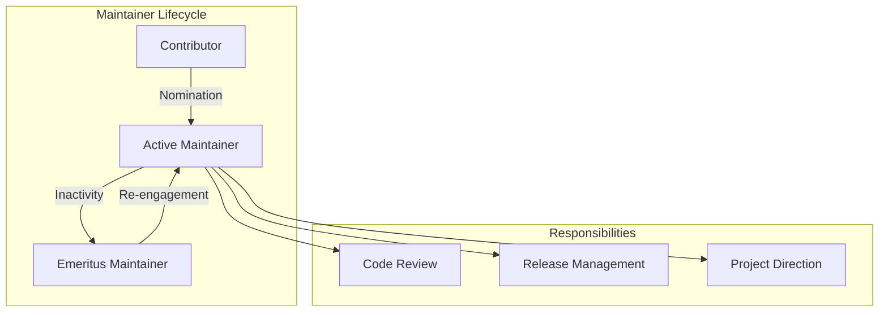

# Maintainer Updates

## Summary

OpenSearch project governance includes maintaining accurate MAINTAINERS.md files across all repositories. These files document active maintainers responsible for code review, release management, and project direction. Periodic updates add new maintainers and transition inactive contributors to emeritus status.

## Details

### Governance Structure

### Maintainer Status Types

| Status | Description |
|--------|-------------|
| Active | Current maintainers with commit access and review responsibilities |
| Emeritus | Former maintainers who are no longer actively contributing |

### MAINTAINERS.md Structure

Each OpenSearch repository contains a MAINTAINERS.md file with:
- List of active maintainers with GitHub handles and affiliations
- Emeritus section for former maintainers
- Alphabetical ordering for consistency

## Limitations

- Maintainer updates are administrative and do not affect software functionality
- Changes require consensus from existing maintainers

## Related PRs

| Version | PR | Repository | Description |
|---------|-----|------------|-------------|
| v2.18.0 | [#8415](https://github.com/opensearch-project/OpenSearch-Dashboards/pull/8415) | opensearch-dashboards | Add Hailong-am as maintainer |
| v2.17.0 | [#4673](https://github.com/opensearch-project/security/pull/4673) | security | Add Nils Bandener as maintainer |
| v2.17.0 | [#1233](https://github.com/opensearch-project/index-management/pull/1233) | index-management | Move inactive maintainers to emeritus |

## References

- [OpenSearch Project Governance](https://github.com/opensearch-project/.github/blob/main/GOVERNANCE.md)
- [Issue #1230](https://github.com/opensearch-project/index-management/issues/1230): Index Management maintainer update request

## Change History

- **v2.18.0** (2024-10-22): Added Hailong Cui (Hailong-am) as maintainer for OpenSearch Dashboards
- **v2.17.0** (2024-09-17): Added maintainers (nibix to security, sumukhswamy to dashboards, riysaxen to notifications); moved inactive index-management maintainers to emeritus
