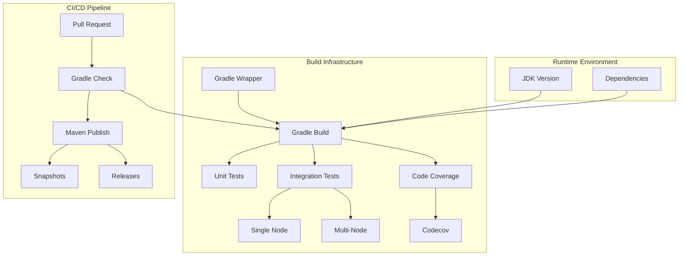

---
tags:
  - indexing
---

# Build Infrastructure (Gradle/JDK)

## Summary

OpenSearch maintains a coordinated build infrastructure across its ecosystem of repositories, ensuring consistent Gradle versions, JDK support, and CI/CD practices. This infrastructure enables reliable builds, comprehensive testing, and streamlined release processes across 50+ repositories.

## Details

### Architecture



### Components

| Component | Description |
|-----------|-------------|
| Gradle Wrapper | Ensures consistent Gradle version across all builds |
| JDK Configuration | CI workflows configured for specific JDK versions |
| Maven Publishing | Snapshot and release artifact publishing |
| Code Coverage | JaCoCo integration with Codecov reporting |
| Integration Tests | Single and multi-node test configurations |

### Configuration

| Setting | Description | Current Value |
|---------|-------------|---------------|
| Gradle Version | Build tool version | 9.2.0 (plugins), 9.1.0 (core) |
| JDK (Bundled) | Bundled JDK version | 25.0.1+8 |
| JDK (Runtime) | Minimum runtime JDK | 21 |
| JDK Vendor | JDK distribution | Adoptium Temurin |
| Kotlin Version | Kotlin plugin version | 2.2.0 |
| Codecov | Code coverage reporting | Enabled |

### Usage Example

```groovy
// build.gradle - Gradle wrapper configuration
wrapper {
    gradleVersion = '9.1.0'
    distributionType = Wrapper.DistributionType.ALL
}

// CI workflow - JDK configuration
// .github/workflows/ci.yml
jobs:
  build:
    runs-on: ubuntu-latest
    steps:
      - uses: actions/setup-java@v4
        with:
          java-version: '25'
          distribution: 'temurin'
```

### Multi-Node Testing

```yaml
# Example multi-node integration test workflow
jobs:
  multi-node-test:
    runs-on: ubuntu-latest
    steps:
      - name: Run multi-node integration tests
        run: ./gradlew integTestMultiNode
```

## Limitations

- JDK 25 is bundled; production deployments may use different JDK versions
- Some third-party dependencies may require updates for full JDK 25 compatibility
- Gradle version upgrades may require plugin compatibility updates
- Gradle warning mode temporarily set to `all` pending Protobuf plugin update

## Change History

- **v3.4.0** (2026-01): Gradle 9.2 and JDK 25 upgrades across 24 plugin repositories (alerting, anomaly-detection, asynchronous-search, common-utils, cross-cluster-replication, custom-codecs, geospatial, index-management, job-scheduler, k-NN, learning-to-rank, ml-commons, neural-search, notifications, observability, performance-analyzer, query-insights, reporting, search-processor, security, skills, system-templates, user-behavior-insights)
- **v3.4.0** (2026-01): Gradle 9.1, bundled JDK 25.0.1+8, forbiddenapis 3.10, Mockito 5.20.0 (OpenSearch core)
- **v3.2.0** (2025): Gradle 8.14/8.14.3, JDK 24 CI support, multi-node testing, Codecov integration, Maven endpoint updates

## References

### Documentation
- [Gradle Documentation](https://docs.gradle.org/): Official Gradle documentation
- [Adoptium](https://adoptium.net/): Eclipse Temurin JDK distribution
- [OpenJDK](https://openjdk.org/): OpenJDK project

### Blog Posts
- [OpenSearch automated build system](https://opensearch.org/blog/public-jenkins/): Public Jenkins infrastructure

### Pull Requests
| Version | PR | Repository | Description | Related Issue |
|---------|-----|------------|-------------|---------------|
| v3.4.0 | [#19575](https://github.com/opensearch-project/OpenSearch/pull/19575) | OpenSearch | Update to Gradle 9.1 |   |
| v3.4.0 | [#19698](https://github.com/opensearch-project/OpenSearch/pull/19698) | OpenSearch | Update bundled JDK to JDK-25 | [#19314](https://github.com/opensearch-project/OpenSearch/issues/19314) |
| v3.4.0 | [#2984](https://github.com/opensearch-project/k-NN/pull/2984) | k-NN | Gradle 9.2.0 and GitHub Actions JDK 25 Upgrade | [#2976](https://github.com/opensearch-project/k-NN/issues/2976) |
| v3.4.0 | [#1995](https://github.com/opensearch-project/alerting/pull/1995) | alerting | JDK upgrade to 25 and gradle upgrade to 9.2 |   |
| v3.4.0 | [#4465](https://github.com/opensearch-project/ml-commons/pull/4465) | ml-commons | Update JDK to 25 and Gradle to 9.2 | [#4389](https://github.com/opensearch-project/ml-commons/issues/4389) |
| v3.4.0 | [#1667](https://github.com/opensearch-project/neural-search/pull/1667) | neural-search | Update to Gradle 9.2 and run CI checks with JDK 25 |   |
| v3.4.0 | [#1618](https://github.com/opensearch-project/security/pull/1618) | security | JDK upgrade to 25 and gradle upgrade to 9.2 | [#969](https://github.com/opensearch-project/security/issues/969) |
| v3.4.0 | [#1534](https://github.com/opensearch-project/index-management/pull/1534) | index-management | Upgrade gradle to 9.2.0 and github actions JDK 25 |   |
| v3.4.0 | [#1101](https://github.com/opensearch-project/notifications/pull/1101) | notifications | Upgrade Gradle to 9.2 and github actions to support java 25 |   |
| v3.4.0 | [#1623](https://github.com/opensearch-project/anomaly-detection/pull/1623) | anomaly-detection | Update CI to JDK 25 and gradle to 9.2 | [#1601](https://github.com/opensearch-project/anomaly-detection/issues/1601) |
| v3.2.0 | [#2792](https://github.com/opensearch-project/k-NN/pull/2792) | k-NN | Bump JDK to 24, Gradle to 8.14 |   |
| v3.2.0 | [#2828](https://github.com/opensearch-project/k-NN/pull/2828) | k-NN | Bump Gradle to 8.14.3 |   |
| v3.2.0 | [#3983](https://github.com/opensearch-project/ml-commons/pull/3983) | ml-commons | Gradle 8.14, JDK 24 |   |
| v3.2.0 | [#4026](https://github.com/opensearch-project/ml-commons/pull/4026) | ml-commons | Lombok update for JDK 24 |   |
| v3.2.0 | [#1445](https://github.com/opensearch-project/index-management/pull/1445) | index-management | Gradle 8.14, Kotlin 2.2.0, JDK 24 |   |
| v3.2.0 | [#1320](https://github.com/opensearch-project/neural-search/pull/1320) | neural-search | Multi-node integration tests | [#1307](https://github.com/opensearch-project/neural-search/issues/1307) |
| v3.2.0 | [#1911](https://github.com/opensearch-project/alerting/pull/1911) | alerting | Gradle 8.14, JDK 24 |   |

### Issues (Design / RFC)
- [Issue #19314](https://github.com/opensearch-project/OpenSearch/issues/19314): Update bundled JDK to JDK25
- [Issue #2976](https://github.com/opensearch-project/k-NN/issues/2976): k-NN Gradle/JDK upgrade tracking
- [Issue #4389](https://github.com/opensearch-project/ml-commons/issues/4389): ml-commons Gradle/JDK upgrade tracking
