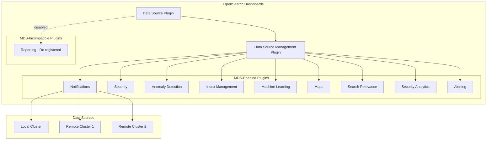
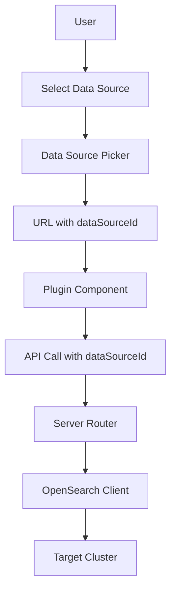

---
tags:
  - multi-plugin
---
# Multi-Data Source Support

## Summary

Multi-Data Source (MDS) is a feature in OpenSearch Dashboards that allows users to connect to and manage multiple OpenSearch clusters from a single Dashboards instance. This enables centralized monitoring, querying, and visualization across different data sources without switching between multiple Dashboards deployments.

MDS support has been progressively added to various OpenSearch Dashboards plugins, allowing each plugin to work with data from different connected clusters.

## Details

### Architecture



### Data Flow



### Components

| Component | Description |
|-----------|-------------|
| Data Source Plugin | Core plugin that manages data source connections and authentication |
| Data Source Management Plugin | UI for creating, editing, and managing data source connections |
| Data Source Picker | Dropdown component for selecting active data source |
| `dataSourceId` | Unique identifier for each connected data source |
| `DataSourceMenuContext` | React context for sharing data source state across components |
| `dataSourceObservable` | RxJS BehaviorSubject for reactive data source state management |

### Configuration

| Setting | Description | Default |
|---------|-------------|---------|
| `data_source.enabled` | Enable/disable MDS feature | `false` |
| `data_source.manageableBy` | Control who can manage data sources (`all`, `dashboard_admin`, `none`) | `all` |
| `data_source.hideLocalCluster` | Hide local cluster from data source picker | `false` |
| `data_source.authTypes.NoAuthentication.enabled` | Show/hide no authentication option | `true` |
| `data_source.authTypes.UsernamePassword.enabled` | Show/hide username/password authentication | `true` |
| `data_source.authTypes.AWSSigV4.enabled` | Show/hide AWS SigV4 authentication | `true` |

### Usage Example

Enable MDS in `opensearch_dashboards.yml`:

```yaml
data_source.enabled: true
```

Create a data source connection via API:

```json
POST /_plugins/_query/_datasources
{
  "name": "remote-cluster",
  "connector": "OPENSEARCH",
  "properties": {
    "opensearch.host": "https://remote-cluster:9200",
    "opensearch.auth.type": "basicauth",
    "opensearch.auth.username": "admin",
    "opensearch.auth.password": "admin"
  }
}
```

### Plugin Support Matrix

| Plugin | MDS Support | Version Introduced |
|--------|-------------|-------------------|
| Index Management | ✅ Yes | v2.14.0 |
| Anomaly Detection | ✅ Yes | v2.14.0 |
| Security | ✅ Yes | v2.14.0 |
| Maps | ✅ Yes | v2.14.0 |
| Machine Learning | ✅ Yes | v2.14.0 |
| Notifications | ✅ Yes | v2.14.0 |
| Search Relevance | ✅ Yes | v2.14.0 |
| Security Analytics | ✅ Yes | v2.15.0 |
| Alerting | ✅ Yes | v2.15.0 |
| Integrations | ✅ Yes | v2.18.0 |
| Reporting | ❌ No | N/A (de-registered when MDS enabled) |

## Limitations

- Timeline visualization types are not supported with MDS
- The `gantt-chart` plugin is not supported with MDS
- Reporting plugin is automatically de-registered when MDS is enabled
- Some plugins may have version compatibility requirements between Dashboards and connected clusters
- Data source connections require appropriate network access and authentication credentials
- Integrations: Saved objects created by integrations may not automatically inherit data source references

## Change History

- **v3.0.0** (2025-05-13): Added MDS support for batch concurrent search (`_msearch`); fixed dataset selector column header; added URL trimming for data source creation
- **v2.18.0** (2024-11-05): Added MDS support to Integrations plugin; users can install and manage integrations across multiple connected clusters
- **v2.17.0** (2024-09-17): Reporting plugin de-registers when MDS enabled; Notifications persists dataSourceId in URL for new navigation
- **v2.16.0** (2024-08-06): Added version decoupling support with `dataSourceEngineType` field and `supportedOSDataSourceVersions`/`requiredOSDataSourcePlugins` manifest entries; Data Connection details page with MDS support; SQL auto-suggest MDS support; compressed DataSourceSelector; improved incompatible data source messaging; removed endpoint validation for data source import; fixed timeline visualization import with data source name; fixed DSM plugin setup when MDS disabled; added `data_source.manageableBy` configuration for access control; dataframes support with MDS; conditional data source selector rendering; placeholder credentials for exported data sources; removedComponentIds for selection service stability
- **v2.15.0** (2024-06-25): Added MDS support to Security Analytics and Alerting plugins
- **v2.14.0** (2024-05-02): Initial MDS support added to multiple plugins including Notifications, Index Management, Anomaly Detection, Security, Maps, Machine Learning, and Search Relevance

## References

### Documentation
- [Documentation](https://docs.opensearch.org/3.0/dashboards/management/multi-data-sources/): Configuring and using multiple data sources
- [Data Sources Overview](https://docs.opensearch.org/3.0/dashboards/management/data-sources/): Data sources management

### Pull Requests
| Version | PR | Repository | Description | Related Issue |
|---------|-----|------------|-------------|---------------|
| v3.0.0 | [#9361](https://github.com/opensearch-project/OpenSearch-Dashboards/pull/9361) | OpenSearch-Dashboards | Add MDS to msearch | [#1234](https://github.com/opensearch-project/OpenSearch-Dashboards/issues/1234) |
| v3.0.0 | [#9343](https://github.com/opensearch-project/OpenSearch-Dashboards/pull/9343) | OpenSearch-Dashboards | Change from cluster to data sources for dataset selector column | [#1234](https://github.com/opensearch-project/OpenSearch-Dashboards/issues/1234) |
| v3.0.0 | [#9637](https://github.com/opensearch-project/OpenSearch-Dashboards/pull/9637) | OpenSearch-Dashboards | Trim the URL for creating data source |   |
| v2.18.0 | [#8008](https://github.com/opensearch-project/OpenSearch-Dashboards/pull/8008) | OpenSearch-Dashboards | Add MDS support for Integration | [#1234](https://github.com/opensearch-project/OpenSearch-Dashboards/issues/1234) |
| v2.18.0 | [#2051](https://github.com/opensearch-project/dashboards-observability/pull/2051) | dashboards-observability | MDS support in Integrations for observability plugin |   |
| v2.17.0 | [#411](https://github.com/opensearch-project/dashboards-reporting/pull/411) | dashboards-reporting | De-register reporting when MDS is enabled |   |
| v2.17.0 | [#249](https://github.com/opensearch-project/dashboards-notifications/pull/249) | dashboards-notifications | Persist dataSourceId across applications |   |
| v2.16.0 | [#7420](https://github.com/opensearch-project/OpenSearch-Dashboards/pull/7420) | OpenSearch-Dashboards | Add data source version and installed plugins in DataSourceView | [#7099](https://github.com/opensearch-project/OpenSearch-Dashboards/issues/7099) |
| v2.16.0 | [#7323](https://github.com/opensearch-project/OpenSearch-Dashboards/pull/7323) | OpenSearch-Dashboards | Data Connection details page with MDS support | [#7143](https://github.com/opensearch-project/OpenSearch-Dashboards/pull/7143) |
| v2.16.0 | [#7307](https://github.com/opensearch-project/OpenSearch-Dashboards/pull/7307) | OpenSearch-Dashboards | Disable inputs in edit data source screen when manageableBy is set | - |
| v2.16.0 | [#7298](https://github.com/opensearch-project/OpenSearch-Dashboards/pull/7298) | OpenSearch-Dashboards | Disable certain routes when data_source.manageableBy is none | - |
| v2.16.0 | [#7214](https://github.com/opensearch-project/OpenSearch-Dashboards/pull/7214) | OpenSearch-Dashboards | Restrict to edit data source on the DSM UI | [#6889](https://github.com/opensearch-project/OpenSearch-Dashboards/issues/6889) |
| v2.16.0 | [#7143](https://github.com/opensearch-project/dashboards-observability/pull/7143) | dashboards-observability | Observability Datasource Plugin migration with MDS support | - |
| v2.16.0 | [#7106](https://github.com/opensearch-project/OpenSearch-Dashboards/pull/7106) | OpenSearch-Dashboards | Onboard dataframes support to MDS | [#6957](https://github.com/opensearch-project/OpenSearch-Dashboards/issues/6957) |
| v2.16.0 | [#7059](https://github.com/opensearch-project/OpenSearch-Dashboards/pull/7059) | OpenSearch-Dashboards | Render the datasource selector component conditionally | [#7046](https://github.com/opensearch-project/OpenSearch-Dashboards/issues/7046) |
| v2.16.0 | [#7463](https://github.com/opensearch-project/OpenSearch-Dashboards/pull/7463) | OpenSearch-Dashboards | Add MDS support for SQL auto-suggest |   |
| v2.16.0 | [#7329](https://github.com/opensearch-project/OpenSearch-Dashboards/pull/7329) | OpenSearch-Dashboards | Use compressed DataSourceSelector |   |
| v2.16.0 | [#7026](https://github.com/opensearch-project/OpenSearch-Dashboards/pull/7026) | OpenSearch-Dashboards | Add data source engine type to saved object | [#7021](https://github.com/opensearch-project/OpenSearch-Dashboards/issues/7021) |
| v2.16.0 | [#7100](https://github.com/opensearch-project/OpenSearch-Dashboards/pull/7100) | OpenSearch-Dashboards | Version Decoupling in Index Patterns Plugin | [#7099](https://github.com/opensearch-project/OpenSearch-Dashboards/issues/7099) |
| v2.16.0 | [#7146](https://github.com/opensearch-project/OpenSearch-Dashboards/pull/7146) | OpenSearch-Dashboards | Add required backend plugins check | [#7099](https://github.com/opensearch-project/OpenSearch-Dashboards/issues/7099) |
| v2.16.0 | [#7163](https://github.com/opensearch-project/OpenSearch-Dashboards/pull/7163) | OpenSearch-Dashboards | Fix DSM plugin setup when MDS disabled | [#7154](https://github.com/opensearch-project/OpenSearch-Dashboards/issues/7154) |
| v2.16.0 | [#6899](https://github.com/opensearch-project/OpenSearch-Dashboards/pull/6899) | OpenSearch-Dashboards | Remove endpoint validation for data source import | [#6893](https://github.com/opensearch-project/OpenSearch-Dashboards/issues/6893) |
| v2.16.0 | [#6954](https://github.com/opensearch-project/OpenSearch-Dashboards/pull/6954) | OpenSearch-Dashboards | Include data source name in timeline import | [#6919](https://github.com/opensearch-project/OpenSearch-Dashboards/pull/6919) |
| v2.16.0 | [#6928](https://github.com/opensearch-project/OpenSearch-Dashboards/pull/6928) | OpenSearch-Dashboards | Use placeholder for data source credentials fields when export | [#6892](https://github.com/opensearch-project/OpenSearch-Dashboards/issues/6892) |
| v2.16.0 | [#6920](https://github.com/opensearch-project/OpenSearch-Dashboards/pull/6920) | OpenSearch-Dashboards | Add removedComponentIds for data source selection service | - |
| v2.16.0 | [#6919](https://github.com/opensearch-project/OpenSearch-Dashboards/pull/6919) | OpenSearch-Dashboards | Allow adding sample data for Timeline visualizations with MDS | - |
| v2.16.0 | [#6678](https://github.com/opensearch-project/OpenSearch-Dashboards/pull/6678) | OpenSearch-Dashboards | Add message for incompatible data sources |   |
| v2.16.0 | [#6822](https://github.com/opensearch-project/OpenSearch-Dashboards/pull/6822) | OpenSearch-Dashboards | Fix endpoint validation by passing request when creating datasource client |   |
| v2.14.0 | [#186](https://github.com/opensearch-project/dashboards-notifications/pull/186) | dashboards-notifications | Initial MDS support in Notifications |   |

### Issues (Design / RFC)
- [Issue #2174](https://github.com/opensearch-project/OpenSearch-Dashboards/issues/2174): MDS batch concurrent search feature request
- [Issue #159](https://github.com/opensearch-project/dashboards-notifications/issues/159): Original MDS feature request for Notifications
- [Issue #1440](https://github.com/opensearch-project/dashboards-observability/issues/1440): MDS feature request for Integrations
