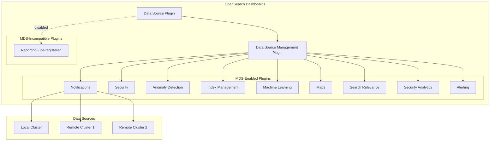
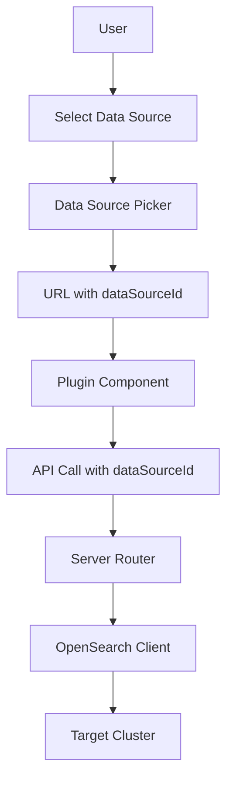

---
tags:
  - multi-plugin
---
# Multi-Data Source Support

## Summary

Multi-Data Source (MDS) is a feature in OpenSearch Dashboards that allows users to connect to and manage multiple OpenSearch clusters from a single Dashboards instance. This enables centralized monitoring, querying, and visualization across different data sources without switching between multiple Dashboards deployments.

MDS support has been progressively added to various OpenSearch Dashboards plugins, allowing each plugin to work with data from different connected clusters.

## Details

### Architecture



### Data Flow



### Components

| Component | Description |
|-----------|-------------|
| Data Source Plugin | Core plugin that manages data source connections and authentication |
| Data Source Management Plugin | UI for creating, editing, and managing data source connections |
| Data Source Picker | Dropdown component for selecting active data source |
| `dataSourceId` | Unique identifier for each connected data source |
| `DataSourceMenuContext` | React context for sharing data source state across components |
| `dataSourceObservable` | RxJS BehaviorSubject for reactive data source state management |

### Configuration

| Setting | Description | Default |
|---------|-------------|---------|
| `data_source.enabled` | Enable/disable MDS feature | `false` |
| `data_source.hideLocalCluster` | Hide local cluster from data source picker | `false` |
| `data_source.authTypes.NoAuthentication.enabled` | Show/hide no authentication option | `true` |
| `data_source.authTypes.UsernamePassword.enabled` | Show/hide username/password authentication | `true` |
| `data_source.authTypes.AWSSigV4.enabled` | Show/hide AWS SigV4 authentication | `true` |

### Usage Example

Enable MDS in `opensearch_dashboards.yml`:

```yaml
data_source.enabled: true
```

Create a data source connection via API:

```json
POST /_plugins/_query/_datasources
{
  "name": "remote-cluster",
  "connector": "OPENSEARCH",
  "properties": {
    "opensearch.host": "https://remote-cluster:9200",
    "opensearch.auth.type": "basicauth",
    "opensearch.auth.username": "admin",
    "opensearch.auth.password": "admin"
  }
}
```

### Plugin Support Matrix

| Plugin | MDS Support | Version Introduced |
|--------|-------------|-------------------|
| Index Management | ✅ Yes | v2.14.0 |
| Anomaly Detection | ✅ Yes | v2.14.0 |
| Security | ✅ Yes | v2.14.0 |
| Maps | ✅ Yes | v2.14.0 |
| Machine Learning | ✅ Yes | v2.14.0 |
| Notifications | ✅ Yes | v2.14.0 |
| Search Relevance | ✅ Yes | v2.14.0 |
| Security Analytics | ✅ Yes | v2.15.0 |
| Alerting | ✅ Yes | v2.15.0 |
| Integrations | ✅ Yes | v2.18.0 |
| Reporting | ❌ No | N/A (de-registered when MDS enabled) |

## Limitations

- Timeline visualization types are not supported with MDS
- The `gantt-chart` plugin is not supported with MDS
- Reporting plugin is automatically de-registered when MDS is enabled
- Some plugins may have version compatibility requirements between Dashboards and connected clusters
- Data source connections require appropriate network access and authentication credentials
- Integrations: Saved objects created by integrations may not automatically inherit data source references

## Change History

- **v3.0.0** (2025-05-13): Added MDS support for batch concurrent search (`_msearch`); fixed dataset selector column header; added URL trimming for data source creation
- **v2.18.0** (2024-11-05): Added MDS support to Integrations plugin; users can install and manage integrations across multiple connected clusters
- **v2.17.0** (2024-09-17): Reporting plugin de-registers when MDS enabled; Notifications persists dataSourceId in URL for new navigation
- **v2.16.0** (2024-08-06): Added `datasourceversion` and `installedplugins` fields to `DataSourceView` returns for version decoupling support; fixed filter logic to apply after fetching data source details
- **v2.15.0** (2024-06-25): Added MDS support to Security Analytics and Alerting plugins
- **v2.14.0** (2024-05-02): Initial MDS support added to multiple plugins including Notifications, Index Management, Anomaly Detection, Security, Maps, Machine Learning, and Search Relevance

## References

### Documentation
- [Documentation](https://docs.opensearch.org/3.0/dashboards/management/multi-data-sources/): Configuring and using multiple data sources
- [Data Sources Overview](https://docs.opensearch.org/3.0/dashboards/management/data-sources/): Data sources management

### Pull Requests
| Version | PR | Repository | Description | Related Issue |
|---------|-----|------------|-------------|---------------|
| v3.0.0 | [#9361](https://github.com/opensearch-project/OpenSearch-Dashboards/pull/9361) | OpenSearch-Dashboards | Add MDS to msearch | [#1234](https://github.com/opensearch-project/OpenSearch-Dashboards/issues/1234) |
| v3.0.0 | [#9343](https://github.com/opensearch-project/OpenSearch-Dashboards/pull/9343) | OpenSearch-Dashboards | Change from cluster to data sources for dataset selector column | [#1234](https://github.com/opensearch-project/OpenSearch-Dashboards/issues/1234) |
| v3.0.0 | [#9637](https://github.com/opensearch-project/OpenSearch-Dashboards/pull/9637) | OpenSearch-Dashboards | Trim the URL for creating data source |   |
| v2.18.0 | [#8008](https://github.com/opensearch-project/OpenSearch-Dashboards/pull/8008) | OpenSearch-Dashboards | Add MDS support for Integration | [#1234](https://github.com/opensearch-project/OpenSearch-Dashboards/issues/1234) |
| v2.18.0 | [#2051](https://github.com/opensearch-project/dashboards-observability/pull/2051) | dashboards-observability | MDS support in Integrations for observability plugin |   |
| v2.17.0 | [#411](https://github.com/opensearch-project/dashboards-reporting/pull/411) | dashboards-reporting | De-register reporting when MDS is enabled |   |
| v2.17.0 | [#249](https://github.com/opensearch-project/dashboards-notifications/pull/249) | dashboards-notifications | Persist dataSourceId across applications |   |
| v2.16.0 | [#7420](https://github.com/opensearch-project/OpenSearch-Dashboards/pull/7420) | OpenSearch-Dashboards | Add data source version and installed plugins in DataSourceView | [#7099](https://github.com/opensearch-project/OpenSearch-Dashboards/issues/7099) |
| v2.14.0 | [#186](https://github.com/opensearch-project/dashboards-notifications/pull/186) | dashboards-notifications | Initial MDS support in Notifications |   |

### Issues (Design / RFC)
- [Issue #2174](https://github.com/opensearch-project/OpenSearch-Dashboards/issues/2174): MDS batch concurrent search feature request
- [Issue #159](https://github.com/opensearch-project/dashboards-notifications/issues/159): Original MDS feature request for Notifications
- [Issue #1440](https://github.com/opensearch-project/dashboards-observability/issues/1440): MDS feature request for Integrations
