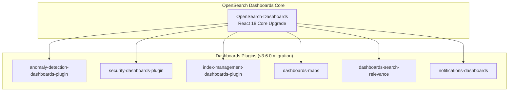

---
tags:
  - multi-plugin
---
# React 18 Migration

## Summary

OpenSearch Dashboards and its plugin ecosystem migrated from React 16 to React 18. This cross-cutting effort required coordinated changes across the core platform and all dashboards plugins to adopt the new `createRoot` rendering API, update test infrastructure, handle breaking changes in the `children` prop for `React.FC`, and upgrade dependent libraries like `react-redux`.

## Details

### Architecture

### Breaking Changes Addressed

| Breaking Change | Migration Pattern |
|----------------|-------------------|
| `ReactDOM.render()` deprecated | Replace with `createRoot()` / `root.render()` |
| `ReactDOM.unmountComponentAtNode()` deprecated | Replace with `root.unmount()` |
| `React.FC` no longer includes implicit `children` prop | Add explicit `children?: React.ReactNode` to component props |
| `@testing-library/react-hooks` deprecated | Import `renderHook`, `act` from `@testing-library/react` |
| `waitForNextUpdate()` removed | Use `waitFor(() => expect(...))` pattern |
| `enzyme-adapter-react-16` incompatible | Replace with `@cfaester/enzyme-adapter-react-18` |
| `react-redux` v7 incompatible | Upgrade to `react-redux` v8 (uses `useSyncExternalStore`) |

### Configuration

No new configuration settings. This is a framework-level upgrade with no user-facing configuration changes.

## Limitations

- Plugins using class components with unsafe lifecycle methods (`UNSAFE_componentWillMount`, etc.) may need additional migration
- Concurrent features (Suspense, transitions) are not yet adopted by the plugin ecosystem
- Some plugins still use Enzyme for testing; full migration to React Testing Library is ongoing

## Change History
- **v3.6.0** (2026-04-13): Migrated alerting-dashboards, anomaly-detection-dashboards, dashboards-maps, dashboards-search-relevance, index-management-dashboards, security-dashboards, and notifications-dashboards plugins to React 18

## References

### Pull Requests
| Version | PR | Description |
|---------|-----|-------------|
| v3.6.0 | [anomaly-detection-dashboards-plugin#1144](https://github.com/opensearch-project/anomaly-detection-dashboards-plugin/pull/1144) | Upgrade AD plugin to React 18 |
| v3.6.0 | [security-dashboards-plugin#2371](https://github.com/opensearch-project/security-dashboards-plugin/pull/2371) | Upgrade to React 18 and adapt unit tests |
| v3.6.0 | [dashboards-maps#789](https://github.com/opensearch-project/dashboards-maps/pull/789) | React 18 compatibility updates for dashboards-maps |
| v3.6.0 | [dashboards-search-relevance#741](https://github.com/opensearch-project/dashboards-search-relevance/pull/741) | React 18 compatibility updates for dashboards-search-relevance |
| v3.6.0 | [index-management-dashboards-plugin#1391](https://github.com/opensearch-project/index-management-dashboards-plugin/pull/1391) | Upgrade React from 16 to 18, fix CVE-2025-64718 |
