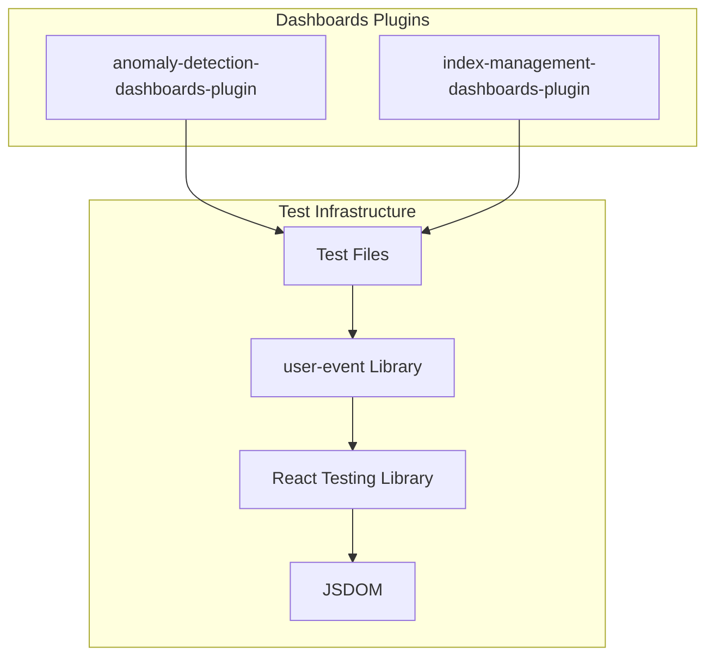

---
tags:
  - dashboards
  - indexing
---

# Testing Library Updates

## Summary

This feature tracks updates to the `@testing-library/user-event` dependency across OpenSearch Dashboards plugins. The testing library is a critical development dependency used for simulating user interactions in unit and integration tests. Keeping this dependency updated ensures compatibility with modern testing practices and improves test reliability.

## Details

### Overview

`@testing-library/user-event` is a companion library to `@testing-library/react` that provides utilities for simulating user interactions in tests. It offers more realistic event simulation compared to `fireEvent`, making tests more reliable and closer to actual user behavior.

### Architecture



### Components

| Component | Description |
|-----------|-------------|
| `@testing-library/user-event` | Library for simulating user interactions in tests |
| `userEvent.setup()` | Creates a user event instance with proper event timing |
| Async API | All user event methods return promises for proper event sequencing |

### Configuration

| Setting | Description | Default |
|---------|-------------|---------|
| `delay` | Delay between keystrokes in `type()` | `0` (no delay) |
| `pointerEventsCheck` | Check for pointer-events CSS property | `true` |
| `skipHover` | Skip hover events before click | `false` |

### Usage Example

```typescript
import userEventModule from '@testing-library/user-event';
import { render, screen, waitFor } from '@testing-library/react';

describe('MyComponent', () => {
  const userEvent = userEventModule.setup();

  test('handles user input', async () => {
    render(<MyComponent />);
    
    const input = screen.getByPlaceholderText('Enter text');
    const button = screen.getByRole('button', { name: 'Submit' });
    
    // Type into input field
    await userEvent.type(input, 'Hello World');
    
    // Click submit button
    await userEvent.click(button);
    
    // Assert results
    await waitFor(() => {
      expect(screen.getByText('Submitted: Hello World')).toBeInTheDocument();
    });
  });
});
```

## Limitations

- Version 14.x requires async/await pattern for all user event methods
- Tests written for older versions need migration to the new API
- The `setup()` method should be called once per test suite for optimal performance

## Change History

- **v3.1.0** (2025-06): Updated `@testing-library/user-event` to v14.4.3 in anomaly-detection-dashboards-plugin and index-management-dashboards-plugin

## References

### Documentation
- [@testing-library/user-event Documentation](https://testing-library.com/docs/user-event/intro)
- [GitHub: @testing-library/user-event](https://github.com/testing-library/user-event)
- [Testing Library Best Practices](https://testing-library.com/docs/guiding-principles)

### Pull Requests
| Version | PR | Repository | Description | Related Issue |
|---------|-----|------------|-------------|---------------|
| v3.1.0 | [#1042](https://github.com/opensearch-project/anomaly-detection-dashboards-plugin/pull/1042) | anomaly-detection-dashboards-plugin | Update from v12.1.6 to v14.4.3 |   |
| v3.1.0 | [#1321](https://github.com/opensearch-project/index-management-dashboards-plugin/pull/1321) | index-management-dashboards-plugin | Update from v13.1.9 to v14.4.3 |   |
