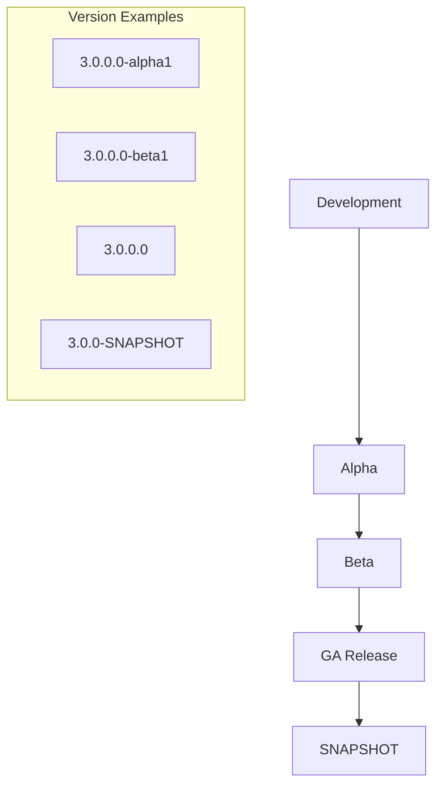

---
tags:
  - domain/infra
  - component/server
  - dashboards
  - indexing
  - ml
  - observability
  - performance
  - search
  - security
---
# Version Bumps & Release Notes

## Summary

Version bumps and release notes are standard maintenance tasks performed across all OpenSearch repositories during each release cycle. These changes ensure consistent versioning across the project and provide documentation of changes for each release.

## Details

### Release Cycle Workflow



### Version String Format

OpenSearch plugins follow a consistent versioning scheme:

| Component | Format | Example |
|-----------|--------|---------|
| Major.Minor.Patch.Build | X.Y.Z.W | 3.0.0.0 |
| With Qualifier | X.Y.Z.W-qualifier | 3.0.0.0-alpha1 |
| SNAPSHOT | X.Y.Z-SNAPSHOT | 3.0.0-SNAPSHOT |

### Files Typically Modified

| File | Purpose |
|------|---------|
| `build.gradle` | Plugin version declaration |
| `gradle.properties` | Version properties |
| `release-notes/*.md` | Release documentation |
| `plugin-descriptor.properties` | Plugin metadata |

### Release Notes Structure

Each plugin maintains release notes in a standard format:

```
release-notes/
├── opensearch-{plugin}.release-notes-3.0.0.0.md
├── opensearch-{plugin}.release-notes-2.19.0.0.md
└── ...
```

## Limitations

- Version bumps are mechanical changes with no functional impact
- Release notes accuracy depends on PR descriptions and changelog entries
- Timing of version bumps must coordinate with release branch creation

## Change History

- **v3.2.0** (2026-01-11): Version bumps across 14 repositories (alerting, asynchronous-search, custom, index-management, ml-commons, notifications, observability, query, dashboards, reporting, security, learning, performance, system)
- **v3.1.0** (2026-01-10): Version bumps across 11 repositories (alerting, asynchronous-search, common-utils, dashboards-notifications, notifications, reporting, index-management-dashboards, index-management, ml-commons, observability, sql, OpenSearch core)
- **v3.0.0** (2025-05-06): Version bumps and release notes across 15 repositories including batch 2 (learning, security, performance, query, dashboards, reporting) in addition to alerting, common-utils, index-management, notifications, security, sql, and dashboard plugins
- **v2.18.0** (2024-11-05): Release notes across 5 repositories (alerting, common-utils, notifications, query-insights, security)
- **v2.17.0** (2024-09-17): Version bumps and release notes across 12 repositories (alerting, anomaly-detection, asynchronous-search, common-utils, dashboards-notifications, index-management, job-scheduler, ml-commons, notifications, query-insights, security, sql)

## References

### Documentation
- [OpenSearch Release Process](https://github.com/opensearch-project/opensearch-build/blob/main/RELEASING.md): Official release documentation

### Pull Requests
| Version | PR | Repository | Description | Related Issue |
|---------|-----|------------|-------------|---------------|
| v3.1.0 | [#1837](https://github.com/opensearch-project/alerting/pull/1837) | alerting | Auto-increment to 3.1.0-SNAPSHOT |   |
| v3.1.0 | [#1249](https://github.com/opensearch-project/alerting/pull/1249) | alerting | Upgrade Java to 21 for binary CI |   |
| v3.1.0 | [#1251](https://github.com/opensearch-project/alerting/pull/1251) | alerting | Increment to 3.1.0.0 |   |
| v3.1.0 | [#726](https://github.com/opensearch-project/asynchronous-search/pull/726) | asynchronous-search | Increment to 3.1.0 |   |
| v3.1.0 | [#820](https://github.com/opensearch-project/common-utils/pull/820) | common-utils | Auto-increment to 3.1.0-SNAPSHOT |   |
| v3.1.0 | [#735](https://github.com/opensearch-project/dashboards-notifications/pull/735) | dashboards-notifications | Increment to 3.1.0.0 |   |
| v3.1.0 | [#357](https://github.com/opensearch-project/notifications/pull/357) | notifications | Increment to 3.1.0.0 |   |
| v3.1.0 | [#579](https://github.com/opensearch-project/reporting/pull/579) | reporting | Increment to 3.1.0.0 |   |
| v3.1.0 | [#587](https://github.com/opensearch-project/reporting/pull/587) | reporting | Adding release notes for 3.1.0 |   |
| v3.1.0 | [#534](https://github.com/opensearch-project/index-management-dashboards-plugin/pull/534) | index-management-dashboards | Increment to 3.1.0.0 |   |
| v3.1.0 | [#1414](https://github.com/opensearch-project/index-management/pull/1414) | index-management | Auto-increment to 3.1.0-SNAPSHOT |   |
| v3.1.0 | [#1313](https://github.com/opensearch-project/index-management/pull/1313) | index-management | Increment to 3.1.0.0 |   |
| v3.1.0 | [#572](https://github.com/opensearch-project/ml-commons/pull/572) | ml-commons | Bump version to 3.1.0.0 |   |
| v3.1.0 | [#2451](https://github.com/opensearch-project/observability/pull/2451) | observability | Workflows - Version bump to 3.1.0 |   |
| v3.2.0 | [#1892](https://github.com/opensearch-project/alerting/pull/1892) | alerting | Moved commons-beanutils pinning to core gradle |   |
| v3.2.0 | [#1887](https://github.com/opensearch-project/alerting/pull/1887) | alerting | Pinned commons-beanutils to 1.11.0 |   |
| v3.2.0 | [#1271](https://github.com/opensearch-project/alerting/pull/1271) | alerting | Increment to 3.2.0.0 | [#1236](https://github.com/opensearch-project/alerting/issues/1236) |
| v3.2.0 | [#751](https://github.com/opensearch-project/asynchronous-search/pull/751) | asynchronous-search | Increment to 3.2.0-SNAPSHOT |   |
| v3.2.0 | [#262](https://github.com/opensearch-project/custom-codecs/pull/262) | custom | Increment to 3.2.0-SNAPSHOT |   |
| v3.2.0 | [#1332](https://github.com/opensearch-project/index-management/pull/1332) | index-management | Increment to 3.2.0.0 |   |
| v3.2.0 | [#1435](https://github.com/opensearch-project/index-management/pull/1435) | index-management | Increment to 3.2.0-SNAPSHOT |   |
| v3.2.0 | [#437](https://github.com/opensearch-project/ml-commons/pull/437) | ml-commons | Increment to 3.2.0.0 |   |
| v3.2.0 | [#365](https://github.com/opensearch-project/notifications/pull/365) | notifications | Increment to 3.2.0.0 |   |
| v3.2.0 | [#2481](https://github.com/opensearch-project/observability/pull/2481) | observability | Increment to 3.2.0.0 |   |
| v3.2.0 | [#1933](https://github.com/opensearch-project/observability/pull/1933) | observability | Increment to 3.2.0-SNAPSHOT |   |
| v3.2.0 | [#295](https://github.com/opensearch-project/query-insights/pull/295) | query | Increment to 3.2.0.0 |   |
| v3.2.0 | [#380](https://github.com/opensearch-project/query-insights/pull/380) | query | Increment to 3.2.0-SNAPSHOT |   |
| v3.2.0 | [#485](https://github.com/opensearch-project/dashboards-notifications/pull/485) | dashboards | Increment to 3.2.0.0 |   |
| v3.2.0 | [#603](https://github.com/opensearch-project/reporting/pull/603) | reporting | Increment to 3.2.0.0 |   |
| v3.2.0 | [#1105](https://github.com/opensearch-project/reporting/pull/1105) | reporting | Increment to 3.2.0-SNAPSHOT |   |
| v3.2.0 | [#1316](https://github.com/opensearch-project/security/pull/1316) | security | Increment to 3.2.0.0 |   |
| v3.2.0 | [#191](https://github.com/opensearch-project/opensearch-learning-to-rank-base/pull/191) | learning | Increment to 3.2.0-SNAPSHOT |   |
| v3.2.0 | [#823](https://github.com/opensearch-project/performance-analyzer/pull/823) | performance | Increment to 3.2.0-SNAPSHOT |   |
| v3.2.0 | [#86](https://github.com/opensearch-project/opensearch-system-templates/pull/86) | system | Increment to 3.2.0-SNAPSHOT |   |
| v3.1.0 | [#3671](https://github.com/opensearch-project/sql/pull/3671) | sql | Bump setuptools to 78.1.1 |   |
| v3.1.0 | [#18039](https://github.com/opensearch-project/OpenSearch/pull/18039) | OpenSearch | Bump Core main branch to 3.0.0 |   |
| v3.0.0 | [#1843](https://github.com/opensearch-project/alerting/pull/1843) | alerting | Added 3.0 release notes |   |
| v3.0.0 | [#775](https://github.com/opensearch-project/common-utils/pull/775) | common-utils | Update shadow plugin and bump to 3.0.0.0-alpha1 |   |
| v3.0.0 | [#1384](https://github.com/opensearch-project/index-management/pull/1384) | index-management | Bump Version to 3.0.0-alpha1 |   |
| v3.0.0 | [#154](https://github.com/opensearch-project/opensearch-learning-to-rank-base/pull/154) | learning | Update 3.0.0 qualifier from alpha1 to beta1 |   |
| v3.0.0 | [#169](https://github.com/opensearch-project/opensearch-learning-to-rank-base/pull/169) | learning | Remove beta1 qualifier |   |
| v3.0.0 | [#791](https://github.com/opensearch-project/performance-analyzer/pull/791) | performance | Bumps OS to 3.0.0-alpha1 and JDK 21 |   |
| v3.0.0 | [#794](https://github.com/opensearch-project/performance-analyzer/pull/794) | performance | Bumps plugin version to 3.0.0.0-beta1 |   |
| v3.0.0 | [#247](https://github.com/opensearch-project/query-insights/pull/247) | query | Bump version to 3.0.0-alpha1 & upgrade to gradle 8.10.2 |   |
| v3.0.0 | [#290](https://github.com/opensearch-project/query-insights/pull/290) | query | Update 3.0.0 qualifier from alpha1 to beta1 |   |
| v3.0.0 | [#329](https://github.com/opensearch-project/query-insights/pull/329) | query | Remove beta1 qualifier |   |
| v3.0.0 | [#127](https://github.com/opensearch-project/dashboards-query-workbench/pull/127) | dashboards | Bump to 3.0.0-alpha1 |   |
| v3.0.0 | [#154](https://github.com/opensearch-project/dashboards-query-workbench/pull/154) | dashboards | Update 3.0.0 qualifier from alpha1 to beta1 |   |
| v3.0.0 | [#1073](https://github.com/opensearch-project/reporting/pull/1073) | reporting | Bump version 3.0.0-alpha1-SNAPSHOT | [#731](https://github.com/opensearch-project/reporting/issues/731) |
| v3.0.0 | [#1083](https://github.com/opensearch-project/reporting/pull/1083) | reporting | Bump version 3.0.0-beta1-SNAPSHOT |   |
| v3.0.0 | [#1517](https://github.com/opensearch-project/security/pull/1517) | security | Increment version to 3.1.0-SNAPSHOT |   |
| v3.0.0 | [#1519](https://github.com/opensearch-project/security/pull/1519) | security | Remove beta1 qualifier |   |
| v3.0.0 | [#1500](https://github.com/opensearch-project/security/pull/1500) | security | Update version qualifier to beta1 |   |
| v3.0.0 | [#1283](https://github.com/opensearch-project/security/pull/1283) | security | Increment version to 3.0.0.0 |   |
| v2.18.0 | [#1718](https://github.com/opensearch-project/alerting/pull/1718) | alerting | Added 2.18.0 release notes |   |
| v2.18.0 | [#750](https://github.com/opensearch-project/common-utils/pull/750) | common-utils | Added 2.18.0.0 release notes |   |
| v2.18.0 | [#980](https://github.com/opensearch-project/notifications/pull/980) | notifications | Added 2.18.0 release notes |   |
| v2.18.0 | [#148](https://github.com/opensearch-project/query-insights/pull/148) | query-insights | Add release notes for 2.18 |   |
| v2.18.0 | [#1399](https://github.com/opensearch-project/security/pull/1399) | security | Added 2.18.0 release notes |   |
| v2.17.0 | [#1650](https://github.com/opensearch-project/alerting/pull/1650) | alerting | Added 2.17 release notes |   |
| v2.17.0 | [#1635](https://github.com/opensearch-project/alerting/pull/1635) | alerting | Increment version to 2.17.0-SNAPSHOT |   |
| v2.17.0 | [#727](https://github.com/opensearch-project/common-utils/pull/727) | common-utils | Added 2.17.0.0 release notes |   |
| v2.17.0 | [#1221](https://github.com/opensearch-project/index-management/pull/1221) | index-management | Increment version to 2.17.0-SNAPSHOT |   |
| v2.17.0 | [#947](https://github.com/opensearch-project/notifications/pull/947) | notifications | Add 2.17.0 release notes |   |
| v2.17.0 | [#4615](https://github.com/opensearch-project/security/pull/4615) | security | Increment version to 2.17.0-SNAPSHOT |   |
| v2.17.0 | [#2892](https://github.com/opensearch-project/sql/pull/2892) | sql | Increment version to 2.17.0-SNAPSHOT |   |

### Issues (Design / RFC)
- [opensearch-build#5267](https://github.com/opensearch-project/opensearch-build/issues/5267): Release coordination
