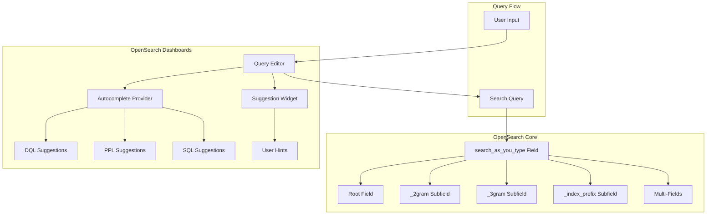
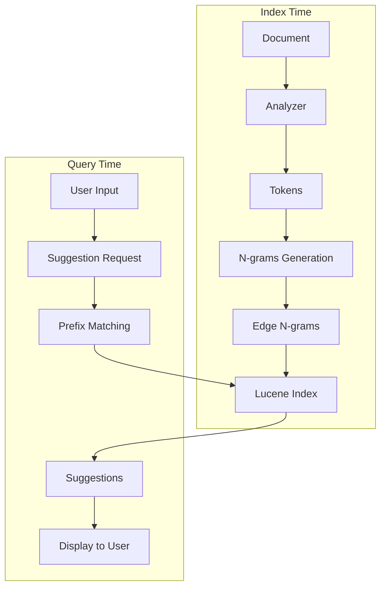

# Search Autocomplete

## Summary

Search Autocomplete in OpenSearch provides real-time search suggestions as users type, improving search experience and helping users find relevant content faster. This feature spans both OpenSearch core (via the `search_as_you_type` field type) and OpenSearch Dashboards (via the query editor autocomplete UI).

## Details

### Architecture



### Data Flow



### Components

| Component | Description |
|-----------|-------------|
| `search_as_you_type` field | Specialized field type that creates n-gram and edge n-gram subfields for efficient prefix matching |
| `_2gram` subfield | Stores 2-word shingles for phrase matching |
| `_3gram` subfield | Stores 3-word shingles for longer phrase matching |
| `_index_prefix` subfield | Stores edge n-grams for prefix completion |
| Multi-fields | Custom subfields (e.g., keyword) for sorting or exact matching |
| Query Editor | Dashboards component providing autocomplete UI |
| Suggestion Widget | Monaco editor widget displaying autocomplete suggestions |
| DQL Autocomplete | Provides field names, values, and operators for DQL queries |

### Configuration

| Setting | Description | Default |
|---------|-------------|---------|
| `max_shingle_size` | Maximum n-gram size (2-4) | 3 |
| `analyzer` | Analyzer for index and search time | standard |
| `search_analyzer` | Override analyzer for search time | (uses analyzer) |
| `index` | Whether field is searchable | true |
| `store` | Whether to store field value separately | false |

### Usage Example

**Creating a search_as_you_type field with multi-fields**:

```json
PUT products
{
  "mappings": {
    "properties": {
      "name": {
        "type": "search_as_you_type",
        "max_shingle_size": 3,
        "fields": {
          "keyword": {
            "type": "keyword"
          },
          "lowercase": {
            "type": "keyword",
            "normalizer": "lowercase"
          }
        }
      }
    }
  },
  "settings": {
    "analysis": {
      "normalizer": {
        "lowercase": {
          "type": "custom",
          "filter": ["lowercase"]
        }
      }
    }
  }
}
```

**Autocomplete query using bool_prefix**:

```json
GET products/_search
{
  "query": {
    "multi_match": {
      "query": "wire head",
      "type": "bool_prefix",
      "fields": [
        "name",
        "name._2gram",
        "name._3gram"
      ]
    }
  }
}
```

**Phrase prefix query for ordered matching**:

```json
GET products/_search
{
  "query": {
    "match_phrase_prefix": {
      "name": "wireless head"
    }
  }
}
```

## Limitations

- `search_as_you_type` fields do not support `doc_values` (always false)
- Maximum shingle size is limited to 4
- Larger `max_shingle_size` values increase index size
- Multi-fields support was added in v2.18.0 (previously silently ignored)
- Dashboards autocomplete behavior may vary between DQL, PPL, and SQL query languages

## Change History

- **v2.18.0** (2024-11-05): Fixed search_as_you_type multi-fields support; Enhanced Dashboards autocomplete UX with persistent suggestions and user hints

## References

### Documentation
- [search_as_you_type Documentation](https://docs.opensearch.org/latest/field-types/supported-field-types/search-as-you-type/): Official field type documentation
- [Autocomplete Documentation](https://docs.opensearch.org/latest/search-plugins/searching-data/autocomplete/): Autocomplete functionality guide
- [Elasticsearch PR #82430](https://github.com/elastic/elasticsearch/pull/82430): Original fix in Elasticsearch

### Pull Requests
| Version | PR | Description |
|---------|-----|-------------|
| v2.18.0 | [#15988](https://github.com/opensearch-project/OpenSearch/pull/15988) | Fix search_as_you_type not supporting multi-fields |
| v2.18.0 | [#7991](https://github.com/opensearch-project/OpenSearch-Dashboards/pull/7991) | Keep Autocomplete suggestion window open and put user hints below the suggestion window |

### Issues (Design / RFC)
- [Issue #5035](https://github.com/opensearch-project/OpenSearch/issues/5035): Original bug report for search_as_you_type multi-fields
