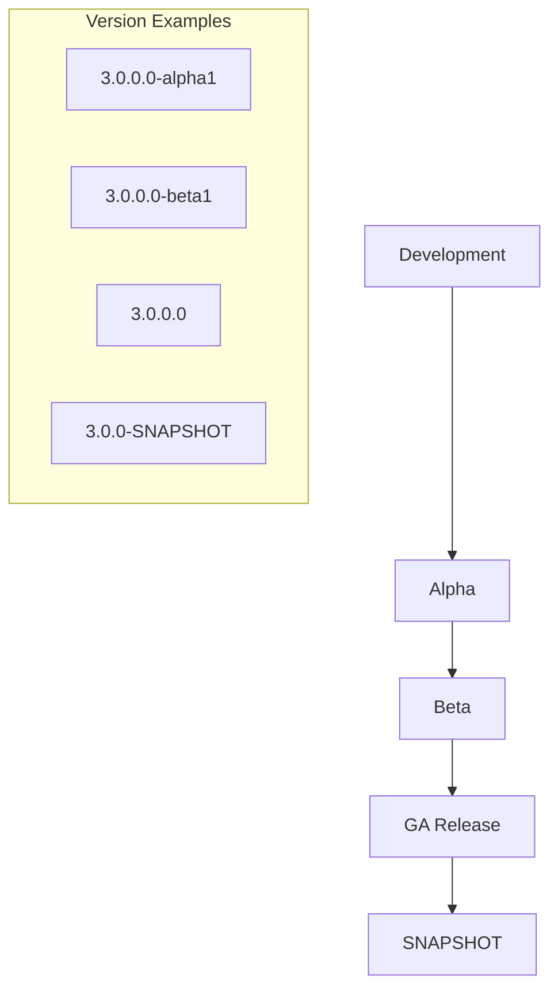

# Version Bumps & Release Notes

## Summary

Version bumps and release notes are standard maintenance tasks performed across all OpenSearch repositories during each release cycle. These changes ensure consistent versioning across the project and provide documentation of changes for each release.

## Details

### Release Cycle Workflow



### Version String Format

OpenSearch plugins follow a consistent versioning scheme:

| Component | Format | Example |
|-----------|--------|---------|
| Major.Minor.Patch.Build | X.Y.Z.W | 3.0.0.0 |
| With Qualifier | X.Y.Z.W-qualifier | 3.0.0.0-alpha1 |
| SNAPSHOT | X.Y.Z-SNAPSHOT | 3.0.0-SNAPSHOT |

### Files Typically Modified

| File | Purpose |
|------|---------|
| `build.gradle` | Plugin version declaration |
| `gradle.properties` | Version properties |
| `release-notes/*.md` | Release documentation |
| `plugin-descriptor.properties` | Plugin metadata |

### Release Notes Structure

Each plugin maintains release notes in a standard format:

```
release-notes/
├── opensearch-{plugin}.release-notes-3.0.0.0.md
├── opensearch-{plugin}.release-notes-2.19.0.0.md
└── ...
```

## Limitations

- Version bumps are mechanical changes with no functional impact
- Release notes accuracy depends on PR descriptions and changelog entries
- Timing of version bumps must coordinate with release branch creation

## Related PRs

| Version | PR | Repository | Description |
|---------|-----|------------|-------------|
| v3.0.0 | [#1843](https://github.com/opensearch-project/alerting/pull/1843) | alerting | Added 3.0 release notes |
| v3.0.0 | [#775](https://github.com/opensearch-project/common-utils/pull/775) | common-utils | Update shadow plugin and bump to 3.0.0.0-alpha1 |
| v3.0.0 | [#1384](https://github.com/opensearch-project/index-management/pull/1384) | index-management | Bump Version to 3.0.0-alpha1 |

## References

- [opensearch-build#5267](https://github.com/opensearch-project/opensearch-build/issues/5267): Release coordination
- [OpenSearch Release Process](https://github.com/opensearch-project/opensearch-build/blob/main/RELEASING.md): Official release documentation

## Change History

- **v3.0.0** (2025-05): Version bumps and release notes across 9 repositories (alerting, common-utils, index-management, notifications, security, sql, and dashboard plugins)
