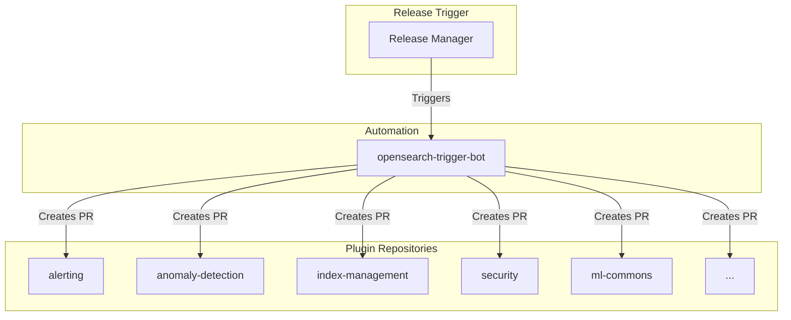

# Version Increment

## Summary

Automated version increment is a release engineering process that updates version strings across all OpenSearch plugin repositories. The `opensearch-trigger-bot` automatically creates PRs to bump versions to `-SNAPSHOT` (development) and final release versions as part of the release cycle.

## Details

### Architecture

### Version Format

| Format | Example | Purpose |
|--------|---------|---------|
| SNAPSHOT | `3.3.0-SNAPSHOT` | Development builds during release cycle |
| Release | `3.3.0.0` | Final release version |

### Process

1. Release manager triggers version increment workflow
2. `opensearch-trigger-bot` creates branches in each plugin repository
3. Bot updates version strings in build configuration files
4. PRs are opened targeting the `main` branch
5. Maintainers review and merge the PRs

### Files Modified

Typical files updated by version increment PRs:
- `build.gradle`
- `gradle.properties`
- `plugin-descriptor.properties`

## Limitations

- Version increment PRs contain no functional changes
- Requires maintainer approval in each repository
- Must be coordinated across all plugins for consistent releases

## Change History

- **v3.3.0** (2026-01-11): Version increment to 3.3.0-SNAPSHOT and 3.3.0.0 across 14 plugin repositories

## References

### Documentation
- [OpenSearch Release Process](https://github.com/opensearch-project/.github/blob/main/RELEASING.md)

### Pull Requests
| Version | Repository | PR | Description | Related Issue |
|---------|------------|-----|-------------|---------------|
| v3.3.0 | alerting | [#1918](https://github.com/opensearch-project/alerting/pull/1918) | Increment to 3.3.0-SNAPSHOT |   |
| v3.3.0 | index-management | [#1467](https://github.com/opensearch-project/index-management/pull/1467) | Increment to 3.3.0-SNAPSHOT |   |
