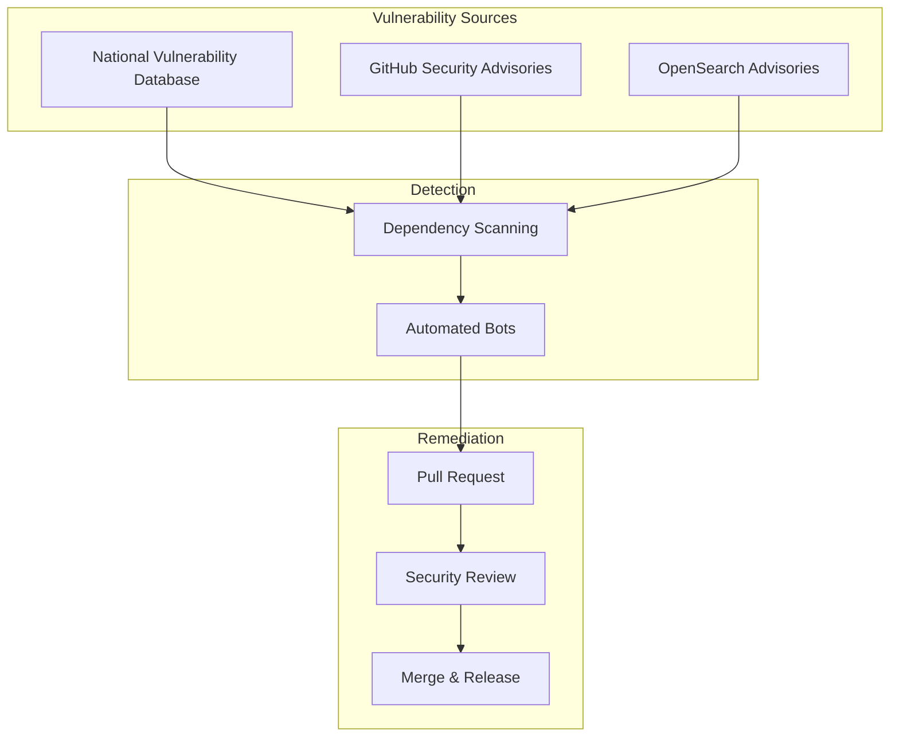

# CVE Fixes & Dependency Updates

## Summary

OpenSearch maintains security by regularly updating dependencies to address Common Vulnerabilities and Exposures (CVEs). This document tracks security-related dependency updates across OpenSearch repositories, ensuring users are aware of patched vulnerabilities and can verify their deployments are secure.

## Details

### Security Update Process

OpenSearch follows a proactive security update process:

1. **Vulnerability Detection**: Automated scanning tools (e.g., Dependabot, Mend) identify vulnerable dependencies
2. **Impact Assessment**: Security team evaluates the severity and exploitability
3. **Patch Development**: Updates are applied to affected repositories
4. **Release Integration**: Fixes are included in the next appropriate release

### Architecture



### Components

| Component | Description |
|-----------|-------------|
| Dependency Scanning | Automated tools that check for known vulnerabilities |
| Security Advisories | Published notices about vulnerabilities and fixes |
| Resolution Strategies | Gradle/npm configurations to force secure versions |

### Configuration

Dependency version forcing in Gradle:

```gradle
configurations.all {
    resolutionStrategy {
        force 'vulnerable-package:secure-version'
    }
}
```

Dependency resolution in npm/yarn:

```json
{
  "resolutions": {
    "vulnerable-package": "^secure-version"
  }
}
```

## Limitations

- Transitive dependencies may require explicit forcing
- Some CVE fixes may require code changes beyond version bumps
- Security patches should be applied promptly after release

## Related PRs

| Version | PR | Repository | Description |
|---------|-----|------------|-------------|
| v3.2.0 | [#4062](https://github.com/opensearch-project/ml-commons/pull/4062) | ml-commons | CVE-2025-48734: beanutils fix |
| v3.2.0 | [#503](https://github.com/opensearch-project/dashboards-query-workbench/pull/503) | dashboards-query-workbench | CVE-2025-7783: form-data fix |

## References

- [OpenSearch Security Advisories](https://advisories.opensearch.org/): Official security advisory database
- [GitHub Advisory Database](https://github.com/advisories): GitHub's CVE database
- [National Vulnerability Database](https://nvd.nist.gov/): NIST CVE database

## Change History

- **v3.2.0**: CVE-2025-48734 (beanutils) and CVE-2025-7783 (form-data) fixes
