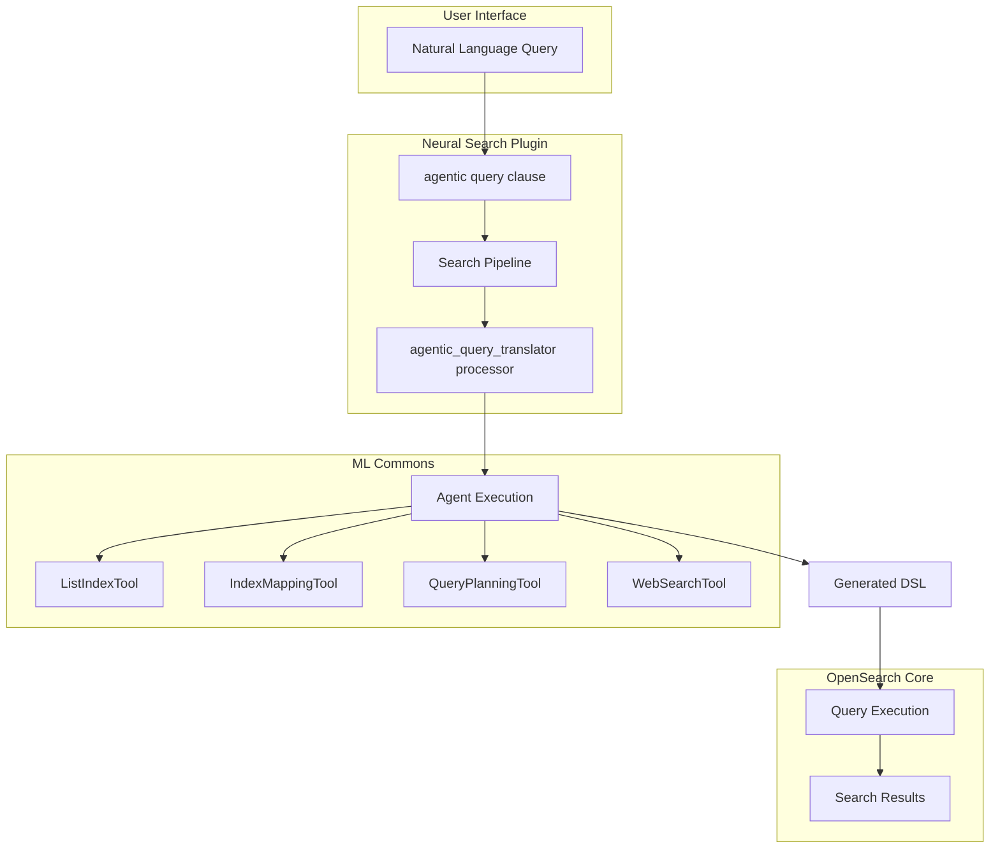
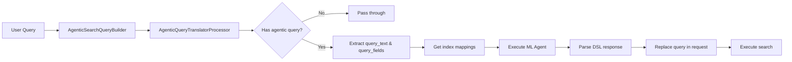

# Agentic Search

## Summary

Agentic Search is an LLM-enhanced search capability that allows users to interact with OpenSearch using natural language queries. Instead of constructing complex DSL queries manually, users can ask questions in plain language, and an intelligent agent interprets the intent, selects appropriate tools, and generates optimized search queries automatically.

Key benefits:
- **Natural language interface**: Query data without learning DSL syntax
- **Intent understanding**: Agent interprets user goals beyond simple keyword matching
- **Automatic query generation**: Converts natural language to optimized OpenSearch queries
- **Tool-based architecture**: Extensible through ML Commons agent framework

## Details

### Architecture



### Data Flow



### Components

| Component | Description |
|-----------|-------------|
| `AgenticSearchQueryBuilder` | Query builder that parses and validates the `agentic` query clause |
| `AgenticQueryTranslatorProcessor` | Search request processor that orchestrates agent execution |
| `MLCommonsClientAccessor` | Client for invoking ML agents with retry support |
| `NeuralSearchClusterUtil` | Utility for retrieving index mappings |
| `NeuralSearchSettingsAccessor` | Settings accessor for feature flag management |

### Configuration

| Setting | Description | Default | Scope |
|---------|-------------|---------|-------|
| `plugins.neural_search.agentic_search_enabled` | Enable/disable agentic search feature | `false` | Node, Dynamic |

### Usage Example

#### 1. Enable the Feature

```json
PUT _cluster/settings
{
  "transient": {
    "plugins.neural_search.agentic_search_enabled": "true"
  }
}
```

#### 2. Create an ML Agent

Create an agent with tools for query planning:

```json
POST /_plugins/_ml/agents/_register
{
  "name": "agentic_search_agent",
  "type": "conversational",
  "description": "Agent for agentic search",
  "llm": {
    "model_id": "<your-llm-model-id>"
  },
  "tools": [
    {
      "type": "ListIndexTool"
    },
    {
      "type": "IndexMappingTool"
    },
    {
      "type": "QueryPlanningTool"
    }
  ]
}
```

#### 3. Create Search Pipeline

```json
PUT _search/pipeline/agentic_pipeline
{
  "request_processors": [
    {
      "agentic_query_translator": {
        "agent_id": "<agent-id-from-step-2>"
      }
    }
  ]
}
```

#### 4. Execute Natural Language Search

```json
GET /products/_search?search_pipeline=agentic_pipeline
{
  "query": {
    "agentic": {
      "query_text": "Find red cars under $30,000",
      "query_fields": ["title", "description", "price", "color"]
    }
  }
}
```

### Query Clause Parameters

| Parameter | Type | Required | Description |
|-----------|------|----------|-------------|
| `query_text` | string | Yes | Natural language query |
| `query_fields` | array | No | Fields to consider for query generation (max 25) |

### Processor Parameters

| Parameter | Type | Required | Description |
|-----------|------|----------|-------------|
| `agent_id` | string | Yes | ID of the ML agent to execute |
| `tag` | string | No | Processor tag for identification |
| `description` | string | No | Processor description |
| `ignore_failure` | boolean | No | Whether to ignore processor failures |

## Limitations

- **Experimental feature**: May change in future releases without backward compatibility
- **Top-level query only**: Cannot be nested inside bool, function_score, or other compound queries
- **Exclusive search mode**: Cannot be combined with aggregations, sort, highlighters, post_filter, suggest, rescores, or collapse
- **Agent dependency**: Requires a properly configured ML agent with appropriate tools
- **Query field limit**: Maximum of 25 query fields allowed
- **Latency**: Additional latency due to LLM inference for query generation

## Related PRs

| Version | PR | Description |
|---------|-----|-------------|
| v3.2.0 | [#1484](https://github.com/opensearch-project/neural-search/pull/1484) | Initial implementation of agentic search query clause and processor |

## References

- [Issue #1479](https://github.com/opensearch-project/neural-search/issues/1479): RFC - Design for Agentic Search
- [Blog: Introducing agentic search in OpenSearch](https://opensearch.org/blog/introducing-agentic-search-in-opensearch-transforming-data-interaction-through-natural-language/): Official announcement
- [Agentic AI Documentation](https://docs.opensearch.org/3.0/tutorials/gen-ai/agents/index/): Agent tutorials
- [ML Commons Agents](https://docs.opensearch.org/3.0/ml-commons-plugin/agents-tools/agents/index/): Agent framework documentation
- [Tools Documentation](https://docs.opensearch.org/3.0/ml-commons-plugin/agents-tools/tools/index/): Available tools for agents

## Change History

- **v3.2.0** (2026-01-10): Initial experimental implementation with `agentic` query clause and `agentic_query_translator` processor
