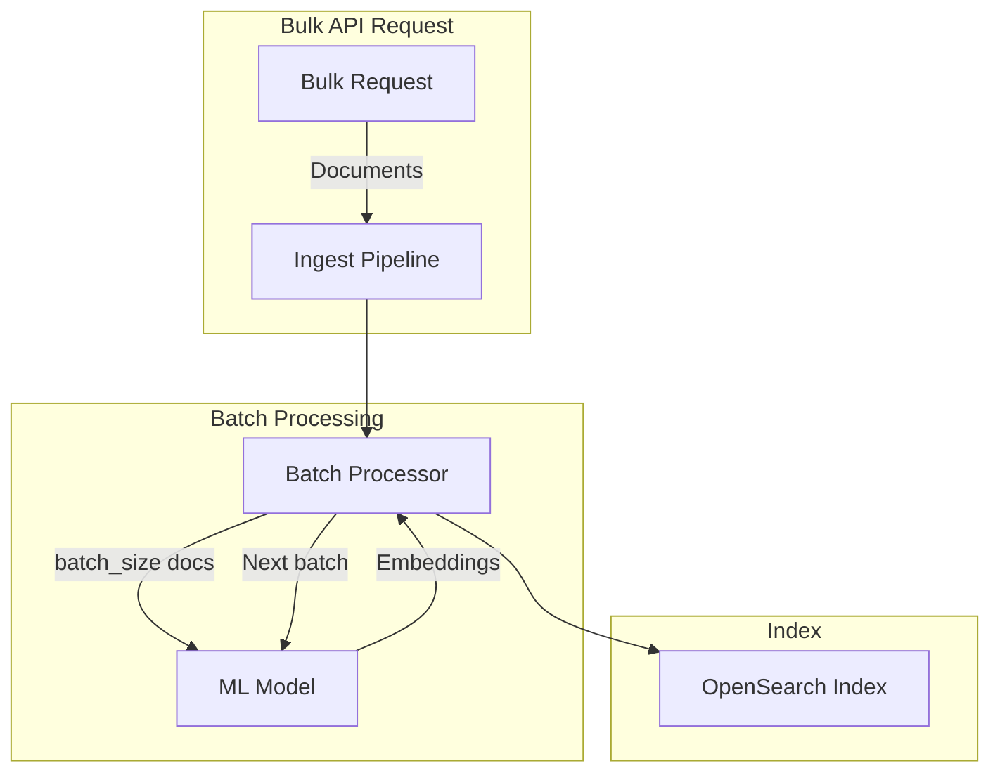
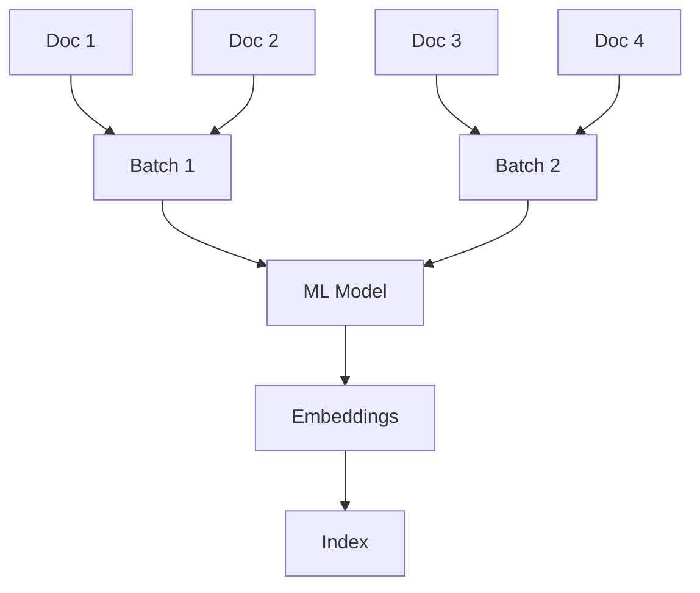

---
tags:
  - indexing
  - ml
  - neural-search
  - performance
---

# Batch Ingestion

## Summary

Batch ingestion is a feature that allows ingest processors to process multiple documents simultaneously when using the Bulk API. This improves performance when generating embeddings with externally hosted ML models by reducing the number of API calls. The `text_embedding` and `sparse_encoding` processors support batch ingestion through a `batch_size` configuration parameter.

## Details

### Architecture



### Data Flow



### Components

| Component | Description |
|-----------|-------------|
| `text_embedding` processor | Converts text to dense vector embeddings with batch support |
| `sparse_encoding` processor | Converts text to sparse vector embeddings with batch support |
| `batch_size` parameter | Controls number of documents processed per ML model call |
| Bulk API | Entry point for batch document ingestion |

### Configuration

| Setting | Description | Default |
|---------|-------------|---------|
| `batch_size` | Number of documents to batch per ML model request | 1 |
| `model_id` | ID of the deployed ML model | Required |
| `field_map` | Mapping of source fields to embedding fields | Required |

### Usage Example

#### Creating a Pipeline with Batch Size

```json
PUT /_ingest/pipeline/nlp-ingest-pipeline
{
  "description": "A text embedding pipeline with batching",
  "processors": [
    {
      "text_embedding": {
        "model_id": "cleMb4kBJ1eYAeTMFFg4",
        "batch_size": 5,
        "field_map": {
          "passage_text": "passage_embedding"
        }
      }
    }
  ]
}
```

#### Bulk Ingestion

```json
POST _bulk?pipeline=nlp-ingest-pipeline
{ "create": { "_index": "testindex", "_id": "1" } }
{ "passage_text": "hello world" }
{ "create": { "_index": "testindex", "_id": "2" } }
{ "passage_text": "big apple" }
{ "create": { "_index": "testindex", "_id": "3" } }
{ "passage_text": "golden gate bridge" }
```

#### Sparse Encoding Pipeline

```json
PUT /_ingest/pipeline/sparse-pipeline
{
  "description": "Sparse encoding pipeline with batching",
  "processors": [
    {
      "sparse_encoding": {
        "model_id": "sparseModelId",
        "batch_size": 2,
        "field_map": {
          "passage_text": "passage_embedding"
        }
      }
    }
  ]
}
```

## Limitations

- Batch size should be tuned based on ML model capacity and memory constraints
- Very large batch sizes may cause timeouts with external ML services
- Only `text_embedding` and `sparse_encoding` processors support batching
- Default batch size is 1 (no batching) for backward compatibility

## Change History

- **v2.17.0** (2024-09-17): Test infrastructure updated to use processor-level batch_size
  - Removed batch_size from Bulk API test parameters
  - Updated BWC test infrastructure with cleaner version checks
  - Added batch_size parameter to pipeline configuration in tests
- **v2.16.0**: Batch size configuration moved from Bulk API to processor level
- **v2.14.0**: Initial batch ingestion feature introduced

## Related Features
- [ML Commons](../ml-commons/agentic-memory.md)
- [k-NN Vector Search](../k-nn/disk-based-vector-search.md)
- [Search Relevance](../search-relevance/ci-tests.md)

## References

### Documentation
- [Batch Ingestion Documentation](https://docs.opensearch.org/2.17/ml-commons-plugin/remote-models/batch-ingestion/): Official docs
- [Text Embedding Processor](https://docs.opensearch.org/2.17/ingest-pipelines/processors/text-embedding/): Processor docs
- [Sparse Encoding Processor](https://docs.opensearch.org/2.17/ingest-pipelines/processors/sparse-encoding/): Processor docs

### Pull Requests
| Version | PR | Description | Related Issue |
|---------|-----|-------------|---------------|
| v2.17.0 | [#852](https://github.com/opensearch-project/neural-search/pull/852) | Update tests to use batch_size in processor | [#14283](https://github.com/opensearch-project/neural-search/issues/14283) |
| v2.16.0 | - | Batch size moved from Bulk API to processor configuration |   |
| v2.14.0 | - | Initial batch ingestion support |   |

### Issues (Design / RFC)
- [Issue #14283](https://github.com/opensearch-project/OpenSearch/issues/14283): Make batch ingestion automatic
