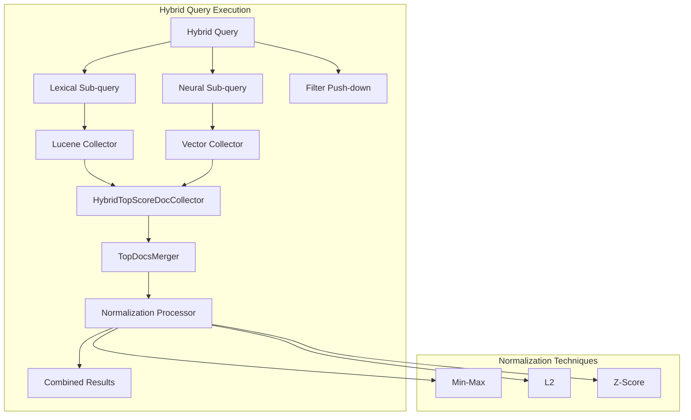
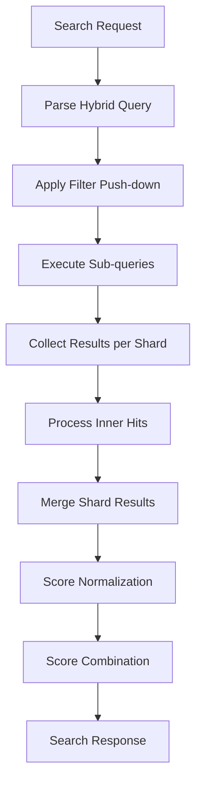

---
tags:
  - indexing
  - neural-search
  - search
---

# Hybrid Query

## Summary

Hybrid query is a compound query type in OpenSearch that combines lexical (keyword) search with neural (vector) search to improve search relevance. It was introduced in OpenSearch 2.11 as part of the neural-search plugin and enables users to leverage both traditional BM25 scoring and semantic similarity in a single query. The hybrid query requires a search pipeline with normalization and combination processors to merge results from different query types.

## Details

### Architecture



### Data Flow



### Components

| Component | Description |
|-----------|-------------|
| `HybridQuery` | Compound query containing multiple sub-queries |
| `HybridQueryBuilder` | Builder for hybrid queries with filter support |
| `HybridQueryPhaseSearcher` | Custom query phase searcher for hybrid execution |
| `HybridTopScoreDocCollector` | Collector that maintains results from all sub-queries |
| `HybridCollapsingTopDocsCollector` | Collector for keyword and numeric field collapse with configurable docs per group |
| `HybridBulkScorer` | Custom bulk scorer with window-based collection (4096 window size) |
| `HybridQueryDocIdStream` | Document ID stream for bulk scoring |
| `HybridSubQueryScorer` | Sub-query scorer for hybrid execution |
| `HybridScorerSupplier` | Supplier for hybrid scorers |
| `TopDocsMerger` | Merges results from multiple shards/segments |
| `NormalizationProcessor` | Search pipeline processor for score normalization |
| `ScoreCombinationTechnique` | Combines normalized scores |
| `RRFScoreCombinationTechnique` | RRF combination with custom weight support |
| `ZScoreNormalizationTechnique` | Z-Score based normalization |
| `SemanticHighlighter` | ML-based semantic highlighting for hybrid results |
| `NeuralStatsAction` | Stats API for neural search observability |
| `CollapseDTO` | Data transfer object for collapse configuration |
| `CollapseDataCollector` | Collects data for collapse processing |
| `CollapseExecutor` | Executes collapse logic on hybrid query results |
| `CollapseStrategy` | Strategy pattern for field type handling (keyword/numeric) |
| `CollapseResultUpdater` | Updates results after collapse processing |
| `UpperBound` | Upper boundary constraint for score normalization |
| `LowerBound` | Lower boundary constraint for score normalization |
| `ScoreBound` | Abstract base class for score boundary constraints |
| `BoundMode` | Enum for boundary modes (APPLY, CLIP, IGNORE) |

### Configuration

Hybrid search requires a search pipeline with normalization and combination processors:

```json
PUT /_search/pipeline/hybrid-pipeline
{
  "description": "Pipeline for hybrid search",
  "phase_results_processors": [
    {
      "normalization-processor": {
        "normalization": {
          "technique": "min_max",
          "parameters": {
            "lower_bounds": [
              { "mode": "apply", "min_score": 0.1 },
              { "mode": "ignore" }
            ],
            "upper_bounds": [
              { "mode": "apply", "max_score": 0.99 },
              { "mode": "clip", "max_score": 1.0 }
            ]
          }
        },
        "combination": {
          "technique": "arithmetic_mean",
          "parameters": {
            "weights": [0.3, 0.7]
          }
        }
      }
    }
  ]
}
```

| Setting | Description | Default |
|---------|-------------|---------|
| `normalization.technique` | Score normalization method (`min_max`, `l2`, `z_score`) | `min_max` |
| `normalization.parameters.lower_bounds` | Lower bound configuration per sub-query | None |
| `normalization.parameters.upper_bounds` | Upper bound configuration per sub-query | None |
| `combination.technique` | Score combination method (`arithmetic_mean`, `geometric_mean`, `harmonic_mean`) | `arithmetic_mean` |
| `combination.parameters.weights` | Weights for each sub-query | Equal weights |
| `index.neural_search.hybrid_collapse_docs_per_group_per_subquery` | Documents stored per group per sub-query in collapse | `0` |

#### Lower Bounds Modes

| Mode | Description |
|------|-------------|
| `apply` | Apply the min_score as the lower bound for normalization |
| `clip` | Clip scores below min_score to min_score value |
| `ignore` | No lower bound applied to this sub-query |

#### Upper Bounds Modes

| Mode | Description |
|------|-------------|
| `apply` | Use actual score value if it exceeds upper bound score |
| `clip` | Clip score to 1.0 if it exceeds the upper bound |
| `ignore` | No upper bound applied to this sub-query |

### Usage Example

```json
GET /my-index/_search?search_pipeline=hybrid-pipeline
{
  "query": {
    "hybrid": {
      "queries": [
        {
          "match": {
            "text_field": "search terms"
          }
        },
        {
          "neural": {
            "embedding_field": {
              "query_text": "semantic search query",
              "model_id": "model-id",
              "k": 10
            }
          }
        }
      ],
      "filter": {
        "term": { "category": "technology" }
      }
    }
  },
  "highlight": {
    "fields": {
      "text_field": { "type": "semantic" }
    },
    "options": {
      "model_id": "highlighter-model"
    }
  }
}
```

### Stats API

Monitor neural search operations:

```
GET /_plugins/_neural/stats
GET /_plugins/_neural/stats?include_metadata=true
GET /_plugins/_neural/stats/text_embedding_executions
```

## Limitations

- **Explain API**: The `explain` parameter is not fully supported for hybrid queries (partial support added in v3.1.0).
- **Nested queries**: Hybrid queries cannot be nested inside other compound queries.
- **Nested filter**: Nested HybridQueryBuilder does not support the filter function.
- **Concurrent segment search**: Results may vary due to non-deterministic merge order when concurrent segment search is enabled.
- **Semantic highlighter**: Requires a deployed sentence highlighting model.
- **Collapse aggregations**: Aggregations run on pre-collapsed results, not the final output.
- **Collapse pagination**: Collapse reduces total results, affecting page distribution.
- **Bounds array size**: Both `lower_bounds` and `upper_bounds` arrays must match the number of sub-queries in the hybrid query.

## Change History

- **v3.3.0** (2026-01-11): Bug fixes for nested list ordering in embedding processor, unit test mocking support, CI disk cleanup for BWC tests
- **v3.2.0** (2026-01-14): Upper bound parameter for min-max normalization, inner hits support within collapse, configurable collapse document storage setting, HybridQueryDocIdStream bug fix
- **v3.1.0** (2025-06-10): Collapse functionality for hybrid queries, custom bulk scorer (2-3x performance), RRF custom weights support; Bug fixes for hybrid query validation, semantic field handling, radial search serialization, stats API, and stability improvements
- **v3.0.0** (2025-05-13): Z-Score normalization, lower bounds for min-max, filter support, inner hits, Stats API, semantic highlighter, analyzer-based neural sparse query, optimized embedding generation
- **v2.18.0** (2024-11-05): Fixed incorrect document order for nested aggregations in hybrid query
- **v2.17.0** (2024-09-17): Fixed pagination error handling and multi-shard merge logic
- **v2.11.0** (2023-10-16): Initial implementation of hybrid search

## References

### Documentation
- [Hybrid Search Documentation](https://docs.opensearch.org/3.1/vector-search/ai-search/hybrid-search/index/)
- [Collapsing Hybrid Query Results](https://docs.opensearch.org/3.1/vector-search/ai-search/hybrid-search/collapse/)
- [Hybrid Query DSL](https://docs.opensearch.org/3.1/query-dsl/compound/hybrid/)
- [Neural Search API](https://docs.opensearch.org/3.1/vector-search/api/neural/)
- [Normalization Processor](https://docs.opensearch.org/3.1/search-plugins/search-pipelines/normalization-processor/)
- [Neural Search Tutorial](https://docs.opensearch.org/3.1/tutorials/vector-search/neural-search-tutorial/)

### Pull Requests
| Version | PR | Description | Related Issue |
|---------|-----|-------------|---------------|
| v3.3.0 | [#1570](https://github.com/opensearch-project/neural-search/pull/1570) | Fix: Reversed order of values in nested list with embedding processor | [#1569](https://github.com/opensearch-project/neural-search/issues/1569) |
| v3.3.0 | [#1528](https://github.com/opensearch-project/neural-search/pull/1528) | Enable mocking of final classes and static functions |   |
| v3.3.0 | [#1584](https://github.com/opensearch-project/neural-search/pull/1584) | Add CI action to clean up disk and apply to BWC | [#1583](https://github.com/opensearch-project/neural-search/issues/1583) |
| v3.2.0 | [#1431](https://github.com/opensearch-project/neural-search/pull/1431) | Add upper bound parameter for min-max normalization technique | [#1210](https://github.com/opensearch-project/neural-search/issues/1210) |
| v3.2.0 | [#1447](https://github.com/opensearch-project/neural-search/pull/1447) | Enable inner hits within collapse parameter for hybrid query |   |
| v3.2.0 | [#1471](https://github.com/opensearch-project/neural-search/pull/1471) | Add setting for number of documents stored by HybridCollapsingTopDocsCollector | [#1381](https://github.com/opensearch-project/neural-search/issues/1381) |
| v3.2.0 | [#1414](https://github.com/opensearch-project/neural-search/pull/1414) | Fix the HybridQueryDocIdStream to properly handle upTo value | [#1344](https://github.com/opensearch-project/neural-search/issues/1344) |
| v3.1.0 | [#1345](https://github.com/opensearch-project/neural-search/pull/1345) | Add collapse functionality to hybrid query | [#665](https://github.com/opensearch-project/neural-search/issues/665) |
| v3.1.0 | [#1289](https://github.com/opensearch-project/neural-search/pull/1289) | Custom bulk scorer for hybrid query (2-3x performance) | [#1290](https://github.com/opensearch-project/neural-search/issues/1290) |
| v3.1.0 | [#1322](https://github.com/opensearch-project/neural-search/pull/1322) | Support custom weights in RRF normalization processor | [#1152](https://github.com/opensearch-project/neural-search/issues/1152) |
| v3.1.0 | [#1277](https://github.com/opensearch-project/neural-search/pull/1277) | Fix: Score value as null for single shard sorting | [#1274](https://github.com/opensearch-project/neural-search/issues/1274) |
| v3.1.0 | [#1291](https://github.com/opensearch-project/neural-search/pull/1291) | Fix: Return bad request for invalid stat parameters |   |
| v3.1.0 | [#1305](https://github.com/opensearch-project/neural-search/pull/1305) | Fix: Add validation for nested hybrid query | [#1108](https://github.com/opensearch-project/neural-search/issues/1108) |
| v3.1.0 | [#1357](https://github.com/opensearch-project/neural-search/pull/1357) | Fix: Use stack for semantic field collection |   |
| v3.1.0 | [#1373](https://github.com/opensearch-project/neural-search/pull/1373) | Fix: Filter stats based on cluster version | [#1368](https://github.com/opensearch-project/neural-search/issues/1368) |
| v3.1.0 | [#1393](https://github.com/opensearch-project/neural-search/pull/1393) | Fix: Radial search serialization | [#1392](https://github.com/opensearch-project/neural-search/issues/1392) |
| v3.1.0 | [#1396](https://github.com/opensearch-project/neural-search/pull/1396) | Fix: Neural query with semantic field |   |
| v3.0.0 | [#1224](https://github.com/opensearch-project/neural-search/pull/1224) | Add Z Score normalization technique | [#376](https://github.com/opensearch-project/neural-search/issues/376) |
| v3.0.0 | [#1195](https://github.com/opensearch-project/neural-search/pull/1195) | Lower bounds for min-max normalization | [#150](https://github.com/opensearch-project/neural-search/issues/150) |
| v3.0.0 | [#1206](https://github.com/opensearch-project/neural-search/pull/1206) | Filter support for HybridQueryBuilder and NeuralQueryBuilder | [#1206](https://github.com/opensearch-project/neural-search/issues/1206) |
| v3.0.0 | [#1253](https://github.com/opensearch-project/neural-search/pull/1253) | Inner hits support with hybrid query | [#718](https://github.com/opensearch-project/neural-search/issues/718) |
| v3.0.0 | [#1256](https://github.com/opensearch-project/neural-search/pull/1256) | Add stats API | [#1196](https://github.com/opensearch-project/neural-search/issues/1196) |
| v3.0.0 | [#1193](https://github.com/opensearch-project/neural-search/pull/1193) | Support semantic sentence highlighter | [#1182](https://github.com/opensearch-project/neural-search/issues/1182) |
| v3.0.0 | [#1088](https://github.com/opensearch-project/neural-search/pull/1088) | Analyzer-based neural sparse query |   |
| v3.0.0 | [#1191](https://github.com/opensearch-project/neural-search/pull/1191) | Optimize embedding generation in Text Embedding Processor | [#1138](https://github.com/opensearch-project/neural-search/issues/1138) |
| v3.0.0 | [#1246](https://github.com/opensearch-project/neural-search/pull/1246) | Optimize embedding generation in Sparse Encoding Processor | [#1138](https://github.com/opensearch-project/neural-search/issues/1138) |
| v3.0.0 | [#1249](https://github.com/opensearch-project/neural-search/pull/1249) | Optimize embedding generation in Text/Image Embedding Processor | [#1138](https://github.com/opensearch-project/neural-search/issues/1138) |
| v2.18.0 | [#956](https://github.com/opensearch-project/neural-search/pull/956) | Fixed incorrect document order for nested aggregations in hybrid query | [#955](https://github.com/opensearch-project/neural-search/issues/955) |
| v2.17.0 | [#867](https://github.com/opensearch-project/neural-search/pull/867) | Removed misleading pagination code, added clear error |   |
| v2.17.0 | [#877](https://github.com/opensearch-project/neural-search/pull/877) | Fixed merge logic for empty shard results | [#875](https://github.com/opensearch-project/neural-search/issues/875) |
| v2.11.0 | - | Initial implementation of hybrid search |   |

### Issues (Design / RFC)
- [Issue #665](https://github.com/opensearch-project/neural-search/issues/665): Hybrid search and collapse compatibility request
- [Issue #1152](https://github.com/opensearch-project/neural-search/issues/1152): Custom weights in RRF request
- [Issue #1290](https://github.com/opensearch-project/neural-search/issues/1290): RFC for speeding up score collecting
- [Issue #376](https://github.com/opensearch-project/neural-search/issues/376): Z-Score normalization request
- [Issue #718](https://github.com/opensearch-project/neural-search/issues/718): Inner hits support request
- [Issue #1138](https://github.com/opensearch-project/neural-search/issues/1138): Embedding optimization RFC
- [Issue #1182](https://github.com/opensearch-project/neural-search/issues/1182): Semantic highlighter tracking
- [Issue #1196](https://github.com/opensearch-project/neural-search/issues/1196): Stats API RFC
- [Issue #875](https://github.com/opensearch-project/neural-search/issues/875): Unable to merge results from shards
- [Issue #280](https://github.com/opensearch-project/neural-search/issues/280): Pagination support tracking
- [Issue #1210](https://github.com/opensearch-project/neural-search/issues/1210): Upper bound in min-max normalization request
- [Issue #1379](https://github.com/opensearch-project/neural-search/issues/1379): Inner hits compatibility with collapse request
- [Issue #1381](https://github.com/opensearch-project/neural-search/issues/1381): Collapse document storage setting request
- [Issue #1344](https://github.com/opensearch-project/neural-search/issues/1344): Flaky test bug in HybridQueryDocIdStream
- [Issue #1569](https://github.com/opensearch-project/neural-search/issues/1569): ProcessorDocumentUtils.handleList messes up the order of nested lists
- [Issue #1108](https://github.com/opensearch-project/neural-search/issues/1108): Nested hybrid query bug
- [Issue #1274](https://github.com/opensearch-project/neural-search/issues/1274): Hybrid search sort score corruption
- [Issue #1368](https://github.com/opensearch-project/neural-search/issues/1368): Stats BWC test failure
- [Issue #1392](https://github.com/opensearch-project/neural-search/issues/1392): Radial search fails on 3.0
