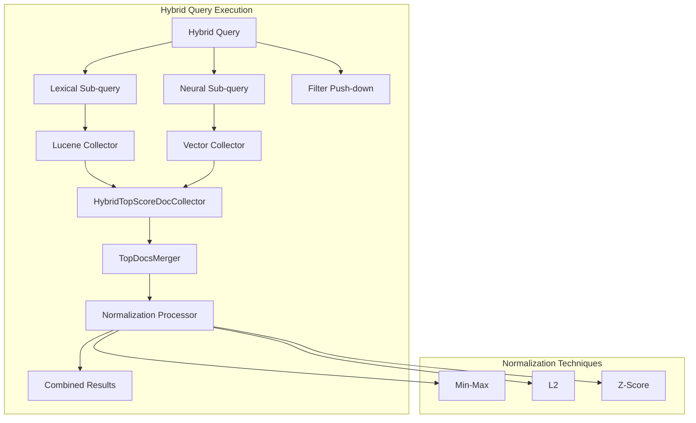
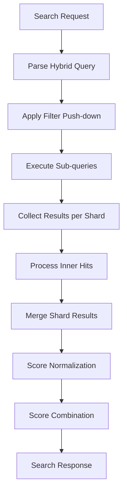

# Hybrid Query

## Summary

Hybrid query is a compound query type in OpenSearch that combines lexical (keyword) search with neural (vector) search to improve search relevance. It was introduced in OpenSearch 2.11 as part of the neural-search plugin and enables users to leverage both traditional BM25 scoring and semantic similarity in a single query. The hybrid query requires a search pipeline with normalization and combination processors to merge results from different query types.

## Details

### Architecture



### Data Flow



### Components

| Component | Description |
|-----------|-------------|
| `HybridQuery` | Compound query containing multiple sub-queries |
| `HybridQueryBuilder` | Builder for hybrid queries with filter support |
| `HybridQueryPhaseSearcher` | Custom query phase searcher for hybrid execution |
| `HybridTopScoreDocCollector` | Collector that maintains results from all sub-queries |
| `TopDocsMerger` | Merges results from multiple shards/segments |
| `NormalizationProcessor` | Search pipeline processor for score normalization |
| `ScoreCombinationTechnique` | Combines normalized scores |
| `ZScoreNormalizationTechnique` | Z-Score based normalization |
| `SemanticHighlighter` | ML-based semantic highlighting for hybrid results |
| `NeuralStatsAction` | Stats API for neural search observability |

### Configuration

Hybrid search requires a search pipeline with normalization and combination processors:

```json
PUT /_search/pipeline/hybrid-pipeline
{
  "description": "Pipeline for hybrid search",
  "phase_results_processors": [
    {
      "normalization-processor": {
        "normalization": {
          "technique": "min_max",
          "parameters": {
            "lower_bounds": [
              { "mode": "apply", "min_score": 0.1 },
              { "mode": "ignore" }
            ]
          }
        },
        "combination": {
          "technique": "arithmetic_mean",
          "parameters": {
            "weights": [0.3, 0.7]
          }
        }
      }
    }
  ]
}
```

| Setting | Description | Default |
|---------|-------------|---------|
| `normalization.technique` | Score normalization method (`min_max`, `l2`, `z_score`) | `min_max` |
| `normalization.parameters.lower_bounds` | Lower bound configuration per sub-query | None |
| `combination.technique` | Score combination method (`arithmetic_mean`, `geometric_mean`, `harmonic_mean`) | `arithmetic_mean` |
| `combination.parameters.weights` | Weights for each sub-query | Equal weights |

#### Lower Bounds Modes

| Mode | Description |
|------|-------------|
| `apply` | Apply the min_score as the lower bound for normalization |
| `clip` | Clip scores below min_score to min_score value |
| `ignore` | No lower bound applied to this sub-query |

### Usage Example

```json
GET /my-index/_search?search_pipeline=hybrid-pipeline
{
  "query": {
    "hybrid": {
      "queries": [
        {
          "match": {
            "text_field": "search terms"
          }
        },
        {
          "neural": {
            "embedding_field": {
              "query_text": "semantic search query",
              "model_id": "model-id",
              "k": 10
            }
          }
        }
      ],
      "filter": {
        "term": { "category": "technology" }
      }
    }
  },
  "highlight": {
    "fields": {
      "text_field": { "type": "semantic" }
    },
    "options": {
      "model_id": "highlighter-model"
    }
  }
}
```

### Stats API

Monitor neural search operations:

```
GET /_plugins/_neural/stats
GET /_plugins/_neural/stats?include_metadata=true
GET /_plugins/_neural/stats/text_embedding_executions
```

## Limitations

- **Pagination**: The `from` parameter is not supported with hybrid queries. Use `search_after` for pagination instead.
- **Explain API**: The `explain` parameter is not fully supported for hybrid queries.
- **Nested queries**: Hybrid queries cannot be nested inside other compound queries.
- **Nested filter**: Nested HybridQueryBuilder does not support the filter function.
- **Concurrent segment search**: Results may vary due to non-deterministic merge order when concurrent segment search is enabled.
- **Semantic highlighter**: Requires a deployed sentence highlighting model.

## Related PRs

| Version | PR | Description |
|---------|-----|-------------|
| v3.0.0 | [#1224](https://github.com/opensearch-project/neural-search/pull/1224) | Add Z Score normalization technique |
| v3.0.0 | [#1195](https://github.com/opensearch-project/neural-search/pull/1195) | Lower bounds for min-max normalization |
| v3.0.0 | [#1206](https://github.com/opensearch-project/neural-search/pull/1206) | Filter support for HybridQueryBuilder and NeuralQueryBuilder |
| v3.0.0 | [#1253](https://github.com/opensearch-project/neural-search/pull/1253) | Inner hits support with hybrid query |
| v3.0.0 | [#1256](https://github.com/opensearch-project/neural-search/pull/1256) | Add stats API |
| v3.0.0 | [#1193](https://github.com/opensearch-project/neural-search/pull/1193) | Support semantic sentence highlighter |
| v3.0.0 | [#1088](https://github.com/opensearch-project/neural-search/pull/1088) | Analyzer-based neural sparse query |
| v3.0.0 | [#1191](https://github.com/opensearch-project/neural-search/pull/1191) | Optimize embedding generation in Text Embedding Processor |
| v3.0.0 | [#1246](https://github.com/opensearch-project/neural-search/pull/1246) | Optimize embedding generation in Sparse Encoding Processor |
| v3.0.0 | [#1249](https://github.com/opensearch-project/neural-search/pull/1249) | Optimize embedding generation in Text/Image Embedding Processor |
| v2.17.0 | [#867](https://github.com/opensearch-project/neural-search/pull/867) | Removed misleading pagination code, added clear error |
| v2.17.0 | [#877](https://github.com/opensearch-project/neural-search/pull/877) | Fixed merge logic for empty shard results |
| v2.11.0 | - | Initial implementation of hybrid search |

## References

- [Hybrid Search Documentation](https://docs.opensearch.org/3.0/vector-search/ai-search/hybrid-search/index/)
- [Hybrid Query DSL](https://docs.opensearch.org/3.0/query-dsl/compound/hybrid/)
- [Neural Search API](https://docs.opensearch.org/3.0/vector-search/api/neural/)
- [Normalization Processor](https://docs.opensearch.org/3.0/search-plugins/search-pipelines/normalization-processor/)
- [Neural Search Tutorial](https://docs.opensearch.org/3.0/tutorials/vector-search/neural-search-tutorial/)
- [Issue #376](https://github.com/opensearch-project/neural-search/issues/376): Z-Score normalization request
- [Issue #718](https://github.com/opensearch-project/neural-search/issues/718): Inner hits support request
- [Issue #1138](https://github.com/opensearch-project/neural-search/issues/1138): Embedding optimization RFC
- [Issue #1182](https://github.com/opensearch-project/neural-search/issues/1182): Semantic highlighter tracking
- [Issue #1196](https://github.com/opensearch-project/neural-search/issues/1196): Stats API RFC
- [Issue #875](https://github.com/opensearch-project/neural-search/issues/875): Unable to merge results from shards
- [Issue #280](https://github.com/opensearch-project/neural-search/issues/280): Pagination support tracking

## Change History

- **v3.0.0** (2025-05-13): Z-Score normalization, lower bounds for min-max, filter support, inner hits, Stats API, semantic highlighter, analyzer-based neural sparse query, optimized embedding generation
- **v2.17.0** (2024-09-17): Fixed pagination error handling and multi-shard merge logic
- **v2.11.0** (2023-10-16): Initial implementation of hybrid search
