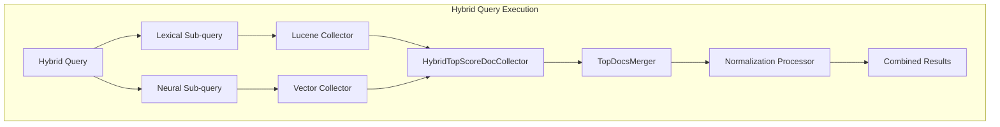

# Hybrid Query

## Summary

Hybrid query is a compound query type in OpenSearch that combines lexical (keyword) search with neural (vector) search to improve search relevance. It was introduced in OpenSearch 2.11 as part of the neural-search plugin and enables users to leverage both traditional BM25 scoring and semantic similarity in a single query.

## Details

### Architecture



### Data Flow


### Components

| Component | Description |
|-----------|-------------|
| `HybridQuery` | Compound query containing multiple sub-queries |
| `HybridQueryPhaseSearcher` | Custom query phase searcher for hybrid execution |
| `HybridTopScoreDocCollector` | Collector that maintains results from all sub-queries |
| `TopDocsMerger` | Merges results from multiple shards/segments |
| `NormalizationProcessor` | Search pipeline processor for score normalization |
| `ScoreCombinationTechnique` | Combines normalized scores (arithmetic_mean, geometric_mean, harmonic_mean) |

### Configuration

Hybrid search requires a search pipeline with normalization and combination processors:

```json
PUT /_search/pipeline/hybrid-pipeline
{
  "description": "Pipeline for hybrid search",
  "phase_results_processors": [
    {
      "normalization-processor": {
        "normalization": {
          "technique": "min_max"
        },
        "combination": {
          "technique": "arithmetic_mean",
          "parameters": {
            "weights": [0.3, 0.7]
          }
        }
      }
    }
  ]
}
```

| Setting | Description | Default |
|---------|-------------|---------|
| `normalization.technique` | Score normalization method (`min_max`, `l2`) | `min_max` |
| `combination.technique` | Score combination method (`arithmetic_mean`, `geometric_mean`, `harmonic_mean`) | `arithmetic_mean` |
| `combination.parameters.weights` | Weights for each sub-query | Equal weights |

### Usage Example

```json
GET /my-index/_search?search_pipeline=hybrid-pipeline
{
  "query": {
    "hybrid": {
      "queries": [
        {
          "match": {
            "text_field": "search terms"
          }
        },
        {
          "neural": {
            "embedding_field": {
              "query_text": "semantic search query",
              "model_id": "model-id",
              "k": 10
            }
          }
        }
      ]
    }
  }
}
```

## Limitations

- **Pagination**: The `from` parameter is not supported with hybrid queries. Use `search_after` for pagination instead.
- **Explain API**: The `explain` parameter is not fully supported for hybrid queries.
- **Nested queries**: Hybrid queries cannot be nested inside other compound queries.
- **Concurrent segment search**: Results may vary due to non-deterministic merge order when concurrent segment search is enabled.

## Related PRs

| Version | PR | Description |
|---------|-----|-------------|
| v2.17.0 | [#867](https://github.com/opensearch-project/neural-search/pull/867) | Removed misleading pagination code, added clear error |
| v2.17.0 | [#877](https://github.com/opensearch-project/neural-search/pull/877) | Fixed merge logic for empty shard results |

## References

- [Hybrid Search Documentation](https://docs.opensearch.org/latest/search-plugins/hybrid-search/)
- [Hybrid Query DSL](https://docs.opensearch.org/latest/query-dsl/compound/hybrid/)
- [Neural Search Tutorial](https://docs.opensearch.org/latest/search-plugins/neural-search-tutorial/)
- [Issue #875](https://github.com/opensearch-project/neural-search/issues/875): Unable to merge results from shards
- [Issue #280](https://github.com/opensearch-project/neural-search/issues/280): Pagination support tracking

## Change History

- **v2.17.0** (2024-09-17): Fixed pagination error handling and multi-shard merge logic
- **v2.11.0** (2023-10-16): Initial implementation of hybrid search
