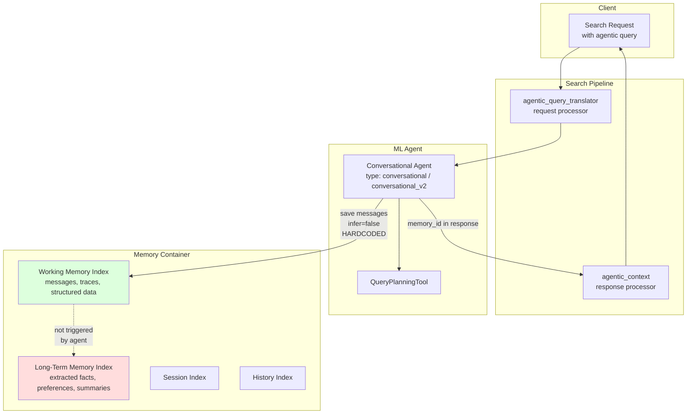

---
tags:
  - neural-search
---
# Agentic Search Memory Integration

## Summary

Agentic Search can be combined with two different memory mechanisms that give the agent context across turns: the legacy `conversation_index` and the newer `agentic_memory` (Memory Container). Behaviorally these look similar from the outside—the agent remembers prior turns and refines subsequent queries—but they differ significantly in storage, configuration, and what is (and isn't) persisted long-term.

The most important and easily-missed detail: **when an agent uses `agentic_memory`, long-term memory extraction is hardcoded to `infer=false` in the ml-commons source code**. Agent execution (including via the `agentic_query_translator` search request processor) populates only working memory. Long-term memory (semantic facts, user preferences, summaries) requires explicit `POST /memories` calls with `infer: true` from the application layer.

This report focuses on how memory actually flows through an Agentic Search request, what the agent writes automatically, what it does not write, and why.

## Details

### Architecture



### Memory Options in Agentic Search

| Memory type | Where data lives | Long-term extraction | Notes |
|-------------|------------------|----------------------|-------|
| `conversation_index` (legacy) | Internal conversation indices | Not available | Simple, zero-config, used by most examples in OpenSearch docs |
| `agentic_memory` | Memory Container (working + long-term + session + history indices) | Supported **only via explicit Add Memory API with `infer: true`**; not triggered by agent execution | Configure via `memory_container_id` on agent registration |
| `remote_agentic_memory` | Memory Container on a remote cluster via HTTP connector | Same as above—agent never triggers `infer` | Enables cross-cluster memory sharing |

### What the Agent Writes Automatically

During Agentic Search execution, the agent writes the following to working memory:

| Payload | Trigger | `infer` flag |
|---------|---------|--------------|
| User message (`query_text`) and assistant reply | Every turn | `false` (hardcoded) |
| Tool invocations and traces (ListIndexTool, IndexMappingTool, QueryPlanningTool outputs) | Per tool call | `false` (hardcoded) |
| Session metadata (`session_id`, timestamps) | Session start | n/a |

These writes happen through `AgenticConversationMemory.save()` (local) or `RemoteAgenticConversationMemory.save()` (remote), both of which call `MLAddMemoriesInput.builder().infer(false)`. This means the LLM-based fact extraction pipeline that populates long-term memory is never engaged by the agent itself.

### Source of the `infer(false)` Behavior

From `AgenticConversationMemory.java` (line 174, and again at line 535):

```java
MLAddMemoriesInput input = MLAddMemoriesInput
    .builder()
    .memoryContainerId(memoryContainerId)
    .structuredDataBlob(structuredData)
    .messageId(traceNum)
    .namespace(namespace)
    .metadata(metadata)
    .infer(false) // Don't infer long-term memory by default
    .build();
```

And `RemoteAgenticConversationMemory.java` (line 227, and again at line 665):

```java
requestBody.put("infer", false); // Don't infer long-term memory by default
```

Both files were introduced in PR [ml-commons#4564](https://github.com/opensearch-project/ml-commons/pull/4564) (merged 2026-01-28). The `infer(false)` value was present from the initial commit, and no code path in the agent runners (including `MLChatAgentRunner`, `AbstractV2AgentRunner`, `MLAgentExecutor`) ever sets `infer` to `true`.

### Why This Design

The RFC behind this implementation ([ml-commons#4572](https://github.com/opensearch-project/ml-commons/issues/4572)) explicitly scoped the feature to **conversation history storage**, not **knowledge extraction**:

> Keeps chat history across sessions / Captures tool traces for transparency and debugging

Three complementary reasons:

1. **Staged feature delivery**: The initial PR delivered working memory support. Long-term memory extraction is acknowledged as a separate concern.
2. **Cost and latency**: Fact extraction triggers an LLM inference per save. Automatically running it on every agent turn would multiply cost and response time.
3. **Separation of concerns**: Deciding what should be remembered long-term is an application-level policy decision (which user events matter, which session boundaries, what retention rules) rather than an agent runtime concern.

Maintainer dhrubo-os states this explicitly in [ml-commons#4791](https://github.com/opensearch-project/ml-commons/issues/4791):

> Phase 1: Auto-create with short-term memory (immediate) ... no LLM, no embedding model, no strategies.
>
> Phase 2: Support long-term memory with LLM only (follow-up improvement to agentic memory) ... Once this is supported in agentic memory, the agent's `llm.model_id` could be passed through to the auto-created container, giving users long-term memory with fact extraction out of the box.

### The `agentic_query_translator` Processor Does Not Touch Memory

From `AgenticQueryTranslatorProcessor.java` in neural-search, the processor only:

1. Reads `agent_id` and optional `embedding_model_id` from configuration.
2. Invokes the agent with the user's `query_text`.
3. Reads `memory_id` from the agent response and stores it in the search request context (so it can be echoed back through the `agentic_context` response processor).

The processor never calls any Memory Container API itself. All memory writes happen inside the agent runtime as described above, always with `infer=false`.

### Using Long-Term Memory: The Required Workaround

If you want semantic facts, user preferences, or summaries extracted and persisted, the application must explicitly call the Add Memory API out-of-band:

```json
POST /_plugins/_ml/memory_containers/{container_id}/memories
{
  "messages": [
    {"role": "user", "content": [{"type": "text", "text": "..."}]},
    {"role": "assistant", "content": [{"type": "text", "text": "..."}]}
  ],
  "namespace": {"user_id": "user123", "session_id": "sess-xyz"},
  "infer": true,
  "payload_type": "conversational"
}
```

Common patterns:

- **Post-session extraction**: After a conversation ends, replay the relevant turns with `infer: true` to distill stable facts.
- **Selective extraction**: Only send turns that the application judges worth remembering (avoiding noise and cost).
- **Batch extraction**: Periodic jobs that scan working memory and promote selected content to long-term.

Either way, the extraction remains under application control, not automated by Agentic Search itself.

### End-to-End Example: Agentic Search with Memory Continuity

Configuring an agent with `agentic_memory`:

```json
POST /_plugins/_ml/agents/_register
{
  "name": "GPT Agent for Agentic Search",
  "type": "conversational",
  "llm": {"model_id": "<llm-model-id>", "parameters": {"max_iteration": 15}},
  "memory": {
    "type": "agentic_memory",
    "memory_container_id": "<container-id>"
  },
  "tools": [{"type": "QueryPlanningTool"}]
}
```

Initial search:

```json
GET /_search?search_pipeline=agentic_search_pipeline
{
  "query": {"agentic": {"query_text": "Find me white shoes under 150 dollars"}}
}
```

Response includes `ext.memory_id` (from the `agentic_context` response processor). Follow-up:

```json
GET /_search?search_pipeline=agentic_search_pipeline
{
  "query": {
    "agentic": {
      "query_text": "Actually, show black ones instead",
      "memory_id": "<memory_id from previous response>"
    }
  }
}
```

The agent correctly preserves the price constraint and only swaps the color. This works because the conversation history is stored in **working memory** and replayed as `_chat_history` to the LLM on the next invocation. **No long-term memory is populated by this flow**, even if the container has `SEMANTIC`, `USER_PREFERENCE`, or `SUMMARY` strategies configured.

## Limitations

- Agent execution always calls `MLAddMemoriesInput` with `infer=false`; there is currently no configuration flag to change this.
- Configuring `strategies` on a Memory Container has no effect unless `infer: true` calls are made by the application.
- The `agentic_query_translator` processor accepts `agent_id` and `embedding_model_id` only; it cannot be configured to trigger long-term extraction.
- Long-term memory strategies currently require both an LLM and an embedding model (tracked for relaxation in issue #4791 Phase 2).
- No auto-creation of a default Memory Container when an agent is registered with `"memory": {"type": "agentic_memory"}` and no `memory_container_id` (tracked in issue #4791 Phase 1).

## Change History

- **v3.6.0** (2026-04-13): `conversational_v2` agent added (experimental), requires `agentic_memory` and supports multimodal input; same `infer=false` behavior applies
- **v3.5.0** (2026-02-11): PR #4564 merged—`AgenticConversationMemory` and `RemoteAgenticConversationMemory` introduced with `infer(false)` hardcoded; `agentic_memory` and `remote_agentic_memory` memory types available for Agentic Search agents
- **v3.3.0** (2026-01-11): Agentic Memory GA (Memory Container, strategies, sessions)
- **v3.2.0** (2026-01-10): Agentic Search experimental release; `conversation_index` memory was the only option at this point

## References

### Documentation
- [Agentic Search – Using agentic memory](https://docs.opensearch.org/latest/vector-search/ai-search/agentic-search/agentic-memory/)
- [Agentic memory overview](https://docs.opensearch.org/latest/ml-commons-plugin/agentic-memory/)
- [Add agentic memory API](https://docs.opensearch.org/latest/ml-commons-plugin/api/agentic-memory-apis/add-memory/)
- [Agentic query translator processor](https://docs.opensearch.org/latest/search-plugins/search-pipelines/agentic-query-translator-processor/)
- [Conversational agents](https://docs.opensearch.org/latest/ml-commons-plugin/agents-tools/agents/conversational/)

### Source Code
- `ml-algorithms/src/main/java/org/opensearch/ml/engine/memory/AgenticConversationMemory.java` (ml-commons): local memory implementation with `infer(false)` at lines 174 and 535
- `ml-algorithms/src/main/java/org/opensearch/ml/engine/memory/RemoteAgenticConversationMemory.java` (ml-commons): remote memory implementation with `infer=false` at lines 227 and 665
- `src/main/java/org/opensearch/neuralsearch/processor/AgenticQueryTranslatorProcessor.java` (neural-search): processor that reads `memory_id` but does not write to Memory Container

### Pull Requests
| Version | PR | Description |
|---------|-----|-------------|
| v3.5.0 | [ml-commons#4564](https://github.com/opensearch-project/ml-commons/pull/4564) | Enhancement: Enable remote conversational agentic memory through REST HTTP call (introduces both `AgenticConversationMemory` and `RemoteAgenticConversationMemory` with `infer(false)` hardcoded) |
| v3.6.0 | [ml-commons#4645](https://github.com/opensearch-project/ml-commons/pull/4645) | Support messages array in all memory types + chat history in AGUI agent |

### Issues (Design / RFC / Roadmap)
- [ml-commons#4572](https://github.com/opensearch-project/ml-commons/issues/4572) (closed): RFC – Agentic Conversation Memory for Built-in Agents. Scoped to conversation history, not knowledge extraction.
- [ml-commons#4791](https://github.com/opensearch-project/ml-commons/issues/4791) (open): Auto-create default memory container when registering agent with `agentic_memory`. Contains maintainer's Phase 1 / Phase 2 roadmap for long-term memory integration.
- [ml-commons#4144](https://github.com/opensearch-project/ml-commons/issues/4144) (closed): [BUG] Agentic memory not updated with new information. Usage example confirming that `infer: true` must be specified explicitly on the Add Memory API call.
- [ml-commons#4799](https://github.com/opensearch-project/ml-commons/issues/4799) (open): [FEATURE] Support structured output / constrained decoding for agentic memory fact extraction.

## Related Feature Reports

- Agentic Search (full feature documentation)
- Agentic Memory (Memory Container, strategies, namespaces)
