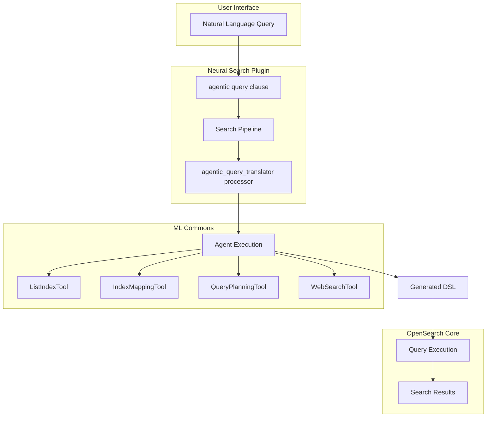
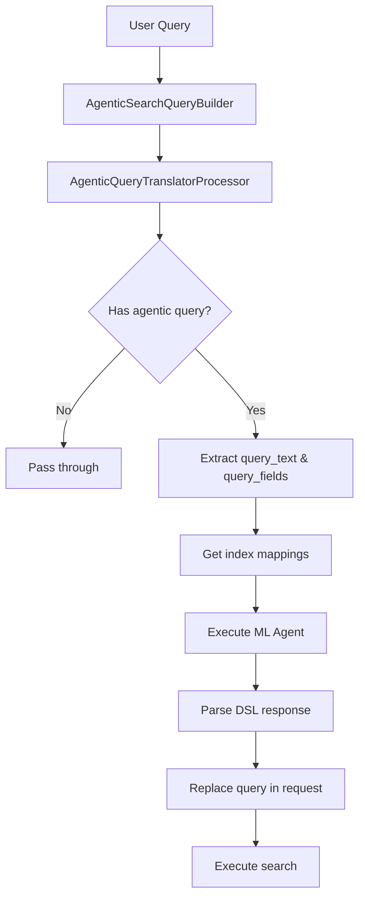

---
tags:
  - domain/search
  - component/server
  - indexing
  - ml
  - neural-search
  - performance
  - search
---
# Agentic Search

## Summary

Agentic Search is an LLM-enhanced search capability that allows users to interact with OpenSearch using natural language queries. Instead of constructing complex DSL queries manually, users can ask questions in plain language, and an intelligent agent interprets the intent, selects appropriate tools, and generates optimized search queries automatically.

Key benefits:
- **Natural language interface**: Query data without learning DSL syntax
- **Intent understanding**: Agent interprets user goals beyond simple keyword matching
- **Automatic query generation**: Converts natural language to optimized OpenSearch queries
- **Tool-based architecture**: Extensible through ML Commons agent framework

## Details

### Architecture



### Data Flow



### Components

| Component | Description |
|-----------|-------------|
| `AgenticSearchQueryBuilder` | Query builder that parses and validates the `agentic` query clause |
| `AgenticQueryTranslatorProcessor` | Search request processor that orchestrates agent execution |
| `MLCommonsClientAccessor` | Client for invoking ML agents with retry support |
| `NeuralSearchClusterUtil` | Utility for retrieving index mappings |
| `NeuralSearchSettingsAccessor` | Settings accessor for feature flag management |

### Configuration

| Setting | Description | Default | Scope |
|---------|-------------|---------|-------|
| `plugins.neural_search.agentic_search_enabled` | Enable/disable agentic search feature | `false` | Node, Dynamic |

### Query Planning Tool Configuration (v3.3.0+)

| Parameter | Description | Default |
|-----------|-------------|---------|
| `question` | Natural language query (required) | - |
| `index_name` | Target index name (required) | - |
| `embedding_model_id` | Model ID for neural search queries | Optional |
| `query_planner_system_prompt` | Custom system prompt for query planning | Default DSL generation prompt |
| `query_planner_user_prompt` | Custom user prompt for query planning | Default with question, mapping, sample doc |
| `template_selection_system_prompt` | Custom system prompt for template selection | Default template selection prompt |
| `template_selection_user_prompt` | Custom user prompt for template selection | Default with inputs |

### Usage Example

#### 1. Enable the Feature

```json
PUT _cluster/settings
{
  "transient": {
    "plugins.neural_search.agentic_search_enabled": "true"
  }
}
```

#### 2. Create an ML Agent

Create an agent with tools for query planning:

```json
POST /_plugins/_ml/agents/_register
{
  "name": "agentic_search_agent",
  "type": "conversational",
  "description": "Agent for agentic search",
  "llm": {
    "model_id": "<your-llm-model-id>"
  },
  "tools": [
    {
      "type": "ListIndexTool"
    },
    {
      "type": "IndexMappingTool"
    },
    {
      "type": "QueryPlanningTool"
    }
  ]
}
```

#### 3. Create Search Pipeline

```json
PUT _search/pipeline/agentic_pipeline
{
  "request_processors": [
    {
      "agentic_query_translator": {
        "agent_id": "<agent-id-from-step-2>"
      }
    }
  ]
}
```

#### 4. Execute Natural Language Search

```json
GET /products/_search?search_pipeline=agentic_pipeline
{
  "query": {
    "agentic": {
      "query_text": "Find red cars under $30,000",
      "query_fields": ["title", "description", "price", "color"]
    }
  }
}
```

#### 5. Using Conversational Agent (v3.3.0+)

Create a conversational agent with a single model for both agent and QueryPlanningTool:

```json
POST /_plugins/_ml/agents/_register
{
  "name": "Agentic Search Conversational Agent",
  "type": "conversational",
  "llm": {
    "model_id": "<your-llm-model-id>",
    "parameters": {
      "embedding_model_id": "<embedding-model-id-for-neural-search>"
    }
  },
  "memory": {
    "type": "conversation_index"
  },
  "parameters": {
    "_llm_interface": "openai/v1/chat/completions"
  },
  "tools": [
    {"type": "ListIndexTool"},
    {"type": "IndexMappingTool"},
    {"type": "QueryPlanningTool"},
    {"type": "WebSearchTool", "parameters": {"engine": "duckduckgo"}}
  ]
}
```

### Query Clause Parameters

| Parameter | Type | Required | Description |
|-----------|------|----------|-------------|
| `query_text` | string | Yes | Natural language query |
| `query_fields` | array | No | Fields to consider for query generation (max 25) |

### Processor Parameters

| Parameter | Type | Required | Description |
|-----------|------|----------|-------------|
| `agent_id` | string | Yes | ID of the ML agent to execute |
| `tag` | string | No | Processor tag for identification |
| `description` | string | No | Processor description |
| `ignore_failure` | boolean | No | Whether to ignore processor failures |

## Limitations

- **Experimental feature**: May change in future releases without backward compatibility
- **Top-level query only**: Cannot be nested inside bool, function_score, or other compound queries
- **Exclusive search mode**: Cannot be combined with aggregations, sort, highlighters, post_filter, suggest, rescores, or collapse
- **Agent dependency**: Requires a properly configured ML agent with appropriate tools
- **Query field limit**: Maximum of 25 query fields allowed
- **Latency**: Additional latency due to LLM inference for query generation

## Change History

- **v3.4.0** (2026-01-11): Source parameter preservation (`_source.includes`/`_source.excludes`), Search Relevance Workbench pairwise comparison support, MCP server integration, conversational search UI with memory management, improved test flow UX, version filtering
- **v3.3.0** (2026-01-11): Conversational agent support, neural search query generation, unified model configuration, automatic index mapping and sample document retrieval
- **v3.2.0** (2026-01-10): Initial experimental implementation with `agentic` query clause and `agentic_query_translator` processor


## References

### Documentation
- [Agentic AI Documentation](https://docs.opensearch.org/3.0/tutorials/gen-ai/agents/index/): Agent tutorials
- [ML Commons Agents](https://docs.opensearch.org/3.0/ml-commons-plugin/agents-tools/agents/index/): Agent framework documentation
- [Tools Documentation](https://docs.opensearch.org/3.0/ml-commons-plugin/agents-tools/tools/index/): Available tools for agents
- [Agentic Search Setup](https://docs.opensearch.org/latest/vector-search/ai-search/agentic-search/index/): Setup documentation

### Blog Posts
- [Blog: Introducing agentic search in OpenSearch](https://opensearch.org/blog/introducing-agentic-search-in-opensearch-transforming-data-interaction-through-natural-language/): Official announcement

### Pull Requests
| Version | PR | Description | Related Issue |
|---------|-----|-------------|---------------|
| v3.4.0 | [neural-search#1669](https://github.com/opensearch-project/neural-search/pull/1669) | Preserve source parameter for agentic query | [#1664](https://github.com/opensearch-project/neural-search/issues/1664) |
| v3.4.0 | [dashboards-search-relevance#693](https://github.com/opensearch-project/dashboards-search-relevance/pull/693) | Add support for agent search in pairwise comparison |   |
| v3.4.0 | [dashboards-search-relevance#802](https://github.com/opensearch-project/dashboards-search-relevance/pull/802) | Add MCP server support |   |
| v3.4.0 | [dashboards-search-relevance#812](https://github.com/opensearch-project/dashboards-search-relevance/pull/812) | Improve Test Flow UX |   |
| v3.3.0 | [ml-commons#4203](https://github.com/opensearch-project/ml-commons/pull/4203) | Support Query Planner Tool with Conversational Agent |   |
| v3.3.0 | [ml-commons#4262](https://github.com/opensearch-project/ml-commons/pull/4262) | Use same model for Agent and QPT |   |
| v3.2.0 | [#1484](https://github.com/opensearch-project/neural-search/pull/1484) | Initial implementation of agentic search query clause and processor | [#1479](https://github.com/opensearch-project/neural-search/issues/1479) |

### Issues (Design / RFC)
- [Issue #1479](https://github.com/opensearch-project/neural-search/issues/1479): RFC - Design for Agentic Search
- [Issue #1664](https://github.com/opensearch-project/neural-search/issues/1664): Agentic Search: Support of `_source.excludes`
