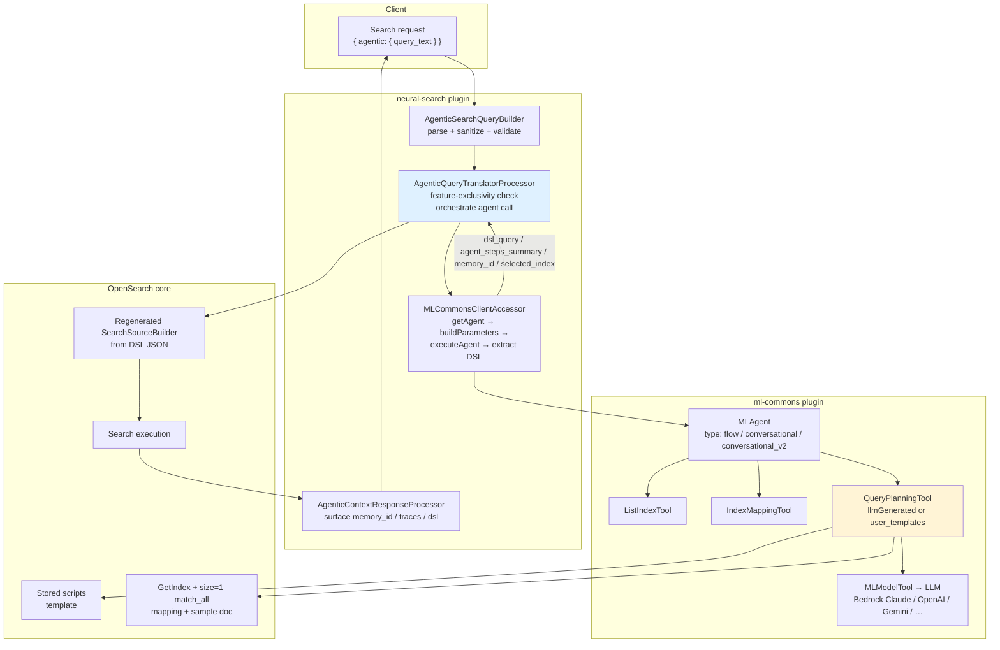

---
tags:
  - neural-search
---
# Agentic Search

## Summary

Agentic Search is an LLM-enhanced search orchestration layer that converts natural-language questions into OpenSearch DSL and executes them as normal searches. It pairs a new `agentic` query clause and an `agentic_query_translator` search request processor (in the neural-search plugin) with an ML agent that owns the reasoning and tool orchestration (in ml-commons).

Key capabilities:

- **Natural language interface**: `{"query": {"agentic": {"query_text": "..."}}}` replaces hand-written DSL at query time.
- **Automatic tool orchestration**: Conversational agents can pick an index (ListIndexTool), inspect its mapping (IndexMappingTool), and then call the `QueryPlanningTool` that actually emits DSL.
- **Pluggable agents**: Same query clause works with flow agents (fast, QPT-only) and conversational agents (multi-tool, memory-aware). Conversational `conversational_v2` is supported with `agentic_memory` only.
- **Deterministic failure mode**: If the LLM cannot produce DSL, the system substitutes a fallback query (`match_all` by default, or a user-provided template with `${parameters.*}` substitution).
- **Dashboards integration**: Search Relevance Workbench can pairwise-compare agentic queries against other search configurations and surface the agent trace, memory ID, and generated DSL.

## Details

### Architecture


```mermaid
graph TB
    subgraph "Client"
        A["Search request<br/>{ agentic: { query_text } }"]
    end

    subgraph "neural-search plugin"
        B[AgenticSearchQueryBuilder<br/>parse + sanitize + validate]
        C[AgenticQueryTranslatorProcessor<br/>feature-exclusivity check<br/>orchestrate agent call]
        D[MLCommonsClientAccessor<br/>getAgent → buildParameters →<br/>executeAgent → extract DSL]
        E[AgenticContextResponseProcessor<br/>surface memory_id / traces / dsl]
    end

    subgraph "ml-commons plugin"
        F[MLAgent<br/>type: flow / conversational / conversational_v2]
        G[ListIndexTool]
        H[IndexMappingTool]
        I[QueryPlanningTool<br/>llmGenerated or user_templates]
        J[MLModelTool → LLM<br/>Bedrock Claude / OpenAI / Gemini / …]
    end

    subgraph "OpenSearch core"
        K[Stored scripts<br/>template]
        L[GetIndex + size=1 match_all<br/>mapping + sample doc]
        M[Regenerated SearchSourceBuilder<br/>from DSL JSON]
        N[Search execution]
    end

    A --> B --> C --> D --> F
    F --> G
    F --> H
    F --> I
    I --> L
    I --> K
    I --> J
    D -->|dsl_query / agent_steps_summary / memory_id / selected_index| C
    C --> M --> N
    N --> E --> A

    style I fill:#fff4d6
    style C fill:#dff1ff
```

### End-to-End Request Life Cycle

```mermaid
sequenceDiagram
    autonumber
    participant C as Client
    participant QB as AgenticSearchQueryBuilder
    participant P as AgenticQueryTranslatorProcessor
    participant ML as MLCommonsClientAccessor
    participant A as ML Agent (conversational)
    participant QPT as QueryPlanningTool
    participant OS as OpenSearch core
    participant RP as AgenticContextResponseProcessor

    C->>QB: POST /index/_search (agentic query)
    QB->>QB: fromXContent: validate query_text,<br/>cap query_fields≤25,<br/>sanitize prompt-injection patterns,<br/>enforce length ≤ 1000
    QB->>P: SearchRequest with AgenticSearchQueryBuilder as top-level query
    P->>P: hasOtherSearchFeatures()<br/>reject aggs/sort/highlighter/post_filter/suggest/rescores/collapse
    P->>ML: getAgentDetails(agentId)
    ML->>A: MLClient.getAgent
    A-->>ML: type, has_system_prompt, has_user_prompt, _llm_interface
    P->>ML: executeAgent(request, query, agentId, info, embeddingModelId)
    ML->>ML: Build params map:<br/>question, index_name, query_fields,<br/>memory_id, embedding_model_id,<br/>verbose=true,<br/>inject default system_prompt / user_prompt if missing
    ML->>A: POST /_plugins/_ml/agents/{id}/_execute
    A->>QPT: question, index_name, embedding_model_id
    QPT->>OS: GetIndex(indexName, strictExpand)<br/>+ search(size=1 match_all, _doc sort)
    OS-->>QPT: mapping + sample doc (values truncated to 250 chars)
    QPT->>A: (user_templates mode only) select stored script
    QPT->>A: call model with full prompt (system+user)
    A-->>QPT: raw LLM output
    QPT->>QPT: extract_json processor;<br/>if blank/null → apply fallback_query with ${parameters.*} substitution
    A-->>ML: ModelTensorOutput (response + memory_id)
    ML->>ML: extractConversationalAgentResult:<br/>first '{' → Jackson readTree → dsl_query<br/>+ Claude/OpenAI agent_steps + selected_index
    ML->>ML: removeTrailingDecimalZeros (e.g. 5.0 → 5)
    ML-->>P: AgentExecutionDTO(dslQuery, agentSteps, memoryId, selectedIndex)
    P->>P: size cap 10 000 chars;<br/>parse as SearchSourceBuilder,<br/>preserve ext & _source include/exclude,<br/>override indices with selectedIndex
    P->>OS: modified SearchRequest
    OS-->>RP: SearchResponse
    RP->>RP: Attach ext { memory_id, (agent_steps_summary), (dsl_query) }
    RP-->>C: SearchResponse with hits + ext
```

### Component Reference

| Component | Repo / File | Responsibility |
|-----------|-------------|----------------|
| `AgenticSearchQueryBuilder` | `neural-search` `src/main/java/org/opensearch/neuralsearch/query/AgenticSearchQueryBuilder.java` | Parses the `agentic` clause, validates fields (max 25, required `query_text`), sanitizes text, and refuses to be used anywhere but as top-level |
| `AgenticQueryTranslatorProcessor` | `neural-search` `src/main/java/org/opensearch/neuralsearch/processor/AgenticQueryTranslatorProcessor.java` | Orchestrates the agent call, validates agent/embedding IDs, enforces exclusivity with other search features, caps response size, rebuilds the search source |
| `AgenticContextResponseProcessor` | `neural-search` `src/main/java/org/opensearch/neuralsearch/processor/AgenticContextResponseProcessor.java` | Propagates `memory_id` back to the client, and optionally `agent_steps_summary` and `dsl_query` via opt-in flags |
| `MLCommonsClientAccessor` | `neural-search` `src/main/java/org/opensearch/neuralsearch/ml/MLCommonsClientAccessor.java` | Type-aware agent execution (flow vs conversational), prompt injection, LLM-interface-aware trace extraction, retry handling |
| `AgentStepsSearchExtBuilder` | `neural-search` `src/main/java/org/opensearch/neuralsearch/query/ext/AgentStepsSearchExtBuilder.java` | Response `ext` container for `agent_steps_summary`, `memory_id`, `dsl_query` |
| `QueryPlanningTool` | `ml-commons` `ml-algorithms/src/main/java/org/opensearch/ml/engine/tools/QueryPlanningTool.java` | Builds prompt context (mapping, sample doc, time, fallback), calls the model, applies `extract_json` processor, performs template selection when configured |
| `QueryPlanningPromptTemplate` | `ml-commons` `ml-algorithms/src/main/java/org/opensearch/ml/engine/tools/QueryPlanningPromptTemplate.java` | Canonical system prompt with rules (query type, aggregation, date, semantic, field-proxy), 13 worked examples, default search template, fallback placeholder |
| `agentic-system-prompt.txt` | `neural-search` resources | Minimal outer-agent system prompt (see below) — used when the agent itself has no `system_prompt` and is not a flow agent |
| `agentic-user-prompt.txt` | `neural-search` resources | `NLQ is: ${parameters.question}, index_name is: ${parameters.index_name:-}, and the model ID for neural search is: ${parameters.embedding_model_id:-}.` |

### Configuration

| Setting | Description | Default | Scope |
|---------|-------------|---------|-------|
| `plugins.neural_search.agentic_search_enabled` | Feature flag; queries fail fast when disabled | `false` | Node, Dynamic |

#### `agentic` query clause

| Parameter | Type | Required | Notes |
|-----------|------|----------|-------|
| `query_text` | string | Yes | Natural-language question. Sanitized server-side; capped at 1000 characters. |
| `query_fields` | string[] | No | Hint for field proxying. Maximum 25; longer arrays raise `ParsingException`. |
| `memory_id` | string | No | Continues a previous conversation. Rejected for `flow` agents. |

#### `agentic_query_translator` processor

| Parameter | Type | Required | Notes |
|-----------|------|----------|-------|
| `agent_id` | string | Yes | Must match `^[a-zA-Z0-9_-]+$` and be ≤100 characters. |
| `embedding_model_id` | string | No | v3.6.0+. Overrides the agent's `embedding_model_id`; blocked at runtime on clusters older than 3.6.0. Same regex and length bounds. |
| `tag`, `description`, `ignore_failure` | standard processor fields | No | |

#### `agentic_context` response processor

| Parameter | Type | Default | Notes |
|-----------|------|---------|-------|
| `agent_steps_summary` | boolean | `false` | When `true`, include a compacted trace of LLM reasoning (Claude/OpenAI only) |
| `dsl_query` | boolean | `false` | When `true`, include the LLM-generated DSL used to run the search |

`memory_id` is always propagated when the agent returned one.

### `AgenticSearchQueryBuilder` Internals

Parsing uses streaming `XContentParser` and enforces validation before the builder can reach the query shard phase.

| Check | Location | Failure |
|-------|----------|---------|
| `query_text` present and non-blank | `fromXContent` | `ParsingException("[query_text] is required")` |
| Unknown top-level field | `fromXContent` | `ParsingException("Unknown field [...]")` |
| `query_fields` length | `fromXContent` (streaming) | `ParsingException("Too many query fields. Maximum allowed is 25")` once 25 would be exceeded |
| Length ≤ 1000 (after sanitization) | `sanitizeQueryText` | `IllegalArgumentException("Query text too long...")` |
| Prompt-injection keywords | `sanitizeQueryText` | Regex strip of `(?i)\b(system|instruction|prompt)\s*:` and `(?i)\b(execute|run|eval|script)\s*[:\(]` from the text (not an error) |
| Top-level usage | `doToQuery` | `IllegalStateException("Agentic search query must be used as top-level query...")` — this is why wrapping the clause inside `bool`/`function_score`/etc. is forbidden: once the processor has not replaced it, `doToQuery` always throws. |
| Agent failure replay | `doToQuery` | When the processor recorded `agentFailureReason`, `doToQuery` throws it, turning an agent error into a normal query-phase error. |

`EventStatsManager.increment(EventStatName.AGENTIC_QUERY_REQUESTS)` fires once per parse, giving an observable counter even when the agent never runs (for example, because of validation failure).

### `AgenticQueryTranslatorProcessor` Internals

Three guard clauses before the agent is called:

1. **No-op when not applicable**: If `source` or `query` is null or the root query is not `AgenticSearchQueryBuilder`, the request passes through unchanged.
2. **Feature exclusivity** (`hasOtherSearchFeatures`):
   ```java
   sourceBuilder.aggregations() != null
     || (sourceBuilder.sorts() != null && !sourceBuilder.sorts().isEmpty())
     || sourceBuilder.highlighter() != null
     || sourceBuilder.postFilter() != null
     || sourceBuilder.suggest() != null
     || (sourceBuilder.rescores() != null && !sourceBuilder.rescores().isEmpty())
     || sourceBuilder.collapse() != null;
   ```
   Any of those produces `IllegalArgumentException("Agentic search blocked - ...")`. The rationale is that the agent rewrites the entire `SearchSourceBuilder`, so anything attached on the client side would either be silently dropped or conflict with the DSL the LLM generates.
3. **Cluster-version gate for `embedding_model_id`**: Enforced at runtime through `MinClusterVersionUtil.isClusterOnOrAfterMinReqVersionForAgenticEmbeddingModelId()`. Mixed 3.5/3.6 clusters will reject the processor option instead of sending an unrecognized parameter to older nodes.

After the agent returns:

| Step | Detail |
|------|--------|
| Null DSL check | Throws `IllegalArgumentException("Agentic search failed - Null response...")` |
| Size cap | `MAX_AGENT_RESPONSE_SIZE = 10_000` characters. Anything larger becomes `"Response size exceeded limit"`. Protects against runaway LLM outputs consuming memory in the parse phase. |
| Pipeline context | `AGENT_STEPS_FIELD_NAME`, `MEMORY_ID_FIELD_NAME`, `DSL_QUERY_FIELD_NAME` are stashed via `PipelineProcessingContext.setAttribute`. The response processor reads them back. |
| Rebuild `SearchSourceBuilder` | `XContentType.JSON.xContent().createParser(...)` → `SearchSourceBuilder.fromXContent(parser)`. |
| Preserve `ext` | Original `ext[]` builders are re-attached after the rebuild, so downstream response processors keep seeing client-supplied context. |
| Preserve `_source` filter | `fetchSource()` from the original source is copied to the new builder (added in neural-search#1669 for v3.4.0 — without it, `"_source": {"excludes": [...]}` was being dropped). |
| Narrow the indices | When the conversational agent set `selected_index`, `request.indices(selectedIndex)` overrides the client-provided index. Lets the agent pick the right index from `ListIndexTool` (neural-search#1713 for v3.5.0). |

At factory time, `agent_id` and `embedding_model_id` go through the same regex (`^[a-zA-Z0-9_-]+$`) and length limit (100) so malformed IDs fail at pipeline creation rather than at search time.

### `MLCommonsClientAccessor` — Agent Execution Path

Two stages: **describe** then **execute**.

**`getAgentDetails`** calls `mlClient.getAgent` and packages `type`, whether the agent already has a `system_prompt` / `user_prompt`, and the `_llm_interface` key. Retries are handled by `RetryUtil.handleRetryOrFailure`. The accessor never caches agents, so changes to an agent's configuration take effect immediately.

**`retryableExecuteAgent`** builds the parameter map:

| Key | Value | Notes |
|-----|-------|-------|
| `question` | sanitized `query_text` | |
| `memory_id` | from clause | Throws if combined with a flow agent. |
| `index_name` | `Arrays.toString(indices)` for conversational agents, `indices[0]` for flow | Flow agents also refuse multiple indices outright. |
| `query_fields` | `gson.toJson(list)` | Emitted as a JSON string so prompt substitution stays literal. |
| `embedding_model_id` | from processor config | Takes precedence over the agent's own `llm.parameters.embedding_model_id`. |
| `system_prompt` | `agentic-system-prompt.txt` content | Only injected for conversational agents that do not already define one. Flow agents never get the default. |
| `user_prompt` | `agentic-user-prompt.txt` content | Same injection rule. |
| `verbose` | `"true"` | Ensures the agent returns its full trace (so `agent_steps_summary` can be extracted). |

Execution is async: `mlClient.execute(FunctionName.AGENT, agentMLInput, ActionListener.wrap(...))` with retry on failure.

Extraction is type-sensitive:

- **Flow agents** (`extractFlowAgentResult`): Flatten `ModelTensors`, return the first non-empty `tensor.getResult()` as the DSL string. There is no trace, memory, or selected-index concept for flow agents.
- **Conversational agents** (`extractConversationalAgentResult`):
  1. For each model tensor, if `tensorName == "memory_id"`, capture it.
  2. For tensors named `"response"`, locate the first `{` and `mapper.readTree(text.substring(startBrace))`. Works even if the LLM prefixed prose before the JSON.
  3. If the parsed object has `dsl_query`, `gson.toJson` it back into a canonical string.
  4. Depending on `_llm_interface`:
     - Claude (`bedrock/converse/claude`): walk `output.message.content[]`. If any block has `toolUse`, append its text blocks to the trace and capture `toolUse.input.index_name` when the tool is `query_planner_tool`.
     - OpenAI (`openai/v1/chat/completions`): walk `choices[0].message.tool_calls[]` looking for the `query_planner_tool` call and parse `arguments` for `index_name`.
  5. If no `dsl_query` surfaces at all, raise `CONVERSATIONAL_AGENT_MISSING_DSL_QUERY_ERROR` (added in neural-search#1631 v3.3.2 to give a clear message instead of a silent null).

**`removeTrailingDecimalZeros`** runs on the final DSL string. Regex `(?<![0-9A-Za-z.])(-?\d+)\.0+(?![0-9Ee.])` collapses `"size": 5.0` back to `"size": 5` without disturbing IP addresses, versions, or scientific notation. This fixes a recurring bug where LLMs emit floats for integer-only DSL fields.

### `QueryPlanningTool` — Where the DSL Is Authored

The tool is an `MLModelTool` wrapper. Two generation modes:

**`llmGenerated` (default)**

1. Drop agent-only keys (`_chat_history`, `_tools`, `_interactions`, `tool_configs`) from the parameters before prompting — stops agent chat context from biasing query planning and lets the same LLM model be shared by both the agent and QPT (ml-commons#4262, v3.3.0).
2. Check required parameters (`question`, `index_name`); return a validation failure otherwise.
3. Set `template` to `DEFAULT_SEARCH_TEMPLATE` (used as a fallback, not as the generation template in this mode).
4. `executeQueryPlanning`:
   - Resolve `effectiveFallbackQuery = fallbackQuery != null ? fallbackQuery : DEFAULT_QUERY` (`{"size":10,"query":{"match_all":{}}}`).
   - Inject it into the system prompt by replacing `{{FALLBACK_QUERY}}` (JSON-escaped so the LLM receives a legal JSON example).
   - Put `system_prompt` / `user_prompt` into the parameter map (defaults from `QueryPlanningPromptTemplate` if the user did not override).
   - `getIndexMappingAsync` → `GetIndexRequest(strictExpand).local(false)`. When the response contains more than one mapping (wildcard/alias), warn and pick the first (ml-commons#4726, v3.6.0).
   - `getSampleDocAsync` → `SearchSourceBuilder.size(1).query(match_all).sort("_doc")`. Each field value is truncated to 250 Unicode code points and prefixed with `[truncated]` — keeps token budget bounded even for very large documents.
   - Inject the current UTC timestamp into `current_time` so the LLM can resolve relative dates.
   - Run the model. If the response is blank or `"null"`, substitute `fallback_query` with `StringSubstitutor(parameters, "${parameters.", "}")` — this is where `${parameters.question}` inside a user-provided `fallback_query` gets filled.
   - Otherwise, run the configured output parser (`extract_json` + any custom processors) and return the result.

**`user_templates`**

Adds a template-selection pre-flight. Registered with `search_templates`: a JSON array of `{template_id, template_description}` pairs.

1. Build a template-selection parameter map with `TEMPLATE_SELECTION_SYSTEM_PROMPT` / `TEMPLATE_SELECTION_USER_PROMPT`.
2. Call the model. Expected output is a bare template id (see `TEMPLATE_SELECTION_VALIDATION`: `^[A-Za-z0-9_-]+$`).
3. If a valid id is returned, `client.admin().cluster().getStoredScript(templateId)` and feed the script source as the `template` parameter.
4. Proceed through `executeQueryPlanning` using the resolved template.

If template selection fails or returns `null`, the tool quietly falls back to `DEFAULT_SEARCH_TEMPLATE` — a bool-should combination of `multi_match` and optional `neural`.

**Default output parser** (ml-commons#4356, v3.3.2): Every QPT factory prepends an `extract_json` processor that pulls a JSON object out of the raw model output. Custom `output_processors` run after it. The processor's fallback value (when no JSON is found) is `DEFAULT_QUERY`.

### The Default System Prompt

`QueryPlanningPromptTemplate.DEFAULT_QUERY_PLANNING_SYSTEM_PROMPT` is assembled from:

```
PURPOSE
RULES
  QUERY_TYPE_RULES
  AGGREGATION_RULES
  DATE_RULES
  SEMANTIC_SEARCH_RULES
FIELD_SELECTION_AND_PROXYING
OUTPUT_FORMAT_INSTRUCTIONS  (with {{FALLBACK_QUERY}} placeholder)
EXAMPLES (1 .. 13)
TEMPLATE_USE_INSTRUCTIONS
```

Highlights that materially affect generated DSL:

- **Query type rules** — `match`/`match_phrase`/`multi_match` for full-text, `term`/`range`/`exists` in `bool.filter`, explicit rules for `nested` (only if mapping says `nested`), `neural` rules for semantic/knn_vector fields, and `neural` may be used top-level when no other clauses are needed.
- **Integer sizes** — explicit instruction to emit `"size": 5` not `"size": 5.0`. Combined with the `TRAILING_ZEROS_PATTERN` scrubber in the neural-search side, this is a two-layer defense against LLMs emitting floats.
- **Date rules** — ISO 8601 UTC with `Z`, date math (`now-1d/d`), `date_histogram` with `calendar_interval` / `fixed_interval`.
- **Field selection and proxying** — mandates using a "best available proxy" field instead of falling back to `match_all`, so queries degrade gracefully when the mapping is only loosely related.
- **Output contract** — strict single JSON object, no markdown, no smart quotes, no code fences; if truly unanswerable, emit exactly the fallback.
- **13 worked examples** cover filter+range merge, fuzzy match, `match_phrase`, `multi_match` + `should`, `prefix` + `exists`, `nested` joins, terms agg, top-N via `size`+`sort`, top-N groups via aggs, proxy-field success, full fallback, neural with/without `model_id`, and neural + exact filter combos.

The user prompt is a single template that hydrates the LLM with question, mapping, query fields, sample doc, current time, and embedding model ID:

```
Question: ${parameters.question}
Mapping: ${parameters.index_mapping:-}
Query Fields: ${parameters.query_fields:-}
Sample Document from index: ${parameters.sample_document:-}
In UTC: ${parameters.current_time:-} format: yyyy-MM-dd'T'HH:mm:ss'Z'
Embedding Model ID for Neural Search: ${parameters.embedding_model_id:- not provided}
```

### Agent Types

| Type | Role | Suitable for |
|------|------|--------------|
| Flow agent (`flow`) | Single-step: route `question` + `index_name` directly into `QueryPlanningTool`. No memory, no multi-tool reasoning. | Low-latency NLQ where the target index is known and there is no conversation state. |
| Conversational agent (`conversational`) | Multi-tool ReAct-style loop. Uses the default "orchestrator" system prompt bundled in neural-search (`agentic-system-prompt.txt`) which instructs the agent to plan, optionally call `ListIndexTool`/`IndexMappingTool`, compose a schema-free natural-language question, and then call `query_planner_tool` to produce strict JSON DSL. Memory and traces are supported. | Ambiguous intent, unknown index, follow-up questions. |
| Conversational V2 (`conversational_v2`) | v3.6.0 unified agent interface. Works with the same `agentic_query_translator` path, but requires `agentic_memory` (not `conversation_index`) and inherits V2-wide limits (no streaming, no hooks yet). | Same scenarios as above when you want unified Strands-style I/O, multi-modal input, or token usage tracking. |

The upstream docs position conversational agents as "highest quality" and flow agents as the low-latency / low-cost path. Choose conversational when an LLM round-trip for mapping/index discovery is acceptable.

**Outer-agent prompt** (`agentic-system-prompt.txt`) is striking — it hard-wires QPT as the authoring tool:

> You MUST call the Query Planner Tool (query_planner_tool, "qpt") to author the DSL. … Compose qpt.question: one concise, clear, self-contained natural-language question … Do NOT mention schema fields, analyzers, or DSL constructs to the qpt.

The practical consequence: the outer agent is a router and the DSL generation is centralized in QPT, even when the agent has many tools. Trace extraction, selected-index capture, and `agent_steps_summary` all assume this shape.

### Response `ext` Shape

`AgentStepsSearchExtBuilder` emits three optional keys under `ext`:

```json
{
  "ext": {
    "agent_steps_summary": {
      "memory_id": "abc123",
      "agent_steps_summary": "Chose index 'products' …",
      "dsl_query": "{\"query\":{\"bool\":{…}}}"
    }
  }
}
```

- `memory_id` is always propagated when available (both for `conversation_index` and `agentic_memory` paths).
- `agent_steps_summary` / `dsl_query` are gated by the response processor's boolean flags (`agent_steps_summary` / `dsl_query`), both defaulting to `false` — minimizes token and data leakage by default.

### Fallback and Error Handling

| Failure | Where caught | Client outcome |
|---------|--------------|----------------|
| `query_text` missing / empty | `AgenticSearchQueryBuilder.fromXContent` | `400` `ParsingException` before pipeline runs |
| Too many `query_fields` | Same | Same |
| `query_text` > 1000 chars | `sanitizeQueryText` | `IllegalArgumentException` |
| Feature exclusivity violated (`aggs`/`sort`/…) | `AgenticQueryTranslatorProcessor` | `IllegalArgumentException("Agentic search blocked - Invalid usage with other search features …")` |
| `embedding_model_id` on pre-3.6.0 cluster | Same | `IllegalArgumentException` with explicit version reason |
| Agent resolution failure | `MLCommonsClientAccessor.getAgentDetails` | Retried; then `IllegalArgumentException("Agentic search failed - Failed to get agent info …")` |
| Agent execution failure (LLM error, timeout) | `retryableExecuteAgent` | Retried via `RetryUtil`; final failure surfaced as `IllegalArgumentException("Agentic search failed - Agent execution error …")` |
| Agent returned unsupported type | Same | `IllegalArgumentException("Unsupported agent type: …")` |
| Agent returned no `dsl_query` | `extractConversationalAgentResult` | `IllegalArgumentException` with `CONVERSATIONAL_AGENT_MISSING_DSL_QUERY_ERROR` message |
| LLM returned blank or `null` DSL | `QueryPlanningTool.executeQueryPlanning` | Substitutes `fallback_query` with `${parameters.*}` expansion. Search runs normally. |
| DSL exceeds 10 000 chars | `AgenticQueryTranslatorProcessor` | `IllegalArgumentException("Agentic search blocked - Response size exceeded limit")` |
| DSL parse failure | Same | `IOException` wrapped as `"Agentic search failed - Parse error"` |

The critical distinction is where the fallback kicks in: `QueryPlanningTool.fallback_query` turns a soft LLM failure into a successful search, but any hard error (bad agent, size cap, parse error) still fails the request. `processor.ignore_failure: true` lets the pipeline degrade gracefully; without it, hard errors propagate to the client.

Agent failure text is stashed on the query builder via `agentFailureReason` so `doToQuery` can re-raise it with full context at the shard phase — a fallback path in case the error reaches the shard phase (for example, in mixed pipelines).

### Alias and Wildcard Index Handling

Before ml-commons#4726 (v3.6.0) `QueryPlanningTool.getIndexMappingAsync` did `mappings().get(indexName)` directly, which returned `null` when `index_name` was an alias or pattern (the response key is the resolved concrete index). Current behavior:

1. `GetIndexRequest(indexName).indicesOptions(strictExpand).local(false)` — strict, cluster-manager-routed (so results come from the up-to-date cluster state).
2. `mappings.isEmpty()` → explicit `IllegalStateException("Failed to extract index mapping: no mappings found for <name>")`.
3. `mappings.size() > 1` → `log.warn("Note: QPT tool will only fetch the first index's mapping which may cause query issues if indices have different mappings.")`.
4. `MappingMetadata mapping = mappings.values().iterator().next();` → use it.

This is a deliberate simplification — if two back-end indices behind an alias diverge in mapping, the LLM will still see only one of them. Users who need per-index routing should pass a concrete index.

The `selected_index` flow (v3.5.0 via `ListIndexTool` + `IndexMappingTool`) is what gives the agent the ability to pick the right physical index when the client did not supply one. When the agent's Claude/OpenAI response exposes `index_name` via `toolUse`/`tool_calls`, the processor calls `request.indices(selectedIndex)` and the search is rescoped.

### Security, Input Hardening, Observability

**Input sanitization**. `AgenticSearchQueryBuilder.sanitizeQueryText` strips common prompt-injection patterns (`system:`, `instruction:`, `prompt:`, `execute:`, `run(`, `eval(`, `script:`). This is a defense-in-depth layer — the LLM itself is the stronger boundary, but the regex blocks naive attempts to overwrite system prompts.

**Resource ID validation**. Both `agent_id` and `embedding_model_id` are matched against `^[a-zA-Z0-9_-]+$` and capped at 100 characters at processor-factory time. Failure produces `IllegalArgumentException` before the pipeline is stored.

**Response size cap**. `MAX_AGENT_RESPONSE_SIZE = 10_000` prevents runaway LLM outputs from consuming memory during JSON parse.

**Security plugin integration**. The agent execution carries the caller's security context through ML Commons; DLS/FLS and index-level permissions apply as usual when the generated DSL runs. The `agentic_search_enabled` cluster setting is guarded by standard permission action checks and can be used as a kill-switch.

**Observability**.
- `EventStatsManager` increments `AGENTIC_QUERY_REQUESTS`, `AGENTIC_QUERY_TRANSLATOR_PROCESSOR_EXECUTIONS`, `AGENTIC_CONTEXT_PROCESSOR_EXECUTIONS` at well-defined points, exposing counts via the neural-search stats API.
- `log.warn` fires on wildcard/alias multi-mapping; `log.debug` on non-JSON agent responses.
- Agent-side workflow logging improved in ml-commons#4681 (v3.6.0).
- The response `ext.dsl_query` (opt-in) plus `agent_steps_summary` provides an application-level audit trail of what was generated and why.

### Dashboards Integration (Search Relevance Workbench)

The Workbench uses the same Agentic Search pipeline and adds a conversational UI on top.

- **Pairwise comparison** (dashboards-search-relevance#693, v3.4.0): new `AgentHandler` / `SearchHandler` routing. When a pipeline's request_processor is `agentic_query_translator`, the workbench switches to `AgentHandler`, shows a 30-second+ spinner, renders an `AgentInfo` panel (memory_id, agent_steps_summary, dsl_query), and exposes "Continue conversation" / "Clear conversation" toggles that auto-populate or clear `memory_id` on the next query.
- **UX enhancements** (dashboards-search-relevance#728, v3.5.0): Searching spinner, docs link in the pairwise comparison Helper flyout, alignment/styling polish for the AgentInfo panels, and "Continue conversation" surfaced with a chat icon.

The workbench is one concrete consumer of the opt-in `agent_steps_summary` and `dsl_query` flags in `agentic_context` — useful as a reference integration when building other UIs.

## Limitations

- Experimental feature; API shape and response `ext` format may change without BWC guarantees (though v3.6.0 did add BWC integration tests).
- `agentic` must be the top-level query. Cannot appear inside `bool`, `function_score`, `dis_max`, or any other wrapper; the builder throws if it reaches the query phase.
- Cannot be combined with aggregations, sort, highlighters, post_filter, suggest, rescorers, or collapse. The processor rewrites the whole `SearchSourceBuilder`, so these would be dropped or conflict.
- `query_fields` limited to 25; `query_text` limited to 1000 characters; agent and model IDs limited to 100 alphanumerics / `-` / `_`.
- Agent response truncated at 10 000 characters.
- Wildcard/alias indices use only the first mapping returned — divergent mappings behind one alias will confuse the planner.
- Sample doc is truncated at 250 Unicode code points per field; large text fields give the LLM only a small window.
- Latency is dominated by LLM inference (one call for flow agents, one or two for conversational depending on tool use). Agentic Search is async and can take ~30 seconds in practice.
- `user_templates` depends on stored scripts being reachable via `GetStoredScriptRequest` by the caller.
- Conversational V2 agents work only with `agentic_memory` and lack streaming / hooks / context management in v3.6.0.
- `agent_steps_summary` extraction is implemented only for Claude (`bedrock/converse/claude`) and OpenAI (`openai/v1/chat/completions`) interfaces; other LLMs return only `dsl_query` and `memory_id`.

## Change History

- **v3.6.0** (2026-04-13): Custom `fallback_query` support (ml-commons#4729) with `${parameters.*}` substitution; alias and wildcard `index_name` handling (ml-commons#4726); `embedding_model_id` on `agentic_query_translator` processor with cluster-version gating (neural-search#1800); BWC integration tests in `qa/restart-upgrade` and `qa/rolling-upgrade`.
- **v3.5.0** (2026-02-11): Conversational agents can set `selected_index` via `ListIndexTool` and have the processor rescope the search to it (neural-search#1713); Dashboards SRW UI/UX polish (dashboards-search-relevance#728) — loading spinner, docs link, alignment fixes.
- **v3.4.0** (2026-01-11): `_source.includes` / `_source.excludes` preserved through DSL replacement (neural-search#1669); Dashboards SRW pairwise comparison support for agentic queries with `AgentHandler`, `AgentInfo` panel, and "Continue conversation" / "Clear conversation" toggles (dashboards-search-relevance#693).
- **v3.3.2** (2026-02-12): Conversation search support (ext params) (neural-search#1626); explicit JSON extraction from agent responses with clear error on missing `dsl_query` (neural-search#1631); model-type-aware trace extraction for Claude and OpenAI (neural-search#1633); default `extract_json` output processor added to QPT (ml-commons#4356).
- **v3.3.0** (2026-01-11): Conversational agent support in QPT (ml-commons#4203) — ReAct loop with `ListIndexTool`/`IndexMappingTool`/`QueryPlanningTool`; unified model between agent and QPT via `AGENT_LLM_MODEL_ID` fallback and `_chat_history`/`_tools`/`_interactions`/`tool_configs` stripping (ml-commons#4262); automatic index mapping and sample document retrieval in QPT.
- **v3.2.0** (2026-01-10): Initial experimental release — `agentic` query clause, `agentic_query_translator` request processor, `agentic_context` response processor, `agentic-system-prompt.txt`, `QueryPlanningTool` with `llmGenerated` and `user_templates` modes (neural-search#1484, ml-commons#4006).

## References

### Documentation
- [Agentic search overview](https://docs.opensearch.org/latest/vector-search/ai-search/agentic-search/index/)
- [Agentic query](https://docs.opensearch.org/latest/query-dsl/specialized/agentic/)
- [Agentic query translator processor](https://docs.opensearch.org/latest/search-plugins/search-pipelines/agentic-query-translator-processor/)
- [Agentic context processor](https://docs.opensearch.org/latest/search-plugins/search-pipelines/agentic-context-processor/)
- [Query Planning tool](https://docs.opensearch.org/latest/ml-commons-plugin/agents-tools/tools/query-planning-tool/)
- [Configuring agents](https://docs.opensearch.org/latest/vector-search/ai-search/agentic-search/agent-customization/)
- [Using flow agents](https://docs.opensearch.org/latest/vector-search/ai-search/agentic-search/flow-agent/)
- [Using conversational agents](https://docs.opensearch.org/latest/vector-search/ai-search/agentic-search/agent-converse/)
- [Using agentic memory](https://docs.opensearch.org/latest/vector-search/ai-search/agentic-search/agentic-memory/)
- [Configuring agents for semantic search](https://docs.opensearch.org/latest/vector-search/ai-search/agentic-search/neural-search/)
- [Adding search templates](https://docs.opensearch.org/latest/vector-search/ai-search/agentic-search/search-templates/)
- [Reranking agentic search results](https://docs.opensearch.org/latest/vector-search/ai-search/agentic-search/rerank-agentic-search-results/)
- [Using external MCP servers](https://docs.opensearch.org/latest/vector-search/ai-search/agentic-search/mcp-server/)

### Blog Posts
- [Introducing agentic search in OpenSearch](https://opensearch.org/blog/introducing-agentic-search-in-opensearch-transforming-data-interaction-through-natural-language/)

### Source Code
- `neural-search` `src/main/java/org/opensearch/neuralsearch/query/AgenticSearchQueryBuilder.java`
- `neural-search` `src/main/java/org/opensearch/neuralsearch/processor/AgenticQueryTranslatorProcessor.java`
- `neural-search` `src/main/java/org/opensearch/neuralsearch/processor/AgenticContextResponseProcessor.java`
- `neural-search` `src/main/java/org/opensearch/neuralsearch/ml/MLCommonsClientAccessor.java`
- `neural-search` `src/main/java/org/opensearch/neuralsearch/query/ext/AgentStepsSearchExtBuilder.java`
- `neural-search` `src/main/resources/agentic-system-prompt.txt`
- `neural-search` `src/main/resources/agentic-user-prompt.txt`
- `ml-commons` `ml-algorithms/src/main/java/org/opensearch/ml/engine/tools/QueryPlanningTool.java`
- `ml-commons` `ml-algorithms/src/main/java/org/opensearch/ml/engine/tools/QueryPlanningPromptTemplate.java`

### Pull Requests

| Version | Repository | PR | Description |
|---------|------------|-----|-------------|
| v3.6.0 | ml-commons | [#4729](https://github.com/opensearch-project/ml-commons/pull/4729) | Custom `fallback_query` field in `QueryPlanningTool` with parameter substitution |
| v3.6.0 | ml-commons | [#4726](https://github.com/opensearch-project/ml-commons/pull/4726) | Support aliases and wildcard index patterns in `QueryPlanningTool` |
| v3.6.0 | neural-search | [#1800](https://github.com/opensearch-project/neural-search/pull/1800) | Add `embedding_model_id` to `agentic_query_translator` processor |
| v3.5.0 | neural-search | [#1713](https://github.com/opensearch-project/neural-search/pull/1713) | Select explicit index from `ListIndexTool` response |
| v3.5.0 | dashboards-search-relevance | [#728](https://github.com/opensearch-project/dashboards-search-relevance/pull/728) | SRW Agentic Search UI/UX enhancements |
| v3.4.0 | neural-search | [#1669](https://github.com/opensearch-project/neural-search/pull/1669) | Preserve `_source` include/exclude across DSL replacement |
| v3.4.0 | dashboards-search-relevance | [#693](https://github.com/opensearch-project/dashboards-search-relevance/pull/693) | Agent search support in SRW pairwise comparison |
| v3.3.2 | neural-search | [#1626](https://github.com/opensearch-project/neural-search/pull/1626) | Conversation search support with agentic search |
| v3.3.2 | neural-search | [#1631](https://github.com/opensearch-project/neural-search/pull/1631) | Extract JSON from agent response |
| v3.3.2 | neural-search | [#1633](https://github.com/opensearch-project/neural-search/pull/1633) | Extract agent summary based on models |
| v3.3.2 | ml-commons | [#4356](https://github.com/opensearch-project/ml-commons/pull/4356) | Add `extract_json` processor to `QueryPlanningTool` |
| v3.3.0 | ml-commons | [#4203](https://github.com/opensearch-project/ml-commons/pull/4203) | Support `QueryPlanningTool` with conversational agents |
| v3.3.0 | ml-commons | [#4262](https://github.com/opensearch-project/ml-commons/pull/4262) | Use same model for agent and QPT |
| v3.2.0 | neural-search | [#1484](https://github.com/opensearch-project/neural-search/pull/1484) | Initial agentic search query clause and processor |
| v3.2.0 | ml-commons | [#4006](https://github.com/opensearch-project/ml-commons/pull/4006) | Initiate `QueryPlanningTool` |

### Issues (Design / RFC)
- [neural-search#1479](https://github.com/opensearch-project/neural-search/issues/1479): RFC – Design for Agentic Search (original motivation, plan-execute-reflect exploration, tool taxonomy)
- [ml-commons#4005](https://github.com/opensearch-project/ml-commons/issues/4005): Meta-issue for QueryPlanningTool
- [neural-search#1664](https://github.com/opensearch-project/neural-search/issues/1664): Agentic Search — support `_source.excludes`
- [neural-search#1799](https://github.com/opensearch-project/neural-search/issues/1799): QueryPlanningTool — support aliases and wildcard patterns
- [neural-search#1801](https://github.com/opensearch-project/neural-search/issues/1801): Surface `embedding_model_id` on the translator processor
- [neural-search#1525](https://github.com/opensearch-project/neural-search/issues/1525): Conversation search support tracking issue

## Related Feature Reports

- Agentic Search Memory Integration (`docs/features/neural-search/neural-search-agentic-search-memory.md`) — how memory flows through agentic search, including the hardcoded `infer=false` behavior and the long-term memory workaround.
- Agentic Memory (`docs/features/ml-commons/ml-commons-agentic-memory.md`) — Memory Container, strategies, and namespace model used by `agentic_memory`-backed agents.
- Agent Framework (`docs/features/ml-commons/ml-commons-agent-framework.md`) — flow / conversational / conversational_v2 / PER agent types, tool registry, function calling.
- AG-UI Protocol (`docs/features/ml-commons/ml-commons-ag-ui-protocol.md`) — unified streaming agent interface; agentic search does not yet use it.
- Dashboards Search Relevance Workbench (`docs/features/dashboards-search-relevance/dashboards-search-relevance-search-relevance-workbench-srw.md`) — UI integration point.
- AI Search Flows (`docs/features/dashboards-flow-framework/dashboards-flow-framework-ai-search-flows.md`) — flow builder that can assemble agentic search pipelines from templates.
