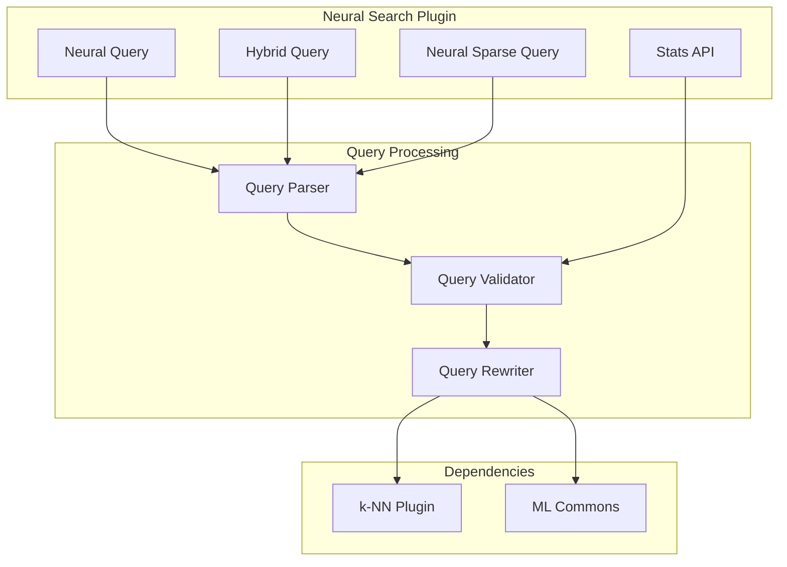

# Neural Search Bug Fixes

## Summary

This document tracks bug fixes and stability improvements in the OpenSearch Neural Search plugin. Neural Search enables semantic search capabilities through vector embeddings, hybrid queries combining lexical and semantic search, and neural sparse search. These fixes ensure reliable operation across various deployment scenarios including multi-node clusters, rolling upgrades, and complex query patterns.

## Details

### Architecture



### Components

| Component | Description |
|-----------|-------------|
| Hybrid Query Parser | Parses and validates hybrid queries, prevents nesting |
| Neural Query Builder | Builds neural queries with semantic field support |
| Stats REST Action | Handles stats API requests with validation |
| Semantic Field Collector | Collects semantic fields from mappings |
| Radial Search Handler | Handles min_score/max_distance queries |

### Bug Fix Categories

#### Query Validation

| Fix | Version | Description |
|-----|---------|-------------|
| Nested hybrid query validation | v3.1.0 | Prevents hybrid queries from being nested within other hybrid queries |
| Semantic field validation | v3.1.0 | Ensures validation runs when semantic field info is available |

#### Serialization & Multi-Node

| Fix | Version | Description |
|-----|---------|-------------|
| Radial search serialization | v3.1.0 | Fixes k-NN parameter serialization in multi-node clusters |
| Stats BWC compatibility | v3.1.0 | Filters stats based on cluster version during rolling upgrades |

#### Query Rewriting

| Fix | Version | Description |
|-----|---------|-------------|
| Model inference trigger | v3.1.0 | Correctly checks semantic field for search analyzer |
| Token source precedence | v3.1.0 | Query settings override semantic field settings |
| Analyzer selection | v3.1.0 | Uses semantic field analyzer when query doesn't specify one |

#### Stability

| Fix | Version | Description |
|-----|---------|-------------|
| Stack overflow prevention | v3.1.0 | Uses iterative approach for semantic field collection |
| Score handling | v3.1.0 | Returns null score for single shard with non-score sorting |

### Configuration

No new configuration options were added. These are internal bug fixes.

### Usage Examples

#### Valid Hybrid Query
```json
{
  "query": {
    "hybrid": {
      "queries": [
        {
          "neural": {
            "passage_embedding": {
              "query_text": "semantic search",
              "model_id": "model_id",
              "k": 10
            }
          }
        },
        {
          "match": {
            "text": "keyword search"
          }
        }
      ]
    }
  }
}
```

#### Neural Query with Radial Search (Fixed in v3.1.0)
```json
{
  "query": {
    "neural": {
      "embedding_field": {
        "query_text": "search query",
        "model_id": "model_id",
        "min_score": 0.5
      }
    }
  }
}
```

#### Stats API with Validation (Fixed in v3.1.0)
```bash
# Returns 400 with suggestion for invalid stat name
GET /_plugins/_neural/stats/invalid_stat

# Valid stat names
GET /_plugins/_neural/stats/text_embedding_executions
```

## Limitations

- Multi-node radial search tests require manual verification until automated multi-node CI is available
- Stats BWC fix is a workaround; full solution requires OpenSearch core changes

## Related PRs

| Version | PR | Description |
|---------|-----|-------------|
| v3.1.0 | [#1277](https://github.com/opensearch-project/neural-search/pull/1277) | Fix score value as null for single shard sorting |
| v3.1.0 | [#1291](https://github.com/opensearch-project/neural-search/pull/1291) | Return bad request for invalid stat parameters |
| v3.1.0 | [#1305](https://github.com/opensearch-project/neural-search/pull/1305) | Add validation for nested hybrid query |
| v3.1.0 | [#1357](https://github.com/opensearch-project/neural-search/pull/1357) | Use stack for semantic field collection |
| v3.1.0 | [#1373](https://github.com/opensearch-project/neural-search/pull/1373) | Filter stats based on cluster version |
| v3.1.0 | [#1393](https://github.com/opensearch-project/neural-search/pull/1393) | Fix radial search serialization |
| v3.1.0 | [#1396](https://github.com/opensearch-project/neural-search/pull/1396) | Fix neural query with semantic field |

## References

- [Issue #1108](https://github.com/opensearch-project/neural-search/issues/1108): Nested hybrid query bug
- [Issue #1274](https://github.com/opensearch-project/neural-search/issues/1274): Hybrid search sort score corruption
- [Issue #1368](https://github.com/opensearch-project/neural-search/issues/1368): Stats BWC test failure
- [Issue #1392](https://github.com/opensearch-project/neural-search/issues/1392): Radial search fails on 3.0
- [Neural Search Documentation](https://docs.opensearch.org/3.0/vector-search/ai-search/neural-sparse-search/)
- [Neural Query DSL](https://docs.opensearch.org/3.0/query-dsl/specialized/neural/)
- [Neural Search API](https://docs.opensearch.org/3.0/vector-search/api/neural/)

## Change History

- **v3.1.0** (2026-01-10): Added 7 bug fixes for hybrid query validation, semantic field handling, radial search serialization, stats API, and stability improvements
