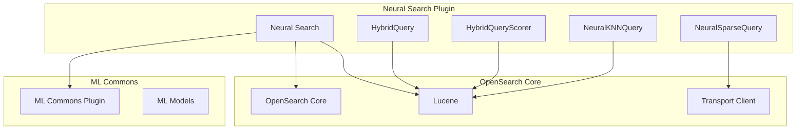
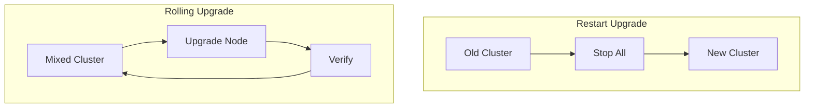

---
tags:
  - domain/search
  - component/server
  - k-nn
  - ml
  - neural-search
  - search
---
# Neural Search Compatibility

## Summary

Neural Search Compatibility refers to the ongoing maintenance work required to keep the neural-search plugin compatible with OpenSearch core releases. This includes adapting to Lucene API changes, OpenSearch core API updates, and maintaining backward compatibility with previous versions.

## Details

### Architecture



### Components

| Component | Description |
|-----------|-------------|
| HybridQuery | Combines multiple sub-queries for hybrid search |
| HybridQueryScorer | Scores documents across multiple sub-queries |
| NeuralKNNQuery | Wrapper for k-NN queries with neural capabilities |
| NeuralSparseQueryBuilder | Builds sparse vector queries using ML models |
| ScoreCombiner | Combines scores from multiple sub-queries |
| NormalizationProcessor | Normalizes scores across different query types |

### Compatibility Matrix

| Neural Search Version | OpenSearch Version | Lucene Version | JDK Version |
|----------------------|-------------------|----------------|-------------|
| 3.0.0 | 3.0.0 | 10.x | 21+ |
| 2.19.x | 2.19.x | 9.x | 11+ |
| 2.18.x | 2.18.x | 9.x | 11+ |

### Key API Changes in v3.0.0

#### Lucene 10 Changes

```java
// Before (Lucene 9)
long totalHits = topDocs.totalHits.value;
TotalHits.Relation relation = topDocs.totalHits.relation;
Query query = booleanClause.getQuery();

// After (Lucene 10)
long totalHits = topDocs.totalHits.value();
TotalHits.Relation relation = topDocs.totalHits.relation();
Query query = booleanClause.query();
```

#### OpenSearch Core Changes

```java
// Before
import org.opensearch.client.Client;

// After
import org.opensearch.transport.client.Client;
```

### BWC Testing Strategy



Supported BWC versions: 2.9.0 through 2.20.0-SNAPSHOT

## Limitations

- BWC tests limited to Linux platforms for CI efficiency
- Rolling upgrade requires minimum version 2.20.0-SNAPSHOT for 3.0.0 compatibility
- Some CI jobs removed for Windows to reduce build times

## Change History

- **v3.1.0** (2025-05-06): Build configuration update for OpenSearch 3.0 beta compatibility
  - Updated version qualifiers from alpha1 to beta1
- **v3.0.0** (2025-05-06): Major compatibility update for Lucene 10 and OpenSearch 3.0
  - Updated all Lucene API calls to use accessor methods
  - Migrated Client import to transport package
  - Updated BWC test infrastructure
  - Removed redundant Windows CI jobs


## References

### Documentation
- [Neural Search Documentation](https://docs.opensearch.org/3.0/vector-search/ai-search/neural-sparse-search/): Official docs
- [Lucene 10 Changelog](https://lucene.apache.org/core/10_0_0/changes/Changes.html): API changes

### Blog Posts
- [OpenSearch 3.0 Blog](https://opensearch.org/blog/opensearch-3-0-what-to-expect/): Breaking changes overview

### Pull Requests
| Version | PR | Description | Related Issue |
|---------|-----|-------------|---------------|
| v3.1.0 | [#1245](https://github.com/opensearch-project/neural-search/pull/1245) | OpenSearch 3.0 beta compatibility | [#225](https://github.com/opensearch-project/neural-search/issues/225) |
| v3.0.0 | [#1141](https://github.com/opensearch-project/neural-search/pull/1141) | OpenSearch 3.0 compatibility |   |
| v3.0.0 | [#502](https://github.com/opensearch-project/neural-search/pull/502) | Code guidelines |   |

### Issues (Design / RFC)
- [Issue #225](https://github.com/opensearch-project/neural-search/issues/225): Release version 3.0.0
