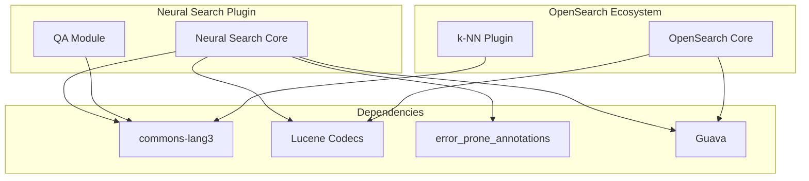

---
tags:
  - domain/search
  - component/server
  - indexing
  - k-nn
  - neural-search
  - search
---
# Neural Search Dependencies

## Summary

The Neural Search plugin manages various third-party dependencies to provide neural search capabilities in OpenSearch. This includes Apache Commons libraries, Lucene codecs, and build tooling dependencies. Proper dependency management ensures compatibility with other OpenSearch plugins and prevents jar hell conflicts.

## Details

### Architecture



### Components

| Component | Description |
|-----------|-------------|
| `commons-lang3` | Apache Commons Lang library providing helper utilities for Java |
| `Lucene Codecs` | Lucene codec implementations for index format compatibility |
| `error_prone_annotations` | Google Error Prone annotations for static analysis |
| `Guava` | Google core libraries for Java |

### Configuration

Dependencies are managed through Gradle build files:

| Setting | Description | Default |
|---------|-------------|---------|
| `versions.commonslang` | commons-lang3 version from version catalog | Managed by OpenSearch |
| `error_prone_annotations` | Forced version for conflict resolution | `2.21.1` |

### Dependency Declaration Example

```groovy
// build.gradle
dependencies {
    compileOnly group: 'org.apache.commons', name: 'commons-lang3', version: "${versions.commonslang}"
    compileOnly group: 'com.google.guava', name: 'guava', version: '32.1.3-jre'
}

configurations.all {
    resolutionStrategy {
        force("com.google.errorprone:error_prone_annotations:2.21.1")
    }
}
```

### Import Migration

When migrating from commons-lang to commons-lang3:

```java
// Before (commons-lang 2.x)
import org.apache.commons.lang.StringUtils;
import org.apache.commons.lang.builder.EqualsBuilder;
import org.apache.commons.lang.builder.HashCodeBuilder;

// After (commons-lang3)
import org.apache.commons.lang3.StringUtils;
import org.apache.commons.lang3.builder.EqualsBuilder;
import org.apache.commons.lang3.builder.HashCodeBuilder;
```

## Limitations

- Version conflicts may occur when multiple plugins bundle different versions of the same dependency
- Jar hell errors can occur if plugins include duplicate classes
- Forced dependency versions are temporary workarounds until upstream fixes are available

## Change History

- **v3.3.0** (2026-01-10): Migrated from commons-lang to commons-lang3, updated Lucene codec paths, forced error_prone_annotations version


## References

### Documentation
- [Apache Commons Lang](https://commons.apache.org/proper/commons-lang/): Official documentation
- [k-NN PR #2863 Comment](https://github.com/opensearch-project/k-NN/pull/2863#issuecomment-3251945721): Original jar hell issue report

### Pull Requests
| Version | PR | Description | Related Issue |
|---------|-----|-------------|---------------|
| v3.3.0 | [#1551](https://github.com/opensearch-project/neural-search/pull/1551) | Remove commons-lang dependency and use gradle version catalog for commons-lang3 |   |
| v3.3.0 | [#1574](https://github.com/opensearch-project/neural-search/pull/1574) | Update Lucene101 codec path to backward path & force errorprone version |   |
| v3.3.0 | [#1589](https://github.com/opensearch-project/neural-search/pull/1589) | Upgrade QA Gradle Dependency Version with commons-lang3 |   |
