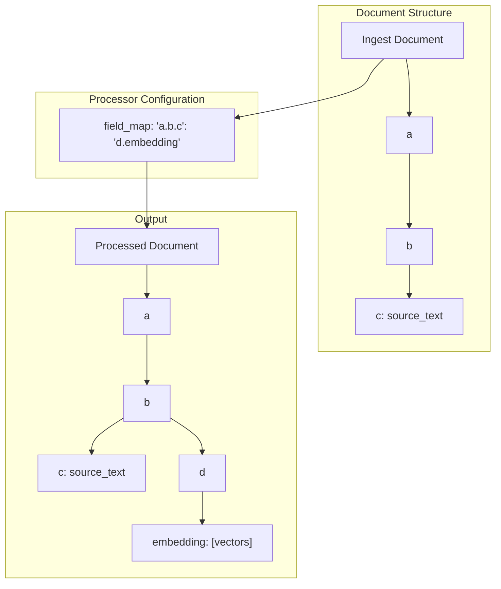

---
tags:
  - neural-search
---
# Neural Search Nested Field Mapping

## Summary

Neural search ingest processors (`text_embedding`, `sparse_encoding`) support dot notation syntax for specifying nested fields in the `field_map` configuration. This allows users to reference deeply nested source fields and specify nested destination fields using a simplified dot-separated path syntax instead of verbose hierarchical JSON structures.

## Details

### Architecture



### Field Map Syntax Options

| Syntax Type | Example | Description |
|-------------|---------|-------------|
| Dot notation (source) | `"a.b.c": "embedding"` | Reference nested source field using dots |
| Dot notation (destination) | `"text": "a.b.embedding"` | Store embeddings in nested structure |
| Mixed notation | `"a.b": { "c": "embedding" }` | Combine dot and hierarchical syntax |
| Hierarchical (legacy) | `"a": { "b": { "c": "embedding" } }` | Full JSON structure |

### Configuration Examples

#### Simple Nested Source Field

```json
PUT /_ingest/pipeline/nested-source-pipeline
{
  "processors": [
    {
      "text_embedding": {
        "model_id": "model_id",
        "field_map": {
          "content.body.text": "content_embedding"
        }
      }
    }
  ]
}
```

Input document:
```json
{
  "content": {
    "body": {
      "text": "Hello world"
    }
  }
}
```

Output document:
```json
{
  "content": {
    "body": {
      "text": "Hello world",
      "content_embedding": [0.1, 0.2, ...]
    }
  }
}
```

#### Nested Destination Field

```json
PUT /_ingest/pipeline/nested-dest-pipeline
{
  "processors": [
    {
      "text_embedding": {
        "model_id": "model_id",
        "field_map": {
          "title": "embeddings.title_vector"
        }
      }
    }
  ]
}
```

Input document:
```json
{
  "title": "OpenSearch Guide"
}
```

Output document:
```json
{
  "title": "OpenSearch Guide",
  "embeddings": {
    "title_vector": [0.1, 0.2, ...]
  }
}
```

#### Both Source and Destination Nested

```json
PUT /_ingest/pipeline/full-nested-pipeline
{
  "processors": [
    {
      "text_embedding": {
        "model_id": "model_id",
        "field_map": {
          "document.content.text": "document.vectors.content_embedding"
        }
      }
    }
  ]
}
```

### Supported Processors

| Processor | Source Nested | Destination Nested | Since |
|-----------|---------------|-------------------|-------|
| `text_embedding` | ✓ | ✓ | v2.16.0 |
| `sparse_encoding` | ✓ | ✓ | v2.16.0 |

## Limitations

- Dot notation is interpreted as path separator; field names containing literal dots are not supported with this syntax
- The destination field is created at the same level as the final source field when using nested source paths
- Array fields within the nested path are not supported

## Change History

- **v2.16.0** (2024-08-06): Added nested field syntax support
  - PR #811: Dot notation for source fields in field_map
  - PR #841: Dot notation for destination fields in field_map

## References

### Documentation
- [Text Embedding Processor](https://docs.opensearch.org/latest/ingest-pipelines/processors/text-embedding/)
- [Sparse Encoding Processor](https://docs.opensearch.org/latest/ingest-pipelines/processors/sparse-encoding/)

### Pull Requests
| Version | PR | Description | Related Issue |
|---------|-----|-------------|---------------|
| v2.16.0 | [#811](https://github.com/opensearch-project/neural-search/pull/811) | Enable '.' for nested field in text embedding processor | [#110](https://github.com/opensearch-project/neural-search/issues/110) |
| v2.16.0 | [#841](https://github.com/opensearch-project/neural-search/pull/841) | Enhance syntax for nested mapping in destination fields | [#110](https://github.com/opensearch-project/neural-search/issues/110) |
