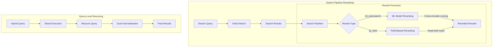

# Neural Search Reranking

## Summary

Neural Search Reranking provides mechanisms to reorder search results after initial retrieval to improve relevance. OpenSearch supports multiple reranking approaches through search pipelines: ML-based cross-encoder reranking, field-based reranking using document values, and query-level rescoring within hybrid queries. These capabilities enable sophisticated relevance tuning for neural search applications.

## Details

### Architecture



### Data Flow


### Components

| Component | Description |
|-----------|-------------|
| `RerankProcessor` | Base search response processor for reranking |
| `MLOpenSearchRerankProcessor` | Reranks using ML models (cross-encoders) |
| `ByFieldRerankProcessor` | Reranks by document field values |
| `RerankType` | Enum defining rerank types (`ml_opensearch`, `by_field`) |
| `ProcessorUtils` | Utility methods for processor operations |
| `HybridQueryPhaseSearcher` | Handles rescore in hybrid query execution |

### Configuration

#### Rerank Processor Configuration

| Setting | Description | Default |
|---------|-------------|---------|
| `context.document_fields` | Fields to pass to ML model for reranking | Required for `ml_opensearch` |
| `ml_opensearch.model_id` | ID of the deployed cross-encoder model | Required for `ml_opensearch` |
| `by_field.target_field` | Dot-path to numeric field for reranking | Required for `by_field` |
| `by_field.remove_target_field` | Remove target field from results | `false` |
| `by_field.keep_previous_score` | Preserve original score | `false` |

#### Rescore Configuration

| Setting | Description | Default |
|---------|-------------|---------|
| `window_size` | Number of top documents to rescore | 10 |
| `query_weight` | Weight for original query score | 1.0 |
| `rescore_query_weight` | Weight for rescore query score | 1.0 |
| `score_mode` | How to combine scores (`total`, `multiply`, `avg`, `max`, `min`) | `total` |

### Usage Examples

#### Cross-Encoder Reranking Pipeline

```json
PUT /_search/pipeline/cross_encoder_pipeline
{
  "response_processors": [
    {
      "rerank": {
        "ml_opensearch": {
          "model_id": "cross-encoder-model-id"
        },
        "context": {
          "document_fields": ["title", "content"]
        }
      }
    }
  ]
}
```

#### Field-Based Reranking Pipeline

```json
PUT /_search/pipeline/byfield_pipeline
{
  "response_processors": [
    {
      "rerank": {
        "by_field": {
          "target_field": "ml_predictions.relevance_score",
          "keep_previous_score": true,
          "remove_target_field": false
        }
      }
    }
  ]
}
```

#### Hybrid Query with Rescore

```json
GET /my-index/_search
{
  "query": {
    "hybrid": {
      "queries": [
        { "match": { "text": "search terms" } },
        { "neural": { "embedding": { "query_text": "semantic query", "model_id": "model-id", "k": 10 } } }
      ]
    }
  },
  "rescore": {
    "window_size": 50,
    "query": {
      "rescore_query": {
        "match_phrase": { "text": { "query": "important phrase", "slop": 2 } }
      },
      "query_weight": 0.7,
      "rescore_query_weight": 1.5
    }
  }
}
```

#### Chained Reranking with Cohere

```json
PUT /_search/pipeline/cohere_rerank_pipeline
{
  "response_processors": [
    {
      "rerank": {
        "ml_opensearch": {
          "model_id": "cohere-rerank-connector-id"
        },
        "context": {
          "document_fields": ["passage_text"]
        }
      }
    }
  ]
}
```

## Limitations

- Cross-encoder reranking requires a deployed ML model with appropriate permissions
- `by_field` reranking requires the target field to be numeric and present in `_source`
- Nested field paths must use dot notation
- Hybrid query rescore does not work with sorting
- Rescore is applied at shard level before normalization in hybrid queries
- Large rescore window sizes increase latency
- One-to-one inference cannot write to search extension due to ordering concerns with reranking

## Change History

- **v2.18.0** (2024-11-05): Added ByFieldRerankProcessor for field-based reranking, enabled rescore support in hybrid queries
- **v2.12.0** (2024-02-20): Initial rerank processor implementation with ML-based reranking

## References

### Documentation
- [Reranking Search Results](https://docs.opensearch.org/2.18/search-plugins/search-relevance/reranking-search-results/): Overview of reranking capabilities
- [Rerank Processor](https://docs.opensearch.org/2.18/search-plugins/search-pipelines/rerank-processor/): Rerank processor reference
- [Reranking by Field](https://docs.opensearch.org/2.18/search-plugins/search-relevance/rerank-by-field/): Field-based reranking guide
- [Reranking with Cohere](https://docs.opensearch.org/2.18/ml-commons-plugin/tutorials/reranking-cohere/): Tutorial for Cohere Rerank integration

### Pull Requests
| Version | PR | Description | Related Issue |
|---------|-----|-------------|---------------|
| v2.18.0 | [#932](https://github.com/opensearch-project/neural-search/pull/932) | ByFieldRerankProcessor for second level reranking | [#926](https://github.com/opensearch-project/neural-search/issues/926) |
| v2.18.0 | [#917](https://github.com/opensearch-project/neural-search/pull/917) | Added rescorer in hybrid query |   |
| v2.12.0 | - | Initial rerank processor implementation |   |

### Issues (Design / RFC)
- [Issue #926](https://github.com/opensearch-project/neural-search/issues/926): ByFieldRerankProcessor feature request
- [Issue #914](https://github.com/opensearch-project/neural-search/issues/914): Hybrid query rescore bug report
