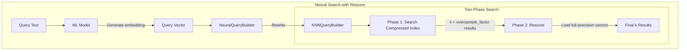
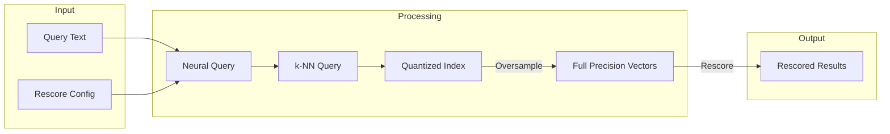

# Neural Search Rescore

## Summary

Neural Search Rescore enables rescoring functionality for neural queries when searching quantized k-NN indexes. This feature improves search recall by performing a two-phase search: first searching the compressed index, then rescoring results using full-precision vectors. It is particularly valuable for disk-based vector search scenarios where memory optimization through binary quantization is used.

## Details

### Architecture



### Data Flow



### Components

| Component | Description |
|-----------|-------------|
| `NeuralQueryBuilder` | Extended to support `rescoreContext` parameter |
| `RescoreContext` | Configuration object for rescoring behavior |
| `RescoreParser` | Parses rescore configuration from query DSL |

### Configuration

| Setting | Description | Default |
|---------|-------------|---------|
| `rescore` | Object containing rescoring configuration | `null` |
| `rescore.oversample_factor` | Multiplier for initial result set size before rescoring | `3.0` (for disk-optimized indexes) |

### Usage Example

Basic neural query with rescore:

```json
GET /my-nlp-index/_search
{
  "query": {
    "neural": {
      "passage_embedding": {
        "query_text": "semantic search query",
        "model_id": "my-model-id",
        "k": 10,
        "rescore": {
          "oversample_factor": 5.0
        }
      }
    }
  }
}
```

Combined with method parameters for hybrid search:

```json
GET /my-nlp-index/_search
{
  "query": {
    "hybrid": {
      "queries": [
        {
          "neural": {
            "passage_embedding": {
              "query_text": "semantic search",
              "model_id": "my-model-id",
              "k": 10,
              "method_parameters": {
                "ef_search": 100
              },
              "rescore": {
                "oversample_factor": 10.0
              }
            }
          }
        },
        {
          "match": {
            "text": "semantic search"
          }
        }
      ]
    }
  }
}
```

## Limitations

- Rescore is designed for quantized/disk-based vector indexes
- Radial search does not support rescoring
- Only works with `float` data type vectors
- Increases search latency due to two-phase processing

## Related PRs

| Version | PR | Description |
|---------|-----|-------------|
| v2.17.0 | [#885](https://github.com/opensearch-project/neural-search/pull/885) | Adds rescore parameter support in neural search |

## References

- [Neural Query Documentation](https://docs.opensearch.org/2.17/query-dsl/specialized/neural/): Official neural query reference
- [Disk-based Vector Search](https://docs.opensearch.org/2.17/search-plugins/knn/disk-based-vector-search/): Documentation on disk-based vector search

## Change History

- **v2.17.0** (2024-09-17): Initial implementation - added rescore parameter support to neural query
