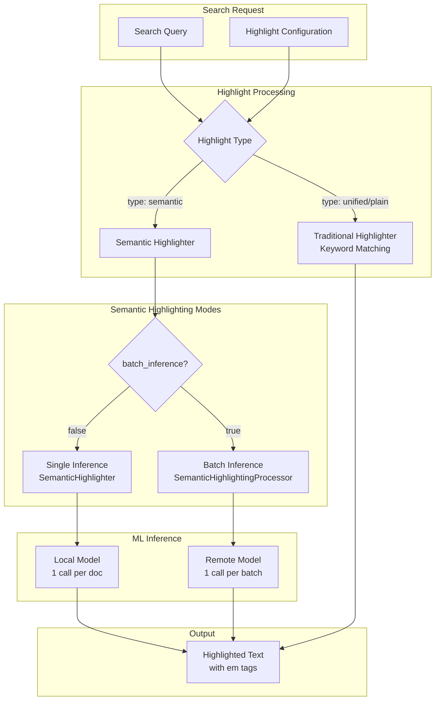
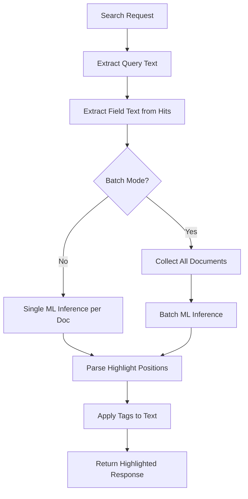

---
tags:
  - domain/search
  - component/server
  - ml
  - neural-search
  - search
---
# Semantic Highlighting

## Summary

Semantic highlighting is an AI-powered feature that intelligently identifies and emphasizes the most semantically relevant sentences or passages within search results based on the query's meaning. Unlike traditional highlighters that rely on exact keyword matches, semantic highlighting uses ML models to understand context and relevance, allowing users to pinpoint pertinent information even when exact search terms aren't present in the highlighted passage.

## Details

### Architecture



### Data Flow



### Components

| Component | Description |
|-----------|-------------|
| `SemanticHighlighter` | Main highlighter implementation registered with OpenSearch |
| `SemanticHighlighterEngine` | Engine for single-document inference operations |
| `SemanticHighlightingProcessor` | Search response processor for batch inference |
| `SemanticHighlightingFactory` | System-generated factory for auto-creating processors |
| `QueryTextExtractorRegistry` | Registry for extracting query text from various query types |
| `HighlightConfig` | Configuration holder for highlighting options |
| `HighlightResultApplier` | Applies position-based highlights to text |

### Configuration

| Setting | Description | Default |
|---------|-------------|---------|
| `model_id` | ID of the semantic highlighting model (required) | - |
| `batch_inference` | Enable batch processing for remote models | `false` |
| `max_inference_batch_size` | Maximum documents per batch | `100` |
| `pre_tag` | Opening tag for highlights | `<em>` |
| `post_tag` | Closing tag for highlights | `</em>` |

### Cluster Settings

| Setting | Description | Default |
|---------|-------------|---------|
| `search.pipeline.enabled_system_generated_factories` | Enable system processors (include `semantic-highlighter` for batch mode) | `[]` |

### Usage Example

#### Deploy Models

```bash
# Register and deploy text embedding model
POST /_plugins/_ml/models/_register?deploy=true
{
  "name": "huggingface/sentence-transformers/all-MiniLM-L6-v2",
  "version": "1.0.2",
  "model_format": "TORCH_SCRIPT"
}

# Register and deploy semantic highlighting model
POST /_plugins/_ml/models/_register?deploy=true
{
  "name": "amazon/sentence-highlighting/opensearch-semantic-highlighter-v1",
  "version": "1.0.0",
  "model_format": "TORCH_SCRIPT",
  "function_name": "QUESTION_ANSWERING"
}
```

#### Single Inference Mode (Default)

```json
POST /my-index/_search
{
  "query": {
    "neural": {
      "embedding": {
        "query_text": "treatments for diseases",
        "model_id": "<embedding-model-id>",
        "k": 10
      }
    }
  },
  "highlight": {
    "fields": {
      "text": { "type": "semantic" }
    },
    "options": {
      "model_id": "<highlighting-model-id>"
    }
  }
}
```

#### Batch Inference Mode (v3.3.0+)

```json
// Enable system processor first
PUT /_cluster/settings
{
  "persistent": {
    "search.pipeline.enabled_system_generated_factories": ["semantic-highlighter"]
  }
}

// Search with batch inference
POST /my-index/_search
{
  "query": {
    "neural": {
      "embedding": {
        "query_text": "treatments for diseases",
        "model_id": "<embedding-model-id>",
        "k": 50
      }
    }
  },
  "highlight": {
    "fields": {
      "text": { "type": "semantic" }
    },
    "options": {
      "model_id": "<highlighting-model-id>",
      "batch_inference": true
    }
  }
}
```

### Response Format

```json
{
  "hits": {
    "hits": [
      {
        "_source": { "text": "..." },
        "highlight": {
          "text": [
            "Document text with <em>semantically relevant passage</em> highlighted."
          ]
        }
      }
    ]
  }
}
```

## Limitations

- Requires a deployed semantic highlighting model (local or remote)
- Batch inference only supported for remote models (REMOTE function type)
- Long documents exceeding model token limits may require chunked processing
- Model inference adds latency compared to keyword-based highlighting

## Change History

- **v3.3.0** (2025-10-28): Added batch inference support for remote models with 100-1,300% performance improvements
- **v3.0.0**: Initial implementation with single inference mode

## Related Features
- [ML Commons](../ml-commons/ml-commons-agentic-memory.md)
- [k-NN Vector Search](../k-nn/k-nn-disk-based-vector-search.md)
- [Search Relevance](../search-relevance/dashboards-observability-search-relevance-ci-tests.md)

## References

### Documentation
- [Documentation](https://docs.opensearch.org/3.0/tutorials/vector-search/semantic-highlighting-tutorial/): Semantic highlighting tutorial
- [Documentation](https://docs.opensearch.org/3.0/search-plugins/searching-data/highlight/): Highlight query matches
- [Pretrained Models](https://docs.opensearch.org/3.0/ml-commons-plugin/pretrained-models/): Semantic sentence highlighting models

### Blog Posts
- [Blog](https://opensearch.org/blog/introducing-semantic-highlighting-in-opensearch/): Introducing semantic highlighting in OpenSearch
- [Blog](https://opensearch.org/blog/batch-processing-semantic-highlighting-in-opensearch-3-3/): Batch Processing Semantic Highlighting in OpenSearch 3.3

### Pull Requests
| Version | PR | Description | Related Issue |
|---------|-----|-------------|---------------|
| v3.3.0 | [neural-search#1520](https://github.com/opensearch-project/neural-search/pull/1520) | Add batch inference support for semantic highlighting | [#1516](https://github.com/opensearch-project/neural-search/issues/1516) |
| v3.0.0 | [neural-search#1183](https://github.com/opensearch-project/neural-search/pull/1183) | Encapsulate KNNQueryBuilder within NeuralKNNQueryBuilder (foundation for query text preservation) | [#1182](https://github.com/opensearch-project/neural-search/issues/1182) |
| v3.0.0 | - | Initial semantic highlighting implementation |   |

### Issues (Design / RFC)
- [Issue #1175](https://github.com/opensearch-project/neural-search/issues/1175): [RFC] OpenSearch Semantic Sentence Highlighting
- [Issue #1182](https://github.com/opensearch-project/neural-search/issues/1182): Semantic Highlighter Project Tasks Tracker
- [Issue #1516](https://github.com/opensearch-project/neural-search/issues/1516): Batch Inference Support for Semantic Highlighting
