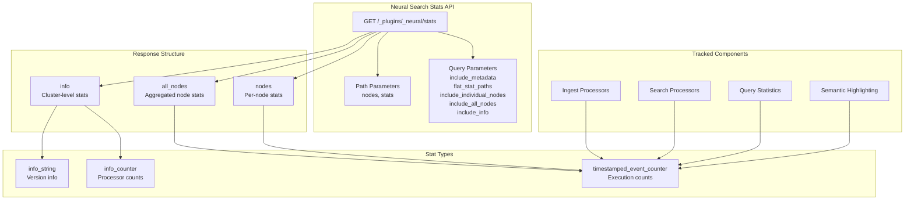
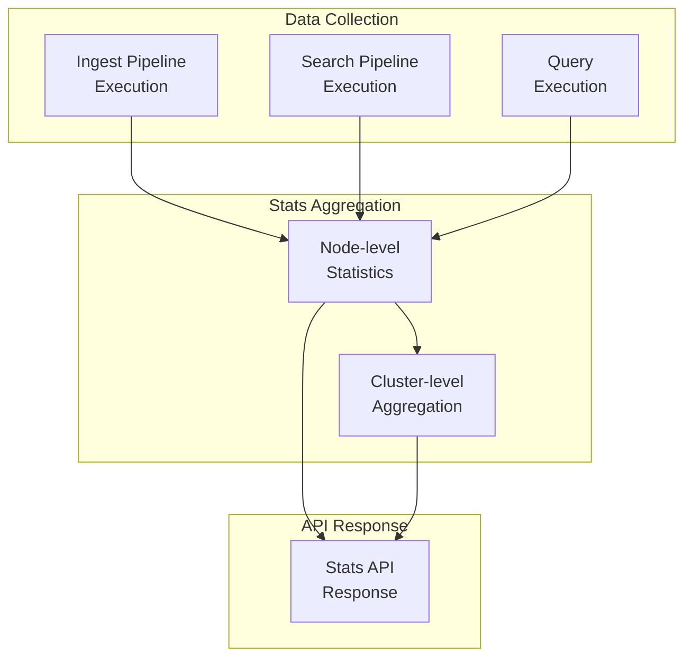

# Neural Search Stats

## Summary

The Neural Search Stats API provides comprehensive monitoring capabilities for the Neural Search plugin in OpenSearch. It exposes cluster-level and node-level statistics for tracking the usage and performance of semantic search, hybrid search, and AI-powered ingest processors.

## Details

### Architecture



### Data Flow



### Components

| Component | Description |
|-----------|-------------|
| Stats API Endpoint | REST endpoint at `/_plugins/_neural/stats` for retrieving statistics |
| Info Stats | Cluster-wide information including version and processor counts |
| Node Stats | Per-node execution counters for processors and queries |
| All Nodes Stats | Aggregated statistics across all nodes in the cluster |
| Event Counter | Timestamped counter tracking executions with trailing interval support |

### Configuration

| Setting | Description | Default |
|---------|-------------|---------|
| `plugins.neural_search.stats_enabled` | Enable/disable statistics collection | `false` |

### API Parameters

| Parameter | Type | Description | Default |
|-----------|------|-------------|---------|
| `nodes` | Path | Filter by node ID(s), comma-separated | All nodes |
| `stats` | Path | Filter by stat name(s), comma-separated | All stats |
| `include_metadata` | Query | Include stat type metadata | `false` |
| `flat_stat_paths` | Query | Flatten JSON response structure | `false` |
| `include_individual_nodes` | Query | Include per-node statistics | `true` |
| `include_all_nodes` | Query | Include aggregated cluster statistics | `true` |
| `include_info` | Query | Include cluster-level info statistics | `true` |

### Available Statistics

#### Ingest Processor Stats

| Statistic | Type | Description |
|-----------|------|-------------|
| `text_embedding_processors_in_pipelines` | Info | Count of text embedding processors in pipelines |
| `text_embedding_executions` | Event | Text embedding processor execution count |
| `text_chunking_processors` | Info | Count of text chunking processors |
| `text_chunking_executions` | Event | Text chunking processor execution count |
| `text_chunking_delimiter_processors` | Info | Count of delimiter-based chunking processors |
| `text_chunking_delimiter_executions` | Event | Delimiter chunking execution count |
| `text_chunking_fixed_length_processors` | Info | Count of fixed-length chunking processors |
| `text_chunking_fixed_length_executions` | Event | Fixed-length chunking execution count |
| `sparse_encoding_processors` | Info | Count of sparse encoding processors |
| `sparse_encoding_executions` | Event | Sparse encoding execution count |
| `text_image_embedding_processors` | Info | Count of text-image embedding processors |
| `text_image_embedding_executions` | Event | Text-image embedding execution count |
| `skip_existing_processors` | Info | Count of processors with skip_existing enabled |
| `skip_existing_executions` | Event | Executions with skip_existing flag |

#### Search Processor Stats

| Statistic | Type | Description |
|-----------|------|-------------|
| `normalization_processors` | Info | Count of score-based normalization processors |
| `normalization_processor_executions` | Event | Score-based normalization execution count |
| `rank_based_normalization_processors` | Info | Count of RRF normalization processors |
| `rank_based_normalization_processor_executions` | Event | RRF normalization execution count |
| `comb_arithmetic_processors` | Info | Arithmetic combination processor count |
| `comb_arithmetic_executions` | Event | Arithmetic combination execution count |
| `comb_geometric_processors` | Info | Geometric combination processor count |
| `comb_geometric_executions` | Event | Geometric combination execution count |
| `comb_harmonic_processors` | Info | Harmonic combination processor count |
| `comb_harmonic_executions` | Event | Harmonic combination execution count |
| `comb_rrf_processors` | Info | RRF combination processor count |
| `comb_rrf_executions` | Event | RRF combination execution count |
| `norm_l2_processors` | Info | L2 normalization processor count |
| `norm_l2_executions` | Event | L2 normalization execution count |
| `norm_minmax_processors` | Info | Min-max normalization processor count |
| `norm_minmax_executions` | Event | Min-max normalization execution count |
| `norm_zscore_processors` | Info | Z-score normalization processor count |
| `norm_zscore_executions` | Event | Z-score normalization execution count |
| `neural_query_enricher_processors` | Info | Neural query enricher processor count |
| `neural_query_enricher_executions` | Event | Neural query enricher execution count |
| `neural_sparse_two_phase_processors` | Info | Neural sparse two-phase processor count |
| `neural_sparse_two_phase_executions` | Event | Neural sparse two-phase execution count |
| `rerank_ml_processors` | Info | ML reranker processor count |
| `rerank_ml_executions` | Event | ML reranker execution count |
| `rerank_by_field_processors` | Info | By-field reranker processor count |
| `rerank_by_field_executions` | Event | By-field reranker execution count |

#### Query Stats

| Statistic | Type | Description |
|-----------|------|-------------|
| `hybrid_query_requests` | Event | Total hybrid query request count |
| `hybrid_query_with_filter_requests` | Event | Hybrid queries with filter count |
| `hybrid_query_with_inner_hits_requests` | Event | Hybrid queries with inner hits count |
| `hybrid_query_with_pagination_requests` | Event | Hybrid queries with pagination count |

#### Semantic Highlighting Stats

| Statistic | Type | Description |
|-----------|------|-------------|
| `semantic_highlighting_request_count` | Event | Semantic highlighting request count |

### Usage Example

Enable statistics collection:
```json
PUT /_cluster/settings
{
  "persistent": {
    "plugins.neural_search.stats_enabled": "true"
  }
}
```

Retrieve all statistics:
```bash
GET /_plugins/_neural/stats
```

Retrieve specific statistics with metadata:
```bash
GET /_plugins/_neural/stats/text_embedding_executions,hybrid_query_requests?include_metadata=true
```

Retrieve aggregated stats only (exclude per-node breakdown):
```bash
GET /_plugins/_neural/stats?include_individual_nodes=false
```

## Limitations

- Statistics collection is disabled by default for performance reasons
- All statistics reset when collection is disabled or node restarts
- Metadata fields (`trailing_interval_value`, `minutes_since_last_event`) only available when `include_metadata=true`

## Change History

- **v3.1.0** (2026-01-10): Comprehensive stats coverage for all Neural Search components including text chunking, text embedding, hybrid query, normalization processors, semantic highlighting, and API parameter enhancements

## References

### Documentation
- [Neural Search Stats API Documentation](https://docs.opensearch.org/3.0/vector-search/api/neural/)

### Pull Requests
| Version | PR | Description | Related Issue |
|---------|-----|-------------|---------------|
| v3.1.0 | [#1308](https://github.com/opensearch-project/neural-search/pull/1308) | Add stats for text chunking processor algorithms |   |
| v3.1.0 | [#1327](https://github.com/opensearch-project/neural-search/pull/1327) | Add stats tracking for semantic highlighting |   |
| v3.1.0 | [#1332](https://github.com/opensearch-project/neural-search/pull/1332) | Add stats for text embedding processor with skip_existing flag |   |
| v3.1.0 | [#1326](https://github.com/opensearch-project/neural-search/pull/1326) | Add stats for score/rank based normalization and hybrid query | [#1146](https://github.com/opensearch-project/neural-search/issues/1146) |
| v3.1.0 | [#1343](https://github.com/opensearch-project/neural-search/pull/1343) | Add stats for neural query enricher, sparse encoding, reranker |   |
| v3.1.0 | [#1360](https://github.com/opensearch-project/neural-search/pull/1360) | Add include_individual_nodes, include_all_nodes, include_info params |   |
| v3.1.0 | [#1378](https://github.com/opensearch-project/neural-search/pull/1378) | Combine skip_existing flag stats into single stat |   |

### Issues (Design / RFC)
- [Issue #1146](https://github.com/opensearch-project/neural-search/issues/1146): Stats for normalization processor
- [Issue #1104](https://github.com/opensearch-project/neural-search/issues/1104): Stats API parameters
- [Issue #1182](https://github.com/opensearch-project/neural-search/issues/1182): Semantic highlighting stats
