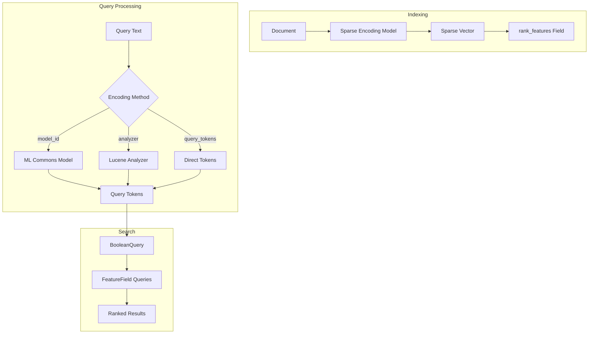
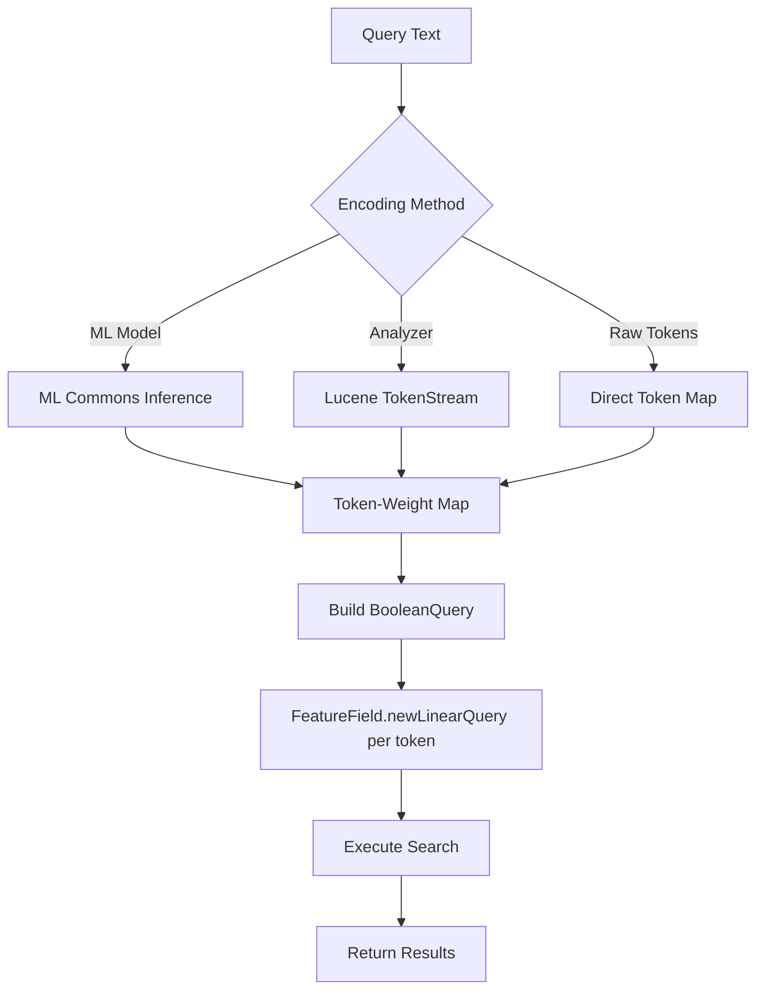
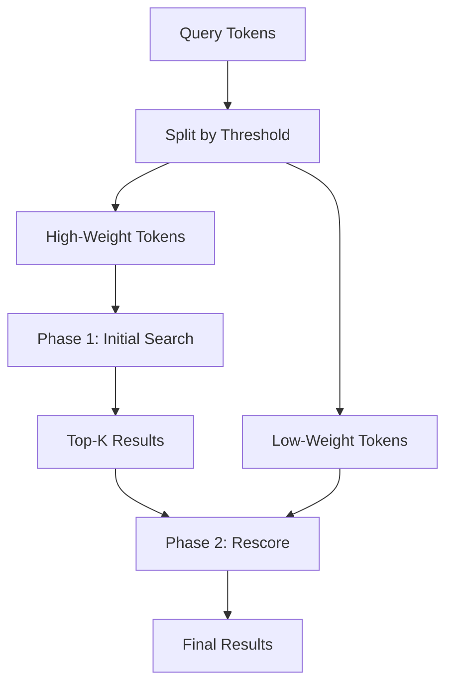

# Neural Sparse Search

## Summary

Neural sparse search is a semantic search technique that uses sparse vector representations to find relevant documents. Unlike dense vector search which uses fixed-dimension embeddings, sparse vectors have variable dimensions where each dimension corresponds to a vocabulary token with an associated weight. This approach combines the interpretability of keyword search with the semantic understanding of neural models.

## Details

### Architecture



### Data Flow



### Components

| Component | Description |
|-----------|-------------|
| `NeuralSparseQueryBuilder` | Query builder that constructs neural sparse queries from text, model, analyzer, or raw tokens |
| `NeuralSparseQueryTwoPhaseInfo` | Encapsulates two-phase execution state for query optimization |
| `sparse_encoding` processor | Ingest processor that generates sparse vectors from text during indexing |
| `neural_sparse_two_phase` processor | Search pipeline processor for two-phase query optimization |

### Configuration

| Setting | Description | Default |
|---------|-------------|---------|
| `query_text` | The text to encode into sparse vectors | Required (unless `query_tokens` provided) |
| `model_id` | ID of the sparse encoding model in ML Commons | Optional |
| `analyzer` | Name of the Lucene analyzer for tokenization | `bert-uncased` |
| `query_tokens` | Pre-computed token-weight map | Optional |
| `max_token_score` | (Deprecated) Maximum token score threshold | N/A |

### Query Modes

Neural sparse query supports three encoding methods:

1. **Model-based**: Uses ML Commons sparse encoding model
   ```json
   {
     "neural_sparse": {
       "field": {
         "query_text": "search query",
         "model_id": "<model-id>"
       }
     }
   }
   ```

2. **Analyzer-based** (v3.0.0+): Uses Lucene analyzer for tokenization
   ```json
   {
     "neural_sparse": {
       "field": {
         "query_text": "search query",
         "analyzer": "bert-uncased"
       }
     }
   }
   ```

3. **Raw tokens**: Directly provides token-weight map
   ```json
   {
     "neural_sparse": {
       "field": {
         "query_tokens": {
           "token1": 1.5,
           "token2": 2.3
         }
       }
     }
   }
   ```

### Two-Phase Query Optimization

The neural sparse query supports two-phase execution for improved performance:



Two-phase status values:
- `NOT_ENABLED`: Standard single-phase execution
- `PHASE_ONE`: First phase with high-weight tokens only
- `PHASE_TWO`: Rescoring phase with low-weight tokens

### Usage Example

```json
PUT /my-sparse-index
{
  "settings": {
    "default_pipeline": "sparse-ingest-pipeline"
  },
  "mappings": {
    "properties": {
      "text_sparse": {
        "type": "rank_features"
      },
      "text": {
        "type": "text"
      }
    }
  }
}

GET /my-sparse-index/_search
{
  "query": {
    "neural_sparse": {
      "text_sparse": {
        "query_text": "semantic search query",
        "analyzer": "bert-uncased"
      }
    }
  }
}
```

## Limitations

- Sparse encoding models must be deployed in ML Commons before use (for model-based queries)
- Analyzer must be configured in index settings (for analyzer-based queries)
- Token weights in analyzer mode must be encoded as 4-byte floats in payload attribute
- Two-phase optimization requires search pipeline configuration
- Cannot specify both `model_id` and `analyzer` in the same query (v3.1.0+)

## Change History

- **v3.1.0**: Added validation to prevent specifying both model_id and analyzer simultaneously
- **v3.0.0** (2025-03-11): Added analyzer-based neural sparse query support, enabling tokenization without ML Commons models
- **v2.11.0**: Initial implementation of neural sparse query with model-based and raw token support

## References

### Documentation
- [Neural Sparse Query Documentation](https://docs.opensearch.org/3.0/query-dsl/specialized/neural-sparse/)
- [Neural Sparse Search Guide](https://docs.opensearch.org/3.0/vector-search/ai-search/neural-sparse-search/)
- [Neural Search API](https://docs.opensearch.org/3.0/vector-search/api/neural/)

### Pull Requests
| Version | PR | Description |
|---------|-----|-------------|
| v3.1.0 | [#1359](https://github.com/opensearch-project/neural-search/pull/1359) | Validate model_id and analyzer mutual exclusivity |
| v3.0.0 | [#1088](https://github.com/opensearch-project/neural-search/pull/1088) | Implement analyzer-based neural sparse query |
| v2.11.0 | - | Initial neural sparse query implementation |

### Issues (Design / RFC)
- [Issue #1052](https://github.com/opensearch-project/neural-search/issues/1052): RFC for analyzer-based neural sparse query
