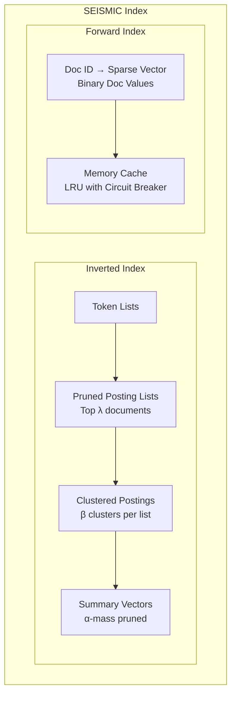
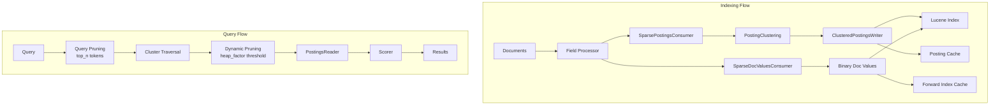

# SEISMIC Sparse ANN

## Summary

SEISMIC (Spilled Clustering of Inverted Lists with Summaries for Maximum Inner Product Search) is an approximate nearest neighbor (ANN) algorithm for sparse vectors in OpenSearch. It enables billion-scale neural sparse search with sub-12ms query latency while maintaining 90%+ recall, delivering 4x faster performance than BM25 and 10x faster than standard neural sparse search.

## Details

### Architecture



### Data Flow



### Components

| Component | Description |
|-----------|-------------|
| `SparseAnnCodec` | Custom Lucene codec providing SEISMIC-specific consumers |
| `SparsePostingsConsumer` | Processes terms and posting lists, delegates to PostingClustering |
| `SparseDocValuesConsumer` | Stores sparse vectors as binary doc values with caching |
| `PostingClustering` | Implements SEISMIC clustering: sorts by weight, prunes to λ, clusters into β groups |
| `ClusteredPostingsLuceneWriter` | Persists clustered posting structure to Lucene files |
| `PostingWithClustersScorer` | Query scorer implementing SEISMIC traversal and scoring |
| `PostingsReader` | Reads clustered postings from cache or Lucene store |
| `SparseAnnQueryBuilder` | Extends NeuralSparseQueryBuilder with SEISMIC parameters |
| `ForwardIndexCache` | LRU cache for sparse vectors with circuit breaker |
| `ClusteredPostingCache` | LRU cache for clustered posting lists |

### Configuration

#### Index Settings

| Setting | Description | Default |
|---------|-------------|---------|
| `index.sparse` | Enable sparse ANN index | `false` |

#### Field Mapping Parameters

| Parameter | Description | Default |
|-----------|-------------|---------|
| `method.name` | Algorithm name | `seismic` |
| `n_postings` | Max posting list length (λ parameter) | `4000` |
| `cluster_ratio` | Ratio for cluster count: clusters = ratio × posting_length | `0.1` |
| `summary_prune_ratio` | Summary vector pruning ratio (α parameter) | `0.4` |
| `approximate_threshold` | Document count threshold for SEISMIC activation | `1000000` |
| `quantization_ceiling_search` | Max float value for search quantization | `3.0` |
| `quantization_ceiling_ingest` | Max float value for ingest quantization | `3.0` |

#### Query Parameters

| Parameter | Description | Default |
|-----------|-------------|---------|
| `top_n` | Number of query tokens to examine | `10` |
| `k` | Number of nearest neighbors to return | Required |
| `heap_factor` | Recall vs QPS trade-off (higher = better recall, lower QPS) | `1.0` |
| `filter` | Pre-filtering boolean query | Optional |

#### Cluster Settings

| Setting | Description | Default |
|---------|-------------|---------|
| `neural.sparse.algo_param.index_thread_qty` | Thread pool size for SEISMIC index building | `# processors / 2` |
| `plugins.neural_search.circuit_breaker.limit` | Memory limit for SEISMIC caches | `10%` |
| `plugins.neural_search.circuit_breaker.overhead` | Circuit breaker overhead factor | `1.01` |
| `plugins.neural_search.stats_enabled` | Enable neural search stats | `false` |

### Usage Example

#### Create Index with SEISMIC

```json
PUT my-seismic-index
{
  "settings": {
    "index": {
      "sparse": true
    }
  },
  "mappings": {
    "properties": {
      "sparse_embedding": {
        "type": "sparse_vector",
        "method": {
          "name": "seismic",
          "parameters": {
            "n_postings": 160,
            "cluster_ratio": 0.075,
            "summary_prune_ratio": 0.4,
            "approximate_threshold": 1000000,
            "quantization_ceiling_search": 16,
            "quantization_ceiling_ingest": 16
          }
        }
      },
      "text": {
        "type": "text"
      }
    }
  }
}
```

#### Ingest Documents

```json
POST my-seismic-index/_bulk
{ "index": { "_id": "1" } }
{ "sparse_embedding": { "1000": 0.1, "2000": 0.5, "3000": 0.3 }, "text": "document one" }
{ "index": { "_id": "2" } }
{ "sparse_embedding": { "1000": 0.8, "4000": 0.2 }, "text": "document two" }
{ "index": { "_id": "3" } }
{ "sparse_embedding": { "5000": 0.9, "6000": 0.4 }, "text": "document three" }
```

#### Force Merge for Optimal Performance

```json
POST my-seismic-index/_forcemerge?max_num_segments=1
```

#### Query with Raw Vectors

```json
GET my-seismic-index/_search
{
  "query": {
    "neural_sparse": {
      "sparse_embedding": {
        "query_tokens": {
          "1000": 5.5,
          "2000": 3.0
        },
        "method_parameters": {
          "heap_factor": 1.0,
          "top_n": 10,
          "k": 10
        }
      }
    }
  }
}
```

#### Query with Natural Language and Model

```json
GET my-seismic-index/_search
{
  "query": {
    "neural_sparse": {
      "sparse_embedding": {
        "query_text": "search query text",
        "model_id": "your-sparse-model-id",
        "method_parameters": {
          "k": 10,
          "top_n": 10,
          "heap_factor": 1.0
        }
      }
    }
  }
}
```

#### Query with Pre-filtering

```json
GET my-seismic-index/_search
{
  "query": {
    "neural_sparse": {
      "sparse_embedding": {
        "query_tokens": {
          "1000": 5.5
        },
        "method_parameters": {
          "k": 10,
          "top_n": 10,
          "heap_factor": 1.0,
          "filter": {
            "bool": {
              "must": [
                { "match": { "text": "document" } }
              ]
            }
          }
        }
      }
    }
  }
}
```

#### Check Memory Stats

```json
PUT _cluster/settings
{
  "persistent": {
    "plugins.neural_search.stats_enabled": "true"
  }
}

GET _plugins/_neural/stats/
```

Response includes:
```json
{
  "memory": {
    "sparse": {
      "sparse_memory_usage_percentage": "5.00%",
      "sparse_memory_usage": "512mb",
      "clustered_posting_usage": "256mb",
      "forward_index_usage": "256mb"
    }
  }
}
```

## Limitations

- **Codec Limitation**: Cannot combine sparse ANN fields with k-NN fields in the same index
- **Memory Requirements**: ~1 GB memory per 1M documents; ~53 GB per data node for 8.8M documents
- **Force Merge Required**: Optimal performance requires force merging to single segment per shard
- **Dataset Size**: Best suited for datasets with 1M+ documents; smaller datasets may not see significant benefits
- **Two-Phase Query**: Neural sparse two-phase query not supported with SEISMIC fields
- **Nested Fields**: Nested field support added in v3.4.0

## Related PRs

| Version | PR | Description |
|---------|-----|-------------|
| v3.3.0 | [#1502](https://github.com/opensearch-project/neural-search/pull/1502) | Add basic classes for SEISMIC algorithm |
| v3.3.0 | [#1528](https://github.com/opensearch-project/neural-search/pull/1528) | Clustering algorithms & field mapper |
| v3.3.0 | [#1536](https://github.com/opensearch-project/neural-search/pull/1536) | Circuit breaker and memory stats |
| v3.3.0 | [#1537](https://github.com/opensearch-project/neural-search/pull/1537) | Add codec |
| v3.3.0 | [#1539](https://github.com/opensearch-project/neural-search/pull/1539) | Add query |
| v3.3.0 | [#1553](https://github.com/opensearch-project/neural-search/pull/1553) | Ingestion interface |
| v3.3.0 | [#1554](https://github.com/opensearch-project/neural-search/pull/1554) | Index thread quantity setting API |
| v3.3.0 | [#1555](https://github.com/opensearch-project/neural-search/pull/1555) | Add IT for memory stats |
| v3.3.0 | [#1557](https://github.com/opensearch-project/neural-search/pull/1557) | Query interface |
| v3.3.0 | [#1559](https://github.com/opensearch-project/neural-search/pull/1559) | WarmUp and clearCache IT |
| v3.3.0 | [#1562](https://github.com/opensearch-project/neural-search/pull/1562) | Remaining integration tests |
| v3.3.0 | [#1564](https://github.com/opensearch-project/neural-search/pull/1564) | Delete/update doc ITs |
| v3.3.0 | [#1565](https://github.com/opensearch-project/neural-search/pull/1565) | Change default circuit breaker limit to 10% |
| v3.3.0 | [#1566](https://github.com/opensearch-project/neural-search/pull/1566) | Fix flakey warm up IT |
| v3.3.0 | [#1577](https://github.com/opensearch-project/neural-search/pull/1577) | Add stats for SEISMIC query |
| v3.3.0 | [#1580](https://github.com/opensearch-project/neural-search/pull/1580) | Dynamic max float value for byte quantization |
| v3.3.0 | [#1581](https://github.com/opensearch-project/neural-search/pull/1581) | Change path of index_thread_qty API |

## References

- [RFC #1335](https://github.com/opensearch-project/neural-search/issues/1335): Sparse ANN Algorithm: Seismic
- [Design #1390](https://github.com/opensearch-project/neural-search/issues/1390): Approximate Sparse Nearest-Neighbor Search in OpenSearch
- [Memory Management Design #1444](https://github.com/opensearch-project/neural-search/issues/1444): SEISMIC memory management
- [SEISMIC Paper](https://dl.acm.org/doi/10.1145/3626772.3657769): Efficient Inverted Indexes for Approximate Retrieval over Learned Sparse Representations
- [Blog: Scaling neural sparse search to billions of vectors](https://opensearch.org/blog/scaling-neural-sparse-search-to-billions-of-vectors-with-approximate-search/)
- [Neural Sparse Search Documentation](https://docs.opensearch.org/3.0/vector-search/ai-search/neural-sparse-search/)
- [Neural Sparse Query Documentation](https://docs.opensearch.org/3.0/query-dsl/specialized/neural-sparse/)

## Change History

- **v3.3.0** (2025-10-23): Initial implementation of SEISMIC sparse ANN algorithm with full indexing, query, caching, and memory management support
