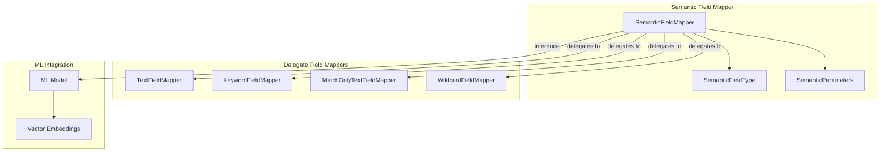

# Semantic Field

## Summary

The semantic field type is a new field mapper in the neural-search plugin that simplifies semantic search workflows. It automatically handles text-to-vector transformations using ML models, eliminating the need for separate ingest pipelines while preserving the original text for traditional search capabilities.

## Details

### Architecture



### Components

| Component | Description | Since |
|-----------|-------------|-------|
| SemanticFieldMapper | Main field mapper handling semantic field configuration | v3.0.0 |
| SemanticFieldType | Field type extending FilterFieldType for delegate wrapping | v3.0.0 |
| SemanticParameters | DTO holding model_id, search_model_id, raw_field_type, semantic_info_field_name | v3.0.0 |
| FeatureFlagUtil | Controls semantic field feature availability | v3.0.0 |

### Configuration

| Parameter | Description | Default |
|-----------|-------------|--------|
| `model_id` | ML model ID for embedding generation at index time | Required |
| `search_model_id` | ML model ID for query inference (optional) | Uses `model_id` |
| `raw_field_type` | Underlying field type for raw data | `text` |
| `semantic_info_field_name` | Custom name for semantic info field | Auto-generated |

### Supported Raw Field Types

| Type | Use Case |
|------|----------|
| `text` | Full-text search with analysis (default) |
| `keyword` | Exact matching, aggregations |
| `match_only_text` | Space-efficient text without scoring |
| `wildcard` | Pattern matching queries |
| `token_count` | Token counting |
| `binary` | Binary data storage |

### Usage Example

```json
// Create index with semantic field
PUT /semantic-index
{
  "mappings": {
    "properties": {
      "description": {
        "type": "semantic",
        "model_id": "sentence-transformers/all-MiniLM-L6-v2",
        "search_model_id": "sentence-transformers/all-MiniLM-L6-v2",
        "raw_field_type": "text"
      }
    }
  }
}

// Index document (embedding generated automatically)
POST /semantic-index/_doc
{
  "description": "OpenSearch is a distributed search and analytics engine."
}

// Get mapping shows semantic field configuration
GET /semantic-index/_mapping
{
  "semantic-index": {
    "mappings": {
      "properties": {
        "description": {
          "type": "semantic",
          "model_id": "sentence-transformers/all-MiniLM-L6-v2",
          "search_model_id": "sentence-transformers/all-MiniLM-L6-v2",
          "raw_field_type": "text"
        }
      }
    }
  }
}
```

## Limitations

- Feature is disabled by default (requires `semantic_field_enabled` feature flag)
- Cannot change `raw_field_type` after index creation
- Cannot change `semantic_info_field_name` after index creation
- Public documentation pending

## References

- [Issue #803](https://github.com/opensearch-project/neural-search/issues/803): Neural Search field type proposal
- [Issue #1226](https://github.com/opensearch-project/neural-search/issues/1226): Semantic field implementation tracking
- [PR #1225](https://github.com/opensearch-project/neural-search/pull/1225): Add semantic field mapper
- [Semantic Search Documentation](https://docs.opensearch.org/3.0/vector-search/ai-search/semantic-search/): Related semantic search concepts

## Change History

| Version | Changes |
|---------|--------|
| v3.0.0 | Initial semantic field mapper implementation (feature-flagged) |
