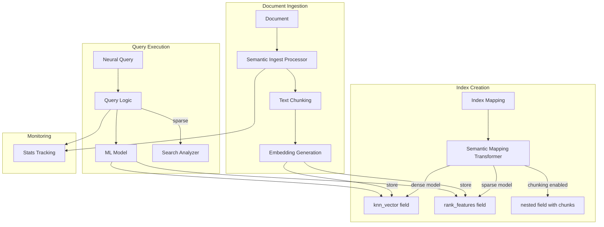
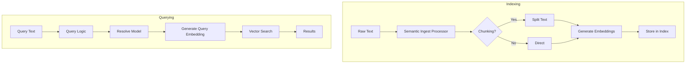

# Semantic Field

## Summary

The `semantic` field type is a high-level abstraction in the neural-search plugin that simplifies semantic search setup in OpenSearch. It wraps text or binary fields and automatically handles embedding generation during indexing and query execution, eliminating the need for separate ingest pipelines while preserving the original text for traditional search capabilities.

## Details

### Architecture



### Data Flow



### Components

| Component | Description | Since |
|-----------|-------------|-------|
| `SemanticFieldMapper` | Main field mapper handling semantic field configuration | v3.0.0 |
| `SemanticFieldType` | Field type extending `FilterFieldType` for delegate wrapping | v3.0.0 |
| `SemanticParameters` | DTO holding model IDs, raw field type, and semantic info field name | v3.0.0 |
| `Semantic Mapping Transformer` | Transforms mappings to create underlying embedding fields | v3.1.0 |
| `Semantic Ingest Processor` | Handles chunking and embedding generation during ingestion | v3.1.0 |
| `Query Logic` | Resolves model configuration and executes neural queries | v3.1.0 |
| `Search Analyzer Support` | Built-in analyzers for sparse query tokenization | v3.1.0 |
| `Stats Tracking` | Tracks semantic field execution metrics | v3.1.0 |

### Configuration

| Parameter | Description | Default | Since |
|-----------|-------------|---------|-------|
| `model_id` | ML model ID for embedding generation at index time | Required | v3.0.0 |
| `search_model_id` | ML model ID for query inference (sparse doc-only mode) | Uses `model_id` | v3.0.0 |
| `raw_field_type` | Underlying field type for raw data | `text` | v3.0.0 |
| `semantic_info_field_name` | Custom name for semantic info field | Auto-generated | v3.0.0 |
| `chunking` | Enable text chunking (boolean or array of strategies) | `false` | v3.1.0 |
| `semantic_field_search_analyzer` | Analyzer for sparse query tokenization | None | v3.1.0 |
| `dense_embedding_config` | Custom settings for knn_vector field (space_type, method, engine, parameters) | Auto from model | v3.2.0 |
| `sparse_encoding_config` | Pruning configuration for sparse vectors (`prune_type`, `prune_ratio`) | `max_ratio: 0.1` | v3.2.0 |
| `skip_existing_embedding` | Skip embedding generation if unchanged | `false` | v3.2.0 |

### Index Settings

| Setting | Description | Default | Since |
|---------|-------------|---------|-------|
| `index.neural_search.semantic_ingest_batch_size` | Documents per batch during ingestion (1-100) | `10` | v3.2.0 |

### Supported Raw Field Types

| Type | Use Case |
|------|----------|
| `text` | Full-text search with analysis (default) |
| `keyword` | Exact matching, aggregations |
| `match_only_text` | Space-efficient text without scoring |
| `wildcard` | Pattern matching queries |
| `token_count` | Token counting |
| `binary` | Binary data storage |

### Supported Search Analyzers (Sparse Models)

| Analyzer | Description |
|----------|-------------|
| `standard` | Standard tokenizer |
| `bert-uncased` | BERT uncased tokenizer |
| `mbert-uncased` | Multilingual BERT uncased tokenizer |

### Usage Example

```json
// Create index with semantic field (dense model)
PUT /my-nlp-index
{
  "settings": {
    "index.knn": true
  },
  "mappings": {
    "properties": {
      "text": {
        "type": "semantic",
        "model_id": "No0hhZcBnsM8JstbBkjQ"
      }
    }
  }
}

// Create index with chunking enabled
PUT /my-nlp-index-chunked
{
  "settings": {
    "index.knn": true
  },
  "mappings": {
    "properties": {
      "text": {
        "type": "semantic",
        "model_id": "No0hhZcBnsM8JstbBkjQ",
        "chunking": true
      }
    }
  }
}

// Create index with advanced chunking configuration
PUT /my-nlp-index-advanced
{
  "settings": {
    "index.knn": true
  },
  "mappings": {
    "properties": {
      "text": {
        "type": "semantic",
        "model_id": "No0hhZcBnsM8JstbBkjQ",
        "chunking": [
          {
            "algorithm": "delimiter",
            "parameters": { "delimiter": "\n\n" }
          },
          {
            "algorithm": "fixed_token_length",
            "parameters": { "token_limit": 128, "overlap_rate": 0.2 }
          }
        ]
      }
    }
  }
}

// Create index with sparse model and search analyzer
PUT /my-sparse-index
{
  "mappings": {
    "properties": {
      "text": {
        "type": "semantic",
        "model_id": "R42oiZcBnsM8JstbUUgc",
        "semantic_field_search_analyzer": "bert-uncased"
      }
    }
  }
}

// Index document (embedding generated automatically)
PUT /my-nlp-index/_doc/1
{
  "text": "A wild animal races across an uncut field."
}

// Search using neural query (no model_id needed)
GET /my-nlp-index/_search
{
  "query": {
    "neural": {
      "text": {
        "query_text": "wild west",
        "k": 10
      }
    }
  }
}
```

## Limitations

- Remote cluster support: Neural queries on semantic fields are not supported in cross-cluster search
- Mapping constraints: Does not support dynamic mapping; cannot use in `fields` section of another field
- Repeated inference: Updates rerun inference even if content unchanged (unless `skip_existing_embedding` enabled)
- Two-phase processor: `neural_sparse_two_phase_processor` not supported when querying semantic field directly
- Cannot change `raw_field_type` or `semantic_info_field_name` after index creation

## Change History

| Version | Date | Changes |
|---------|------|---------|
| v3.3.0 | 2025-12 | Bug fix: MultiFields now properly indexed for semantic fields with supported raw field types |
| v3.2.0 | 2025-09 | knn_vector field configuration, ingest batch size setting, sparse encoding prune strategies, chunking strategies configuration, embedding reuse option, remote dense model handling fix, neural sparse analyzer version fix |
| v3.1.0 | 2025-06 | Semantic mapping transformer, ingest processor, query logic, chunking support, search analyzer support, stats tracking |
| v3.0.0 | 2025-03 | Initial semantic field mapper implementation (feature-flagged) |

## References

### Documentation
- [Documentation: Semantic Field Type](https://docs.opensearch.org/3.1/field-types/supported-field-types/semantic/)
- [Documentation: Semantic Search](https://docs.opensearch.org/3.1/vector-search/ai-search/semantic-search/)

### Blog Posts
- [Blog: The new semantic field](https://opensearch.org/blog/the-new-semantic-field-simplifying-semantic-search-in-opensearch/)
- [Blog: Advanced usage of the semantic field](https://opensearch.org/blog/advanced-usage-of-the-semantic-field-in-opensearch/)

### Pull Requests
| Version | PR | Description | Related Issue |
|---------|-----|-------------|---------------|
| v3.3.0 | [#1572](https://github.com/opensearch-project/neural-search/pull/1572) | Fix not able to index the multiFields for the rawFieldType | [#1571](https://github.com/opensearch-project/neural-search/issues/1571) |
| v3.2.0 | [#1420](https://github.com/opensearch-project/neural-search/pull/1420) | Support configuring the auto-generated knn_vector field through the semantic field | [#1356](https://github.com/opensearch-project/neural-search/issues/1356) |
| v3.2.0 | [#1438](https://github.com/opensearch-project/neural-search/pull/1438) | Support configuring the ingest batch size for the semantic field | [#1349](https://github.com/opensearch-project/neural-search/issues/1349) |
| v3.2.0 | [#1434](https://github.com/opensearch-project/neural-search/pull/1434) | Allow configuring prune strategies for sparse encoding in semantic fields | [#1351](https://github.com/opensearch-project/neural-search/issues/1351) |
| v3.2.0 | [#1446](https://github.com/opensearch-project/neural-search/pull/1446) | Support configuring the chunking strategies through the semantic field | [#1354](https://github.com/opensearch-project/neural-search/issues/1354) |
| v3.2.0 | [#1480](https://github.com/opensearch-project/neural-search/pull/1480) | Support configuring reusing existing embedding for the semantic field | [#1350](https://github.com/opensearch-project/neural-search/issues/1350) |
| v3.2.0 | [#1427](https://github.com/opensearch-project/neural-search/pull/1427) | Handle remote dense model properly during mapping transform | [#1426](https://github.com/opensearch-project/neural-search/issues/1426) |
| v3.2.0 | [#1475](https://github.com/opensearch-project/neural-search/pull/1475) | Fix minimal supported version for neural sparse query analyzer field | [#1416](https://github.com/opensearch-project/neural-search/issues/1416) |
| v3.1.0 | [#1276](https://github.com/opensearch-project/neural-search/pull/1276) | Add semantic mapping transformer | [#803](https://github.com/opensearch-project/neural-search/issues/803) |
| v3.1.0 | [#1309](https://github.com/opensearch-project/neural-search/pull/1309) | Add semantic ingest processor | [#803](https://github.com/opensearch-project/neural-search/issues/803) |
| v3.1.0 | [#1315](https://github.com/opensearch-project/neural-search/pull/1315) | Implement query logic for semantic field | [#803](https://github.com/opensearch-project/neural-search/issues/803) |
| v3.1.0 | [#1337](https://github.com/opensearch-project/neural-search/pull/1337) | Enable/disable chunking support |   |
| v3.1.0 | [#1341](https://github.com/opensearch-project/neural-search/pull/1341) | Add search analyzer support at query time | [#1341](https://github.com/opensearch-project/neural-search/issues/1341) |
| v3.1.0 | [#1367](https://github.com/opensearch-project/neural-search/pull/1367) | Support analyzer at semantic field creation time |   |
| v3.1.0 | [#1362](https://github.com/opensearch-project/neural-search/pull/1362) | Add stats tracking for semantic field |   |
| v3.0.0 | [#1225](https://github.com/opensearch-project/neural-search/pull/1225) | Add semantic field mapper | [#803](https://github.com/opensearch-project/neural-search/issues/803) |

### Issues (Design / RFC)
- [Issue #803](https://github.com/opensearch-project/neural-search/issues/803): Neural Search field type proposal
- [Issue #1571](https://github.com/opensearch-project/neural-search/issues/1571): MultiFields doesn't work for semantic field type
