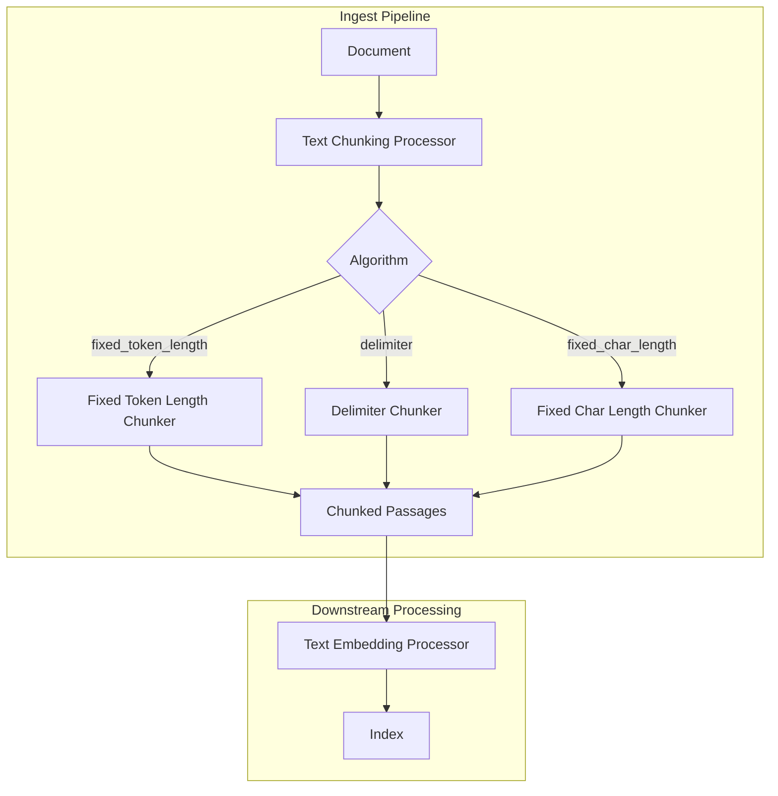
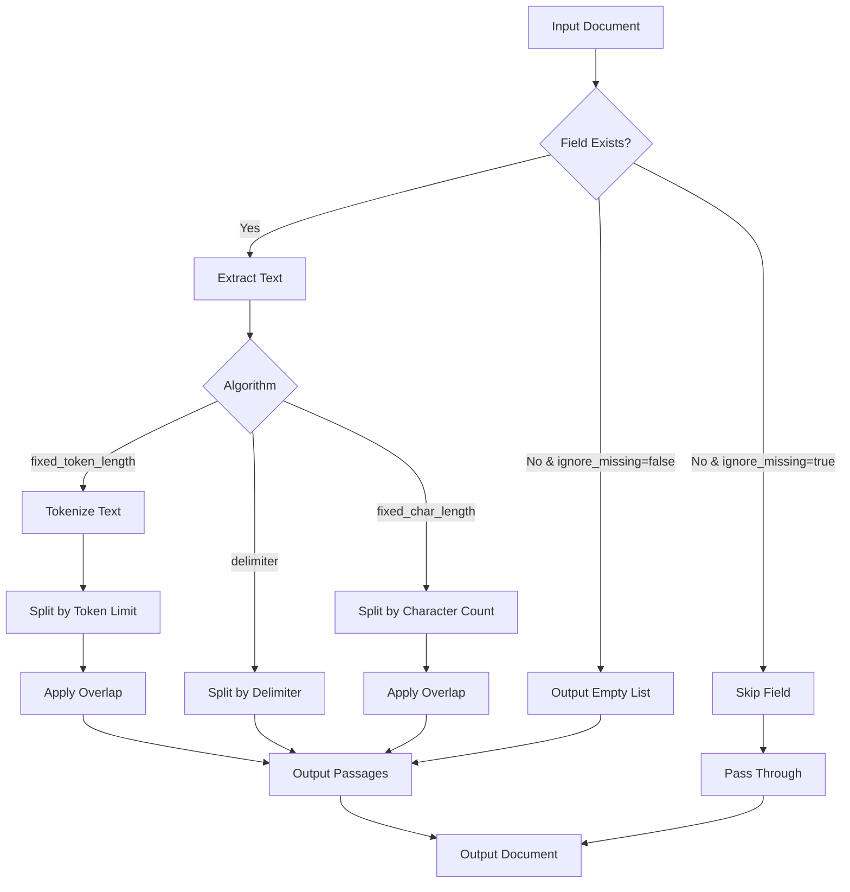

# Text Chunking

## Summary

Text chunking is an ingest processor in the neural-search plugin that splits long documents into shorter passages for improved semantic search and embedding generation. It supports multiple chunking algorithms including fixed token length, delimiter-based splitting, and fixed character length, with configurable parameters for token/character limits, overlap, and handling of missing fields.

## Details

### Architecture



### Data Flow



### Components

| Component | Description |
|-----------|-------------|
| `TextChunkingProcessor` | Main processor class that orchestrates text chunking |
| `TextChunkingProcessorFactory` | Factory for creating processor instances from pipeline configuration |
| `FixedTokenLengthChunker` | Splits text into passages of specified token count with optional overlap |
| `DelimiterChunker` | Splits text on specified delimiter strings |
| `FixedCharLengthChunker` | Splits text into passages of specified character count with optional overlap |

### Configuration

| Setting | Description | Default |
|---------|-------------|---------|
| `field_map` | Maps input fields to output fields for chunking | Required |
| `algorithm` | Specifies chunking algorithm and parameters | `fixed_token_length` |
| `ignore_missing` | Skip missing fields instead of outputting empty list | `false` |
| `description` | Optional description of the processor | - |
| `tag` | Optional identifier tag for debugging | - |

#### Fixed Token Length Algorithm Parameters

| Setting | Description | Default |
|---------|-------------|---------|
| `token_limit` | Maximum tokens per chunk | `384` |
| `tokenizer` | Word tokenizer name | `standard` |
| `overlap_rate` | Overlap percentage between chunks (0-0.5) | `0` |
| `max_chunk_limit` | Maximum number of chunks allowed | `100` |

#### Delimiter Algorithm Parameters

| Setting | Description | Default |
|---------|-------------|---------|
| `delimiter` | String delimiter for splitting | `\n\n` |
| `max_chunk_limit` | Maximum number of chunks allowed | `100` |

#### Fixed Character Length Algorithm Parameters

| Setting | Description | Default |
|---------|-------------|---------|
| `char_limit` | Maximum characters per chunk | `2048` |
| `overlap_rate` | Overlap percentage between chunks (0-0.5) | `0` |
| `max_chunk_limit` | Maximum number of chunks allowed | `100` |

### Usage Example

```json
PUT _ingest/pipeline/text-chunking-pipeline
{
  "description": "A text chunking ingest pipeline",
  "processors": [
    {
      "text_chunking": {
        "ignore_missing": true,
        "algorithm": {
          "fixed_token_length": {
            "token_limit": 384,
            "overlap_rate": 0.2,
            "tokenizer": "standard"
          }
        },
        "field_map": {
          "passage_text": "passage_chunk"
        }
      }
    }
  ]
}
```

### Cascaded Processors

Multiple text chunking processors can be chained for complex splitting strategies:

```json
{
  "processors": [
    {
      "text_chunking": {
        "algorithm": { "delimiter": { "delimiter": "\n\n" } },
        "field_map": { "text": "paragraphs" }
      }
    },
    {
      "text_chunking": {
        "algorithm": { "fixed_token_length": { "token_limit": 500 } },
        "field_map": { "paragraphs": "chunks" }
      }
    }
  ]
}
```

### Fixed Character Length Example

The `fixed_char_length` algorithm is especially beneficial for languages that do not use spaces to separate words, such as Chinese, Japanese, Thai, and Khmer:

```json
PUT _ingest/pipeline/char-chunking-pipeline
{
  "processors": [
    {
      "text_chunking": {
        "algorithm": {
          "fixed_char_length": {
            "char_limit": 500,
            "overlap_rate": 0.2
          }
        },
        "field_map": {
          "content": "content_chunks"
        }
      }
    }
  ]
}
```

## Limitations

- The default `token_limit` of 384 is optimized for OpenSearch pretrained models with 512 token input limits
- `max_chunk_limit` throws an exception if exceeded; set to `-1` to disable
- Nested field paths must use JSON object notation, not dot notation
- The `fixed_char_length` algorithm's `overlap_rate` is limited to 0-0.5 range

## Related PRs

| Version | PR | Description |
|---------|-----|-------------|
| v3.1.0 | [#1342](https://github.com/opensearch-project/neural-search/pull/1342) | Add FixedCharLengthChunker for character length-based chunking |
| v2.18.0 | [#907](https://github.com/opensearch-project/neural-search/pull/907) | Add ignore_missing field to text chunking processors |

## References

- [Issue #906](https://github.com/opensearch-project/neural-search/issues/906): Feature request for ignore_missing field
- [Issue #1261](https://github.com/opensearch-project/neural-search/issues/1261): Proposal for RecursiveCharacterTextSplitter
- [Text Chunking Processor Documentation](https://docs.opensearch.org/latest/ingest-pipelines/processors/text-chunking/): Official documentation
- [Text Chunking Guide](https://docs.opensearch.org/latest/search-plugins/text-chunking/): Usage guide for semantic search

## Change History

- **v3.1.0**: Added `fixed_char_length` algorithm for character-based chunking, beneficial for non-space-delimited languages
- **v2.18.0** (2024-10-29): Added `ignore_missing` parameter to skip missing fields during processing
