---
tags:
  - domain/observability
  - component/server
  - dashboards
  - indexing
  - security
---
# Notifications Plugin

## Summary

The OpenSearch Notifications plugin enables other plugins to send notifications via multiple channels including Email (SMTP and Amazon SES), Slack, Amazon Chime, Microsoft Teams, and custom webhooks. It provides a unified notification infrastructure for alerting, reporting, and other OpenSearch features that need to communicate with external systems.

## Details

### Architecture

```mermaid
graph TB
    subgraph "OpenSearch Cluster"
        A[Alerting Plugin] --> N[Notifications Plugin]
        B[Reporting Plugin] --> N
        C[Index Management] --> N
        D[Other Plugins] --> N
    end
    
    subgraph "Notifications Core"
        N --> T[Transport Layer]
        T --> SMTP[SMTP Client]
        T --> SES[SES Client]
        T --> WH[Webhook Client]
    end
    
    subgraph "Destinations"
        SMTP --> E[Email Server]
        SES --> AWS[Amazon SES]
        WH --> S[Slack]
        WH --> CH[Chime]
        WH --> MS[Teams]
        WH --> CW[Custom Webhook]
    end
```



### Components

| Component | Description |
|-----------|-------------|
| `notifications-core` | Core notification processing and transport logic |
| `notifications` | OpenSearch plugin integration |
| `DestinationSmtpClient` | SMTP email delivery client |
| `DestinationSesClient` | Amazon SES email delivery client |
| `EmailMimeProvider` | MIME message construction for emails |
| `WebhookClient` | HTTP webhook delivery for Slack, Chime, Teams |

### Supported Channels

| Channel | Protocol | Authentication |
|---------|----------|----------------|
| Email (SMTP) | SMTP/SMTPS | Username/Password, STARTTLS |
| Email (SES) | AWS API | IAM Role, Access Keys |
| Slack | HTTPS Webhook | Webhook URL |
| Amazon Chime | HTTPS Webhook | Webhook URL |
| Microsoft Teams | HTTPS Webhook | Webhook URL |
| Custom Webhook | HTTP/HTTPS | Basic Auth, Headers |

### Configuration

| Setting | Description | Default |
|---------|-------------|---------|
| `opensearch.notifications.core.email.minimum_header_length` | Minimum email header length | 32 |
| `opensearch.notifications.core.email.size_limit` | Maximum email size in bytes | 10000000 |
| `opensearch.notifications.core.http.max_connections` | Max HTTP connections | 60 |
| `opensearch.notifications.core.http.connection_timeout` | Connection timeout (ms) | 5000 |
| `opensearch.notifications.core.http.socket_timeout` | Socket timeout (ms) | 50000 |

### Usage Example

```json
POST _plugins/_notifications/configs
{
  "config_id": "my-email-channel",
  "config": {
    "name": "Email Channel",
    "description": "Send notifications via email",
    "config_type": "email",
    "is_enabled": true,
    "email": {
      "email_account_id": "account-id",
      "recipient_list": [
        { "recipient": "user@example.com" }
      ]
    }
  }
}
```

## Limitations

- Email attachments have size limits based on configuration
- Webhook destinations require network access from OpenSearch nodes
- SES requires proper IAM permissions and verified email addresses

## Change History

- **v3.3.0** (2026-01-11): Build infrastructure fixes - Gradle 9 compatibility for environment variable syntax, SLF4J version conflict resolution for Maven snapshot publication
- **v3.2.0** (2026-01-11): Infrastructure updates - Gradle 8.14, JaCoCo 0.8.13, nebula.ospackage 12.0.0, JDK 24 CI support
- **v3.1.0** (2026-01-10): Migrated from javax.mail to jakarta.mail APIs to avoid version conflicts; updated greenmail test dependency to 2.0.1


## References

### Documentation
- [OpenSearch Notifications Repository](https://github.com/opensearch-project/notifications)
- [Jakarta Mail 2.0 Specification](https://jakarta.ee/specifications/mail/2.0/)
- [Gradle 8.14 Release Notes](https://docs.gradle.org/8.14/release-notes.html)

### Pull Requests
| Version | PR | Description | Related Issue |
|---------|-----|-------------|---------------|
| v3.3.0 | [#1074](https://github.com/opensearch-project/notifications/pull/1074) | Fix issue publishing maven snapshots by forcing slf4j version |   |
| v3.3.0 | [#1069](https://github.com/opensearch-project/notifications/pull/1069) | Fix: Update System.env syntax for Gradle 9 compatibility |   |
| v3.2.0 | [#1057](https://github.com/opensearch-project/notifications/pull/1057) | Updated gradle, jdk and other dependencies |   |
| v3.1.0 | [#1036](https://github.com/opensearch-project/notifications/pull/1036) | Upgrade javax to jakarta mail |   |
| v3.1.0 | [#1027](https://github.com/opensearch-project/notifications/pull/1027) | Version increment to 3.1.0-SNAPSHOT |   |
