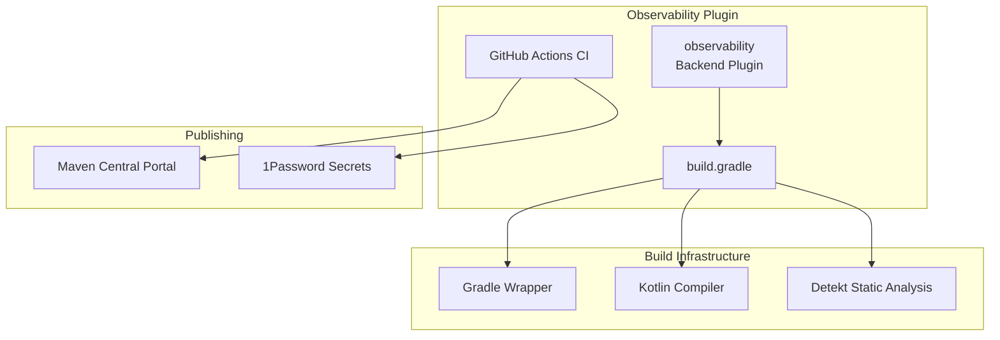

---
tags:
  - indexing
  - observability
---

# Observability Infrastructure

## Summary

This feature tracks infrastructure and build system maintenance for the OpenSearch Observability plugin, including CI/CD pipeline updates, dependency management, Gradle upgrades, and Maven publishing configuration. These changes ensure the plugin remains compatible with the latest tooling and follows OpenSearch project-wide infrastructure standards.

## Details

### Architecture



### Components

| Component | Description |
|-----------|-------------|
| build.gradle | Main build configuration with dependencies and publishing setup |
| gradle-wrapper.properties | Gradle version and distribution configuration |
| maven-publish.yml | GitHub Actions workflow for Maven snapshot publishing |
| opensearch-observability-test-and-build-workflow.yml | CI workflow for testing and building |

### Configuration

| Setting | Description | Current Value |
|---------|-------------|---------------|
| Gradle Version | Build tool version | 8.14.3 |
| Kotlin Version | Kotlin compiler version | 2.2.0 |
| Nebula OSPackage | Packaging plugin version | 12.0.0 |
| Maven Snapshots URL | Repository for snapshot publishing | `https://central.sonatype.com/repository/maven-snapshots/` |
| CI Java Versions | JDK versions for CI testing | 21, 24 |
| Detekt JVM Target | Static analysis JVM target | 21 |

### Usage Example

```groovy
// build.gradle - Maven publishing configuration
publishing {
    repositories {
        maven {
            name = "Snapshots"
            url = "https://central.sonatype.com/repository/maven-snapshots/"
            credentials {
                username "$System.env.SONATYPE_USERNAME"
                password "$System.env.SONATYPE_PASSWORD"
            }
        }
    }
}
```

## Limitations

- Detekt static analysis does not yet support JDK 24, requiring JVM target override
- Legacy Sonatype URL maintained for backward compatibility during transition

## Change History

- **v3.2.0** (2025-08-04): Maven snapshot publishing migration to Central Portal, Gradle 8.14.3 upgrade, JDK 24 CI support

## Related Features
- [Observability (Dashboards)](../dashboards-observability/ci-tests.md)

## References

### Documentation
- [observability repository](https://github.com/opensearch-project/observability)
- [Sonatype Central Portal Snapshots](https://central.sonatype.org/publish/publish-portal-snapshots/)

### Pull Requests
| Version | PR | Description | Related Issue |
|---------|-----|-------------|---------------|
| v3.2.0 | [#1931](https://github.com/opensearch-project/observability/pull/1931) | Update maven snapshot publish endpoint and credential | [#5551](https://github.com/opensearch-project/opensearch-build/issues/5551) |
| v3.2.0 | [#1937](https://github.com/opensearch-project/observability/pull/1937) | Upgrade gradle to 8.14.3 and run CI checks with JDK24 | [#1932](https://github.com/opensearch-project/observability/issues/1932) |

### Issues (Design / RFC)
- [Issue #5551](https://github.com/opensearch-project/opensearch-build/issues/5551): Plugin snapshot publishing migration
