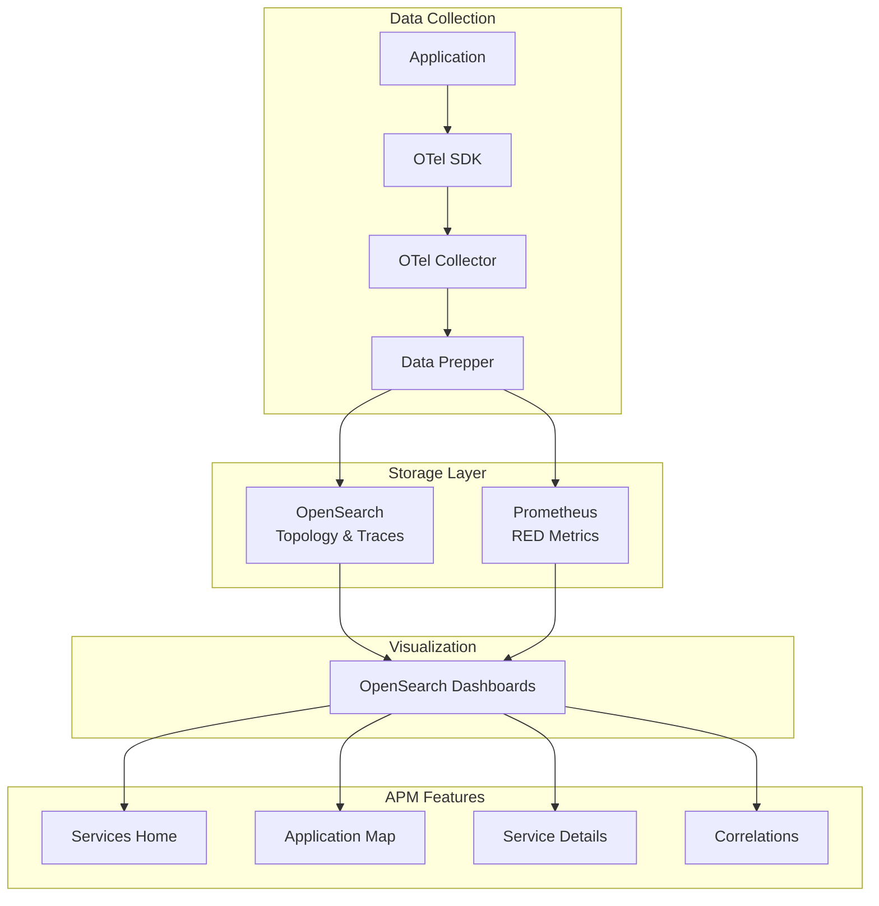

---
tags:
  - observability
---
# Application Performance Monitoring (APM)

## Summary

OpenSearch APM (Application Performance Monitoring) provides comprehensive observability capabilities for distributed systems built on open-source technologies. It enables monitoring of service health, performance metrics, and dependencies through an integrated dashboard experience in OpenSearch Dashboards.

## Details

### Architecture

APM employs a hybrid architecture leveraging different storage systems for optimal performance:

### Key Capabilities

| Capability | Description |
|------------|-------------|
| RED Metrics | Rate, Errors, and Duration metrics for services and operations |
| Service Maps | Interactive topology visualization showing service dependencies |
| Service-Level Monitoring | Detailed performance metrics at service and operation levels |
| Trace Exploration | Deep dive into distributed traces with log correlation |

### Components

#### Services Home Page

Interactive landing page displaying all monitored services with:
- Services table with columns: Service Name, Environment, Latency (P95), Throughput, Failure Ratio
- Sparkline visualizations for metric trends
- Resizable filter sidebar with environment, latency, throughput, and failure ratio filters
- Top Services by Fault Rate widget
- Top Dependencies by Fault Rate widget

#### Application Map

Interactive service topology visualization featuring:
- CelestialMap-based graph visualization
- Group By functionality (environment, deployment, namespace)
- Service Details Panel with RED metrics on node click
- Edge Metrics Flyout for dependency metrics
- Sidebar navigation with service list and search

#### Service Details Pages

Comprehensive drill-down views with three tabs:
- **Overview Tab**: Key metric cards (Requests, Faults, Errors, Availability, P99 Latency) and time-series charts
- **Operations Tab**: All operations with sortable/filterable metrics and expandable detail charts
- **Dependencies Tab**: Outbound service dependencies with metrics

#### Correlations Flyout

Quick view panel for:
- Correlated spans with status code filtering
- Associated logs with log level filtering
- Expandable rows showing raw logs and spans
- Navigation links to Explore traces and logs

### Configuration

APM configuration is stored as a saved object containing:

| Setting | Description |
|---------|-------------|
| Trace Dataset | OpenSearch index pattern for trace data |
| Service Map Dataset | OpenSearch index pattern for service topology |
| Prometheus Connection | Saved object reference for Prometheus data source |

### Query Languages

| Language | Use Case |
|----------|----------|
| PPL | Querying OpenSearch for topology, operations, and trace data |
| PromQL | Querying Prometheus for RED metrics and time-series data |

### Data Flow

1. Applications instrumented with OpenTelemetry SDK emit traces and metrics
2. OTel Collector receives and processes telemetry data
3. Data Prepper routes data to appropriate backends:
   - Topology and trace data → OpenSearch
   - Time-series metrics → Prometheus
4. APM UI queries both backends to display unified observability views

## Limitations

- Requires hybrid backend setup (OpenSearch + Prometheus)
- Service map visualization depends on CelestialMap library
- Metrics accuracy depends on proper OpenTelemetry instrumentation
- High-cardinality data may impact Prometheus performance

## Change History

- **v3.5.0** (2026-02): Initial implementation with Services Home, Application Map, Service Details, and Correlations Flyout

## References

### Documentation

- [RFC: OpenSearch Application Performance Monitoring](https://github.com/opensearch-project/dashboards-observability/issues/2545)

### Pull Requests

| Version | PR | Description |
|---------|-----|-------------|
| v3.5.0 | [#2556](https://github.com/opensearch-project/dashboards-observability/pull/2556) | APM Configuration page and server components |
| v3.5.0 | [#2557](https://github.com/opensearch-project/dashboards-observability/pull/2557) | APM config and context provider |
| v3.5.0 | [#2558](https://github.com/opensearch-project/dashboards-observability/pull/2558) | Services landing page |
| v3.5.0 | [#2561](https://github.com/opensearch-project/dashboards-observability/pull/2561) | Correlations flyout support |
| v3.5.0 | [#2565](https://github.com/opensearch-project/dashboards-observability/pull/2565) | Service details hooks and utilities |
| v3.5.0 | [#2566](https://github.com/opensearch-project/dashboards-observability/pull/2566) | Service details pages |
| v3.5.0 | [#2574](https://github.com/opensearch-project/dashboards-observability/pull/2574) | Application Map with topology visualization |
