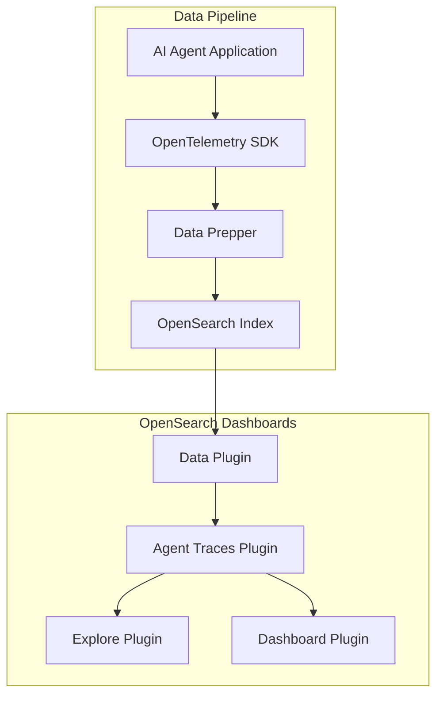

---
tags:
  - observability
---
# GenAI Agent Tracing

## Summary

GenAI Agent Tracing provides a dedicated UI in OpenSearch Dashboards for monitoring and debugging generative AI agent workflows. It visualizes OpenTelemetry trace data from AI agents, showing trace hierarchies, span details, token usage, latency metrics, and input/output content. The feature is part of the observability workspace and integrates with the Explore plugin's data infrastructure.

## Details

### Architecture

### Components

| Component | Description |
|-----------|-------------|
| `agent_traces` plugin (OSD) | Core Dashboards plugin providing the agent traces UI |
| `agent_traces` plugin (observability) | Observability workspace integration for agent tracing |
| Traces Tab | Shows root-level agent traces with expandable child spans |
| Spans Tab | Shows all GenAI spans in a flat DataTable view |
| Visualization Tab | Renders chart visualizations from PPL stats queries |
| Trace Map | Celestial Map-based directed graph of trace flow |
| Flyout | Detail panel showing metadata, input/output, and raw span data |
| Metrics Bar | EuiStats showing trace/span counts, tokens, latency percentiles, errors |

### Data Model

Agent traces are stored as OpenTelemetry spans in indices matching `otel-v1-apm-span-*`. Key attributes:

| Field | Description |
|-------|-------------|
| `attributes.gen_ai.operation.name` | GenAI operation type (e.g., chat, tool_call) |
| `attributes.gen_ai.system` | AI system identifier |
| `attributes.gen_ai.usage.input_tokens` | Input token count |
| `attributes.gen_ai.usage.output_tokens` | Output token count |
| `attributes.gen_ai.input.messages` | Input messages content |
| `attributes.gen_ai.output.messages` | Output messages content |
| `status.code` | Span status (0=OK, 2=Error) |
| `parentSpanId` | Parent span ID (empty for root traces) |
| `durationInNanos` | Span duration in nanoseconds |

### Span Categories

| Category | Color | Description |
|----------|-------|-------------|
| Agent | — | Top-level agent orchestration |
| LLM | — | Language model inference calls |
| Tool | Gray | Tool/function invocations |
| Retrieval | Mauve | Data retrieval operations |

### Tab System

The plugin uses a tab registry with three built-in tabs:

| Tab | ID | Query Behavior |
|-----|----|----------------|
| Traces | `traces` | Filters for root spans (`parentSpanId = ""`) with `gen_ai.operation.name` |
| Spans | `spans` | Filters for all spans with `gen_ai.operation.name` |
| Visualization | `visualization` | Uses the raw user query for chart rendering |

The `detectAndSetOptimalTab` action automatically selects the Visualization tab when a `stats` pipe is detected in the PPL query.

### Dashboard Integration

Visualizations can be saved to dashboards via the "Add to Dashboard" modal:
- Save to existing dashboard or create a new one
- Saved as `agentTraces` embeddable type
- Supports keyboard shortcut (`a`) for quick access

### Query Infrastructure

- PPL is the primary query language
- `splitPplWhereAndTail()` separates WHERE clauses from tail commands for correct query assembly
- `unflattenSource()` handles both flat dotted-key and nested attribute formats
- Metrics use 3 parallel PPL queries: unfiltered counts, filtered stats, filtered counts
- PPL requests use the `queries` array format with dataset binding

## Limitations

- Only PPL query language is supported
- Multi-column sorting is not available (single-column sort only due to PPL limitations)
- Token sorting uses `output_tokens` as a proxy since PPL cannot sort by a sum of two fields

## Change History

- **v3.6.0**: Major UX overhaul — migrated to Discover DataTable, added Visualization tab with dashboard integration, switched trace map to Celestial Map, updated Kind label colors to pastel style, added error filtering in metrics bar, enabled analytics workspace support, added `unflattenSource` for nested attribute handling, split metrics into parallel queries, fixed saved search loading bug

## References

### Pull Requests
| Version | PR | Description |
|---------|-----|-------------|
| v3.6.0 | `https://github.com/opensearch-project/observability/pull/11387` | Create agent_traces plugin in observability |
| v3.6.0 | `https://github.com/opensearch-project/opensearch-dashboards/pull/11564` | Support visualizations tab |
| v3.6.0 | `https://github.com/opensearch-project/opensearch-dashboards/pull/11520` | Update Kind label colors and flyout styling |
| v3.6.0 | `https://github.com/opensearch-project/opensearch-dashboards/pull/11513` | Improve UX with Discover data table |
| v3.6.0 | `https://github.com/opensearch-project/opensearch-dashboards/pull/11450` | Update graph library to Celestial Map |
| v3.6.0 | `https://github.com/opensearch-project/opensearch-dashboards/pull/11532` | Fix styles and saved search loading |
| v3.6.0 | `https://github.com/opensearch-project/opensearch-dashboards/pull/11432` | Improve usability with sorting and Cypress tests |
